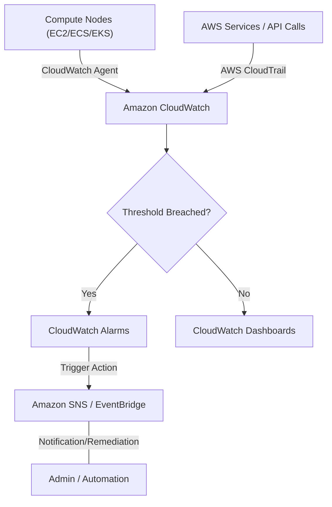

# Curriculum Overview: AWS Monitoring & Logging

> [!NOTE]
> This curriculum overview focuses specifically on **Task 1.1 of the AWS Certified CloudOps Engineer - Associate (SOA-C03)** exam: *Implement metrics, alarms, and filters by using AWS monitoring and logging services.*

## Prerequisites

Before embarking on this module, learners should possess a foundational understanding of AWS infrastructure and basic operational concepts:

*   **AWS Core Services:** Familiarity with provisioning Amazon EC2 instances, basic understanding of containers (ECS/EKS), and the AWS Management Console.
*   **Basic Networking & Security:** Understanding of IAM roles (especially instance profiles) and VPC fundamentals.
*   **Command Line & Scripting:** Basic proficiency navigating the AWS CLI and reading JSON/YAML configurations.
*   **Fundamental Cloud Observability:** A high-level grasp of what logs, metrics, and traces represent in a distributed system environment.

## Module Breakdown

This curriculum is designed to progressively build your observability skills, taking you from data collection to automated, cross-account visualization and alerting.

| Module | Topic | Difficulty | Estimated Time | Key Focus |
| :--- | :--- | :--- | :--- | :--- |
| **1** | Native Monitoring Services | Beginner | 2 Hours | CloudWatch, CloudTrail, Managed Prometheus |
| **2** | The CloudWatch Agent | Intermediate | 3 Hours | Collecting custom logs/metrics from EC2, ECS, and EKS |
| **3** | Alarms & Event Automation | Intermediate | 3 Hours | Composite alarms, EventBridge triggers, threshold math |
| **4** | Cross-Account Dashboards | Advanced | 2 Hours | Centralized visualization and metric math |
| **5** | Notification Routing (SNS) | Beginner | 1.5 Hours | Alarm invocations, topic subscriptions, and filters |

### Observability Data Flow



## Learning Objectives per Module

### Module 1: Native Monitoring Services
*   **Differentiate** between CloudWatch (metrics/logs) and CloudTrail (API auditing).
*   **Configure** foundational monitoring using Amazon Managed Service for Prometheus for open-source compatible workloads.
*   **Apply** metric filters to extract numerical data points from unstructured log events.

### Module 2: The CloudWatch Agent
*   **Deploy** and configure the CloudWatch agent on EC2 using AWS Systems Manager (SSM).
*   **Collect** system-level metrics (e.g., memory and disk utilization) which are not captured by default hypervisor metrics.
*   **Route** containerized application logs from ECS and EKS clusters to centralized CloudWatch Log Groups.

### Module 3: Alarms & Event Automation
*   **Configure** standard and composite CloudWatch alarms using static thresholds and anomaly detection.
*   **Troubleshoot** alarm states (e.g., `OK`, `ALARM`, `INSUFFICIENT_DATA`).
*   **Integrate** alarms with Amazon EventBridge to invoke programmatic remediation (e.g., triggering AWS Lambda or SSM Runbooks).

### Module 4: Cross-Account Dashboards
*   **Design** customizable CloudWatch dashboards that aggregate metrics across multiple AWS Regions and accounts.
*   **Implement** Metric Math to derive new insights (e.g., calculating error rates: $E_{rate} = \frac{Errors}{Total Requests} \times 100$).
*   **Share** operational dashboards securely with stakeholders who may not have direct AWS Console access.

### Module 5: Notification Routing (SNS)
*   **Configure** AWS services to securely publish events to Amazon Simple Notification Service (SNS).
*   **Build** alarm actions that invoke SNS topics to distribute critical alerts via email, SMS, or HTTPS webhooks.

## Success Metrics

How will you know you have mastered this curriculum? You should be able to check off the following practical milestones:

*   [ ] **Agent Deployment:** Successfully install the CloudWatch agent on an EC2 instance and verify custom memory metrics appear in the console.
*   [ ] **Log Extraction:** Create a metric filter that successfully counts `ERROR` strings in a log group and graphs them.
*   [ ] **Alarm Automation:** Trigger a CPU utilization alarm that successfully routes a formatted email notification via SNS.
*   [ ] **Dashboard Creation:** Build a single pane of glass dashboard displaying at least 4 different resource metrics (using $P_{99}$ latency and standard averages).

```tikz
\begin{tikzpicture}
% Grid and Axes
\draw[thick, ->] (0,0) -- (6,0) node[anchor=north west] {Time};
\draw[thick, ->] (0,0) -- (0,4) node[anchor=south east] {Metric Value};

% Threshold Line
\draw[dashed, red, thick] (0,2.5) -- (5.5,2.5) node[anchor=south east] {Alarm Threshold};

% Metric Data points
\draw[blue, thick] (0,1) -- (1,1.5) -- (2,1.2) -- (3,2.8) -- (4,3.2) -- (5,2.6);

% Points and Annotations
\filldraw[black] (2,1.2) circle (2pt) node[anchor=north] {OK};
\filldraw[red] (3,2.8) circle (2pt) node[anchor=south east] {ALARM State};
\filldraw[red] (4,3.2) circle (2pt);

% Anomaly band illustration
\draw[gray, fill=gray, opacity=0.2] (0,0.5) -- (1,1.8) -- (2,1.6) -- (3,3.1) -- (4,3.5) -- (5,3.0) -- (5,2.2) -- (4,2.8) -- (3,2.4) -- (2,0.8) -- (1,1.0) -- (0,0.5) -- cycle;
\node[gray] at (4.5, 1.5) {Expected Band};

\end{tikzpicture}
```
*Visual Anchor: CloudWatch Alarms evaluate metric data points against a static threshold or an anomaly detection band over a specified period.*

## Real-World Application

In a professional CloudOps environment, "flying blind" is the leading cause of prolonged downtime. 

Mastering these logging and monitoring services allows you to transition from **reactive firefighting** to **proactive remediation**.

*   **Cost Efficiency:** By implementing detailed custom metrics via the CloudWatch agent, you can accurately right-size EC2 instances based on true memory utilization, rather than guessing based on CPU alone.
*   **Reduced MTTR (Mean Time To Recovery):** Composite alarms and EventBridge integrations allow your infrastructure to "self-heal" (e.g., rebooting frozen instances automatically) before a human engineer even reads the SNS notification.
*   **Compliance & Auditing:** CloudTrail logs integrated with CloudWatch metrics ensure that unauthorized API access attempts instantly trigger security alarms, a critical requirement for HIPAA, SOC2, and PCI-DSS compliance.