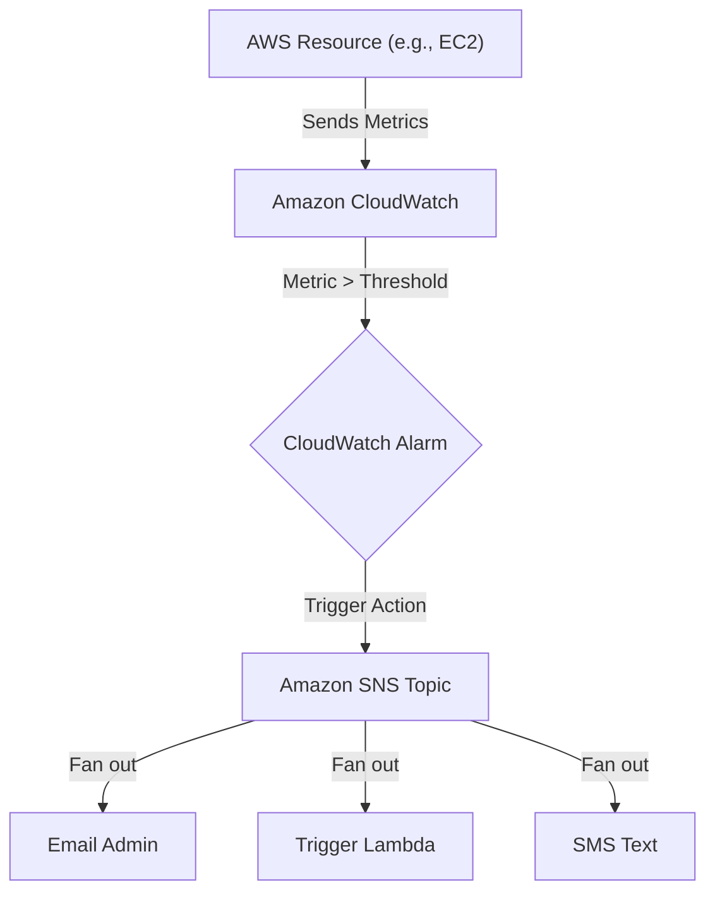

# AWS Notification Services: SNS, CloudWatch Alarms, and Budgets

This study guide focuses on the critical skills required to configure AWS services for automated notifications, primarily through **Amazon Simple Notification Service (Amazon SNS)**. Mastering these configurations is essential for the AWS Certified SysOps Administrator Associate (SOA-C03) exam, specifically within the Monitoring and Logging domain.

## Learning Objectives

By the end of this module, you should be able to:
- **Configure Amazon SNS Topics** and manage subscriptions (Email, SMS, Lambda).
- **Implement CloudWatch Alarms** that trigger SNS notifications based on static thresholds or anomaly detection.
- **Establish AWS Budget Alerts** to monitor spending habits and forecasted costs.
- **Troubleshoot Permission Issues** related to SNS Access Policies and subscription confirmations.
- **Integrate EventBridge** to route system state changes to SNS targets.

## Key Terms & Glossary

- **Amazon SNS (Simple Notification Service):** A managed pub/sub messaging service that enables decoupled communication between microservices or direct notifications to users.
- **Topic:** A logical access point and communication channel to which messages are sent.
- **Subscription:** The endpoint (Email, SQS, Lambda, SMS) that "listens" to an SNS topic.
- **CloudWatch Alarm:** A mechanism that watches a single metric over a specified time period and performs actions based on the value of the metric relative to a threshold.
- **Anomaly Detection:** A CloudWatch feature that uses machine learning to analyze historical metric data and create a model of expected values.
- **SNS Access Policy:** A resource-based policy that determines who can publish to or subscribe from an SNS topic.

## The "Big Idea"

In the AWS ecosystem, **monitoring is distinct from notification**. While services like CloudWatch and AWS Budgets observe data, they do not inherently "know" how to send an email or an SMS. **Amazon SNS** acts as the universal "switchboard." By decoupling the detection of an issue (the Alarm) from the delivery of the message (SNS), AWS allows for high scalability and complex automated responses (e.g., triggering a Lambda function to self-heal a system while simultaneously emailing the admin).

## Formula / Concept Box

| Concept | Logical Rule / Requirement |
| :--- | :--- |
| **Alarm State Change** | `OK` → `ALARM` or `ALARM` → `OK` triggers the action. |
| **SNS Subscription** | Must be **confirmed** by the recipient before notifications are delivered. |
| **Budget Forecasts** | Requires **5 weeks** of historical usage data before alerts can trigger. |
| **SNS Topic Policy** | Must allow `sns:Publish` permission to the AWS service (e.g., `budgets.amazonaws.com`). |

## Hierarchical Outline

1.  **Amazon SNS Fundamentals**
    *   **Topic Creation**: Standard vs. FIFO (First-In-First-Out) topics.
    *   **Protocol Support**: HTTP/S, Email, Email-JSON, SMS, SQS, Lambda.
    *   **Pub/Sub Model**: One publisher (CloudWatch) to many subscribers.
2.  **CloudWatch Alarm Integration**
    *   **Metric Selection**: Standard (CPU, Disk, Network) or Custom Metrics.
    *   **Threshold Types**: Static (Fixed value) or Anomaly Detection (Band of expected values).
    *   **Actions**: SNS Notification, EC2 Auto Scaling, or EC2 Systems Recovery.
3.  **AWS Budgets and Cost Alerts**
    *   **Alert Thresholds**: Based on **Actual** cost or **Forecasted** cost.
    *   **Recipients**: SNS Topic + up to 10 direct email addresses.
    *   **Reports**: Daily, weekly, or monthly delivery (up to 50 email addresses).
4.  **Operational Troubleshooting**
    *   **The "Pending Confirmation" Trap**: Emails must click the link in the subscription mail.
    *   **Service Principal Permissions**: Updating the SNS policy to allow `cloudwatch.amazonaws.com` access.

## Visual Anchors

### Notification Flowchart



### SNS Topic Architecture

```tikz
\begin{tikzpicture}[node distance=2cm, every node/.style={fill=white, font=\footnotesize}, scale=0.8]
\draw[thick, fill=orange!20] (0,0) circle (1.5cm) node[align=center] {\textbf{SNS Topic} \\ (The Hub)};
\draw[->, thick] (-4, 1) -- (-1.5, 0.5) node[midway, above] {CloudWatch};
\draw[->, thick] (-4, -1) -- (-1.5, -0.5) node[midway, below] {AWS Budgets};
\draw[->, thick] (1.5, 0.8) -- (4, 1.5) node[midway, above right] {Email};
\draw[->, thick] (1.5, 0) -- (4, 0) node[midway, right] {SMS};
\draw[->, thick] (1.5, -0.8) -- (4, -1.5) node[midway, below right] {Lambda};
\node[draw, dashed, inner sep=10pt, label=above:Publishers] at (-4.5, 0) {};
\node[draw, dashed, inner sep=10pt, label=above:Subscribers] at (4.5, 0) {};
\end{tikzpicture}
```

## Definition-Example Pairs

- **Static Threshold:** A fixed numerical limit that triggers an alarm.
    - *Example:* Trigger an alarm if CPU Utilization is $> 80\%$ for 5 minutes.
- **Actual vs. Forecasted Budget:** A distinction between money already spent and money predicted to be spent.
    - *Example:* An **Actual** alert triggers when you hit \$100 spend; a **Forecasted** alert triggers if AWS predicts you will hit \$100 by the end of the month based on current trends.
- **SNS Fan-out:** Sending a single message to multiple subscribers simultaneously.
    - *Example:* An alarm publishes to an SNS topic, which then sends an email to the SysOps team, an SMS to the manager on call, and pushes a message to an SQS queue for logging.

## Worked Examples

### Example 1: Creating a CloudWatch Alarm for High Memory
1.  **Metric:** Select `CWAgent > ImageID > InstanceId > mem_used_percent` (Note: Memory requires the CloudWatch Agent).
2.  **Condition:** Set a Static Threshold of `Greater/Equal` to `90` for `3 out of 3` datapoints.
3.  **Notification:** Select an existing SNS Topic `Admin-Alerts` or create a new one.
4.  **Confirm:** Ensure all team members have clicked "Confirm Subscription" in their email inboxes.

### Example 2: Configuring a Budget Alert for Free Tier Protection
1.  **Type:** Select "Cost Budget."
2.  **Amount:** Set the monthly budget to \$0.01 (to catch any non-free usage).
3.  **Threshold:** Set an alert for `100%` of the **Forecasted** amount.
4.  **Action:** Add an SNS Topic ARN. 
    - *Note:* This ensures you get an early warning *before* the charge actually occurs.

## Checkpoint Questions

1.  **Question:** Why might an SNS notification fail even if the CloudWatch Alarm state is in `ALARM`?
    - **Answer:** The subscription might be in "Pending Confirmation" status, or the SNS Topic Access Policy may lack permissions for the CloudWatch service principal to publish.
2.  **Question:** How many email addresses can receive a direct alert from an AWS Budget (excluding those on the SNS topic)?
    - **Answer:** Up to 10 email addresses.
3.  **Question:** How much historical data does AWS Budgets require to generate a **forecast-based** alarm?
    - **Answer:** Five weeks of usage data.
4.  **Question:** What is the difference between an SNS Topic and a Subscription?
    - **Answer:** The Topic is the communication channel (the resource); the Subscription is the endpoint (the destination) and its protocol.

> [!IMPORTANT]
> Remember that for AWS Budgets to successfully notify an SNS topic, you must explicitly grant the `budgets.amazonaws.com` service principal the `sns:Publish` permission in the SNS Topic's Access Policy.

> [!TIP]
> Use **CloudWatch Alarms** for real-time performance monitoring (seconds/minutes) and **AWS Budgets** for financial/usage monitoring (daily/monthly).