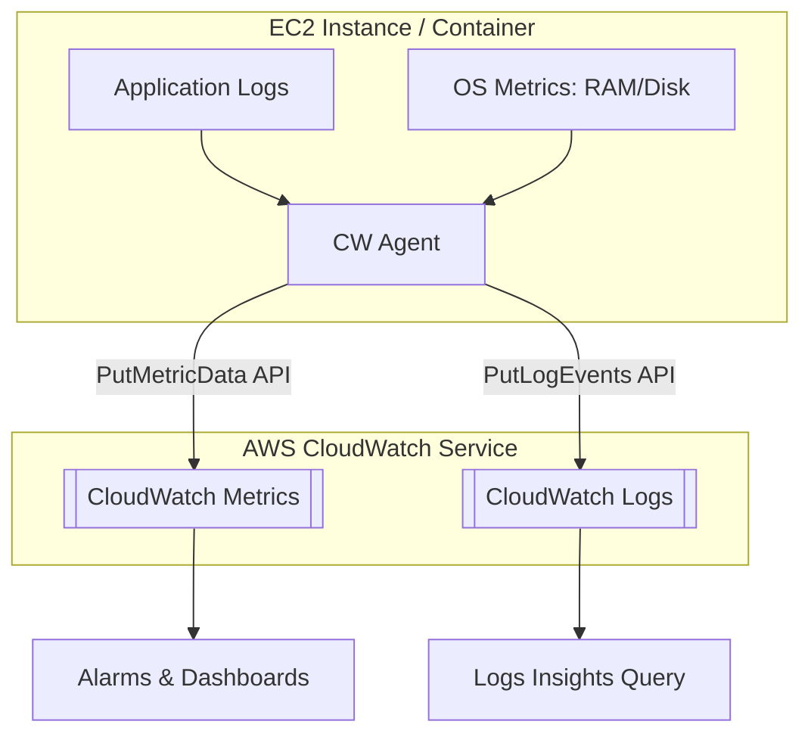

# CloudWatch Agent: Comprehensive Configuration & Management

This guide covers the implementation and management of the CloudWatch agent to bridge the gap between infrastructure (EC2, ECS, EKS) and AWS monitoring services. 

## Learning Objectives

After studying this material, you should be able to:
- **Differentiate** between default CloudWatch metrics and those requiring the CloudWatch agent.
- **Configure** the agent's JSON configuration file for both metrics and logs.
- **Deploy** the agent across EC2 instances using AWS Systems Manager (SSM).
- **Implement** container-specific logging and monitoring for Amazon ECS and EKS.
- **Troubleshoot** common agent connectivity and permission issues.

## Key Terms & Glossary

- **Namespace**: A container for CloudWatch metrics. The default namespace for the agent is `CWAgent`.
- **Dimension**: A name/value pair that is part of the identity of a metric (e.g., `InstanceId`, `ImageId`).
- **Log Group**: A group of log streams that share the same retention, monitoring, and access control settings.
- **Log Stream**: A sequence of log events that share the same source (e.g., a specific file on an EC2 instance).
- **High-Resolution Metric**: Metrics with a granularity of up to 1 second (default is 60 seconds).
- **SSM Parameter Store**: An AWS service used to store the CloudWatch agent configuration centrally for fleet-wide deployment.

## The "Big Idea"

By default, Amazon EC2 is a "black box" to CloudWatch. AWS can see the outside of the box (CPU usage, Network I/O, Disk I/O at the hypervisor level) but cannot see **inside** the operating system. To monitor internal health—specifically **Memory Utilization** and **Disk Space**—or to aggregate application logs, you must install a local process (the CloudWatch Agent) that has permission to push that data out to the CloudWatch API.

## Formula / Concept Box

| Feature | Default CloudWatch (Agentless) | CloudWatch Agent Required |
| :--- | :--- | :--- |
| **CPU Utilization** | Yes | Yes (Extra Detail Available) |
| **Memory Utilization** | No | **Yes** |
| **Disk Capacity** | No | **Yes** |
| **Log File Collection** | No | **Yes** |
| **Custom Namespaces** | Limited | Yes (User Defined) |
| **Cost** | Free for basic | Per Metric / Per GB Log Ingest |

## Hierarchical Outline

1. **CloudWatch Agent Fundamentals**
    - **Operating Systems**: Supports Windows Server and multiple Linux distributions.
    - **IAM Requirements**: Requires `CloudWatchAgentServerPolicy` attached to the EC2 Instance Profile.
2. **Configuration Management**
    - **The Wizard**: `amazon-cloudwatch-agent-config-wizard` for interactive JSON generation.
    - **The JSON Structure**: 
        - `agent`: General settings (user, collection interval).
        - `metrics`: OS-level counters (Memory, Swap, Disk).
        - `logs`: File paths to monitor (e.g., `/var/log/apache2/error.log`).
3. **Deployment Strategies**
    - **Manual**: Direct installation via CLI.
    - **SSM Run Command**: Using `AWS-ConfigureAWSPackage` and `AmazonCloudWatch-ManageAgent`.
    - **Containers**: 
        - **ECS**: Sidecar pattern or task definition integration.
        - **EKS**: Deployed as a **DaemonSet** to ensure every node runs an agent.

## Visual Anchors

### Metric & Log Flow Architecture



### EKS DaemonSet Logic

\begin{tikzpicture}[node distance=2cm, every node/.style={rectangle, draw, rounded corners, minimum width=2.5cm, minimum height=1cm, align=center}]
    \node (node1) {Worker Node 1};
    \node (node2) [right of=node1, xshift=2cm] {Worker Node 2};
    \node (agent1) [below of=node1, fill=blue!10] {CW Agent Pod\\(DaemonSet)};
    \node (agent2) [below of=node2, fill=blue!10] {CW Agent Pod\\(DaemonSet)};
    \node (app1) [above of=node1] {App Pod A};
    \node (app2) [above of=node2] {App Pod B};
    
    \draw[->, thick] (node1) -- (agent1);
    \draw[->, thick] (node2) -- (agent2);
    \draw[->, thick, dashed] (agent1) -- ++(0,-1.5) node[below] {CloudWatch};
    \draw[->, thick, dashed] (agent2) -- ++(0,-1.5) node[below] {CloudWatch};
\end{tikzpicture}

## Definition-Example Pairs

- **Aggregation Dimensions**: The ability to view metrics across different groups.
    - *Example*: Viewing "Memory Utilization" across an entire Auto Scaling Group rather than just per Instance ID.
- **StatsD / collectd**: External protocols the agent can listen to for custom application metrics.
    - *Example*: A Java application sending custom performance counters to the agent on port 8125.
- **Standard vs. Advanced Precision**: Intervals of data collection.
    - *Example*: Setting a high-resolution alarm for a critical payment microservice at 10-second intervals to catch spikes faster than the standard 1-minute interval.

## Worked Examples

### Example 1: Configuring a Log Stream
**Scenario**: You need to monitor the Linux system log located at `/var/log/messages` and send it to a log group named `SystemLogs`.

**JSON Fragment:**
```json
"logs": {
    "logs_collected": {
        "files": {
            "collect_list": [{
                "file_path": "/var/log/messages",
                "log_group_name": "SystemLogs",
                "log_stream_name": "{instance_id}"
            }]
        }
    }
}
```
**Step-by-step Execution:**
1. Install the agent: `sudo yum install amazon-cloudwatch-agent`.
2. Save the JSON file to `/opt/aws/amazon-cloudwatch-agent/etc/amazon-cloudwatch-agent.json`.
3. Start the agent: `sudo /opt/aws/amazon-cloudwatch-agent/bin/amazon-cloudwatch-agent-ctl -a fetch-config -m ec2 -s -c file:/opt/aws/amazon-cloudwatch-agent/etc/amazon-cloudwatch-agent.json`.

## Checkpoint Questions

1. **Q**: Which AWS managed IAM policy is required for an EC2 instance to send data to CloudWatch via the agent?
   - **A**: `CloudWatchAgentServerPolicy`.
2. **Q**: If you see CPU metrics in CloudWatch but no Memory metrics, what is the most likely cause?
   - **A**: The CloudWatch agent is either not installed, not configured for metrics, or not running. Memory is not a default metric.
3. **Q**: How do you deploy the CloudWatch agent to a fleet of 100 EC2 instances efficiently?
   - **A**: Use **AWS Systems Manager (SSM) Run Command** with the `AmazonCloudWatch-ManageAgent` document.
4. **Q**: In an EKS cluster, what is the preferred method for deploying the agent to ensure all nodes are covered?
   - **A**: A **DaemonSet**.

> [!IMPORTANT]
> Always verify that the EC2 Instance Metadata Service (IMDS) is reachable by the agent, as it uses IMDS to identify the instance ID and region automatically.