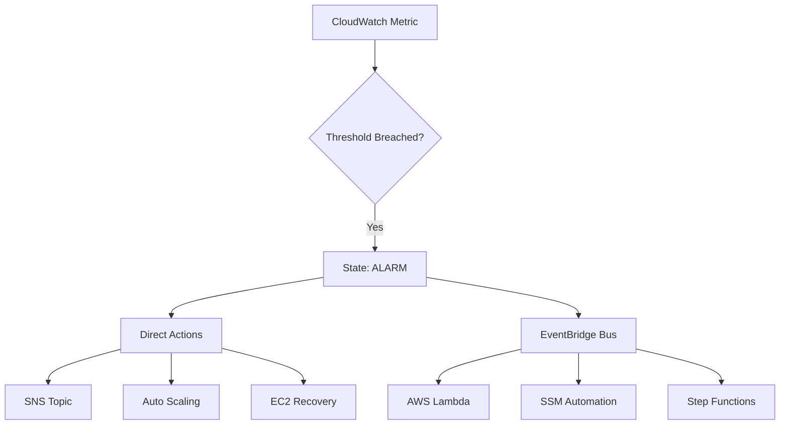

# CloudWatch Alarms: Direct Actions, Composite Logic, and EventBridge Integration

Monitoring without automation is just observation. This guide focuses on transforming CloudWatch metrics into actionable intelligence through direct service invocations and the powerful EventBridge ecosystem.

## Learning Objectives

*   **Configure** metric alarms with static and dynamic thresholds.
*   **Define** the three alarm states and their transitions.
*   **Implement** direct actions including SNS, Auto Scaling, and EC2 Recovery.
*   **Architect** composite alarms using boolean logic to reduce alarm fatigue.
*   **Integrate** alarms with EventBridge to trigger complex remediation via Lambda or SSM.
*   **Troubleshoot** common alarm misconfigurations and permission issues.

## Key Terms & Glossary

*   **Metric**: A time-ordered set of data points (e.g., CPUUtilization).
*   **Namespace**: A container for CloudWatch metrics (e.g., `AWS/EC2`).
*   **Threshold**: The value that a metric must cross to trigger a state change.
*   **Evaluation Period**: The number of most recent data points to examine (e.g., 3 out of 5).
*   **Composite Alarm**: An alarm that monitors the state of other alarms using logical expressions.
*   **Suppression**: A feature of composite alarms that prevents actions while a "suppressor" alarm is active.
*   **EventBridge**: A serverless event bus that routes CloudWatch alarm state changes to various targets.

## The "Big Idea"

CloudWatch Alarms act as the "nervous system" of your AWS infrastructure. Instead of simply alerting a human (which leads to fatigue), high-maturity operations use **Automated Remediation**. By combining **Composite Alarms** (to filter noise) with **EventBridge** (to trigger code), you move from reactive monitoring to a self-healing architecture.

## Formula / Concept Box

| Component | Logic / Rule | Description |
| :--- | :--- | :--- |
| **Standard Alarm** | $Metric > Threshold$ | Triggers when a single metric exceeds a limit. |
| **Evaluation Logic** | $M$ of $N$ datapoints | Avoids flapping; requires $M$ failures in $N$ intervals. |
| **Composite Alarm** | `ALARM("A") OR ALARM("B")` | Combines multiple alarms using boolean logic. |
| **Action Delay** | State Change Only | Actions only fire when moving from one state to another (e.g., OK $\to$ ALARM). |

## Hierarchical Outline

*   **I. Standard Metric Alarms**
    *   **States**: OK (normal), ALARM (breached), INSUFFICIENT_DATA (missing data).
    *   **Threshold Types**: Static (fixed value) vs. Anomaly Detection (machine learning bands).
    *   **Evaluation**: Period length (10s, 30s, 1m, 5m) and Datapoints to Alarm.
*   **II. Direct Invocation Actions**
    *   **SNS Notifications**: Email, SMS, or PagerDuty integration.
    *   **EC2 Auto Scaling**: Scale-out (add instances) or Scale-in (remove instances).
    *   **EC2 Recovery**: Automatically restart an instance on new hardware if the underlying host fails.
*   **III. Composite Alarms**
    *   **Logic**: Use `AND`, `OR`, and `NOT` to create complex dependencies.
    *   **Hierarchy**: A composite alarm can monitor other composite alarms.
    *   **Benefit**: Redundancy; only trigger if both the Application and Database alarms are failing.
*   **IV. EventBridge Integration**
    *   **Event Pattern**: Capture `CloudWatch Alarm State Change` events.
    *   **Targets**: Lambda (remediation scripts), SSM Automation (runbooks), Step Functions (workflows).
    *   **Routing**: Filter events by specific alarm names or state transitions.

## Visual Anchors

### Alarm Action Flow



### Composite Alarm Hierarchy

```tikz
\begin{tikzpicture}[node distance=2cm, every node/.style={draw, rectangle, rounded corners, align=center, fill=blue!5}]
    \node (root) {\textbf{Composite Alarm}\\(Production Health)};
    \node (logic) [below of=root] {\textbf{Logic: AND}};
    \node (a1) [below left of=logic, xshift=-1cm] {\textbf{Alarm A}\\(High Latency)};
    \node (a2) [below right of=logic, xshift=1cm] {\textbf{Alarm B}\\(High CPU)};
    \draw[->, thick] (logic) -- (root);
    \draw[->, thick] (a1) -- (logic);
    \draw[->, thick] (a2) -- (logic);
\end{tikzpicture}
```

## Definition-Example Pairs

*   **Static Threshold**: A fixed numerical limit. 
    *   *Example*: Triggering an alarm if the EBS Volume queue length is greater than 100 for 5 minutes.
*   **Anomaly Detection**: A threshold that adjusts based on historical patterns.
    *   *Example*: An alarm that ignores high CPU at 2 AM (during scheduled backups) but alerts if it happens at 2 PM.
*   **Suppression**: Preventing a composite alarm from taking action based on another alarm's state.
    *   *Example*: If a 