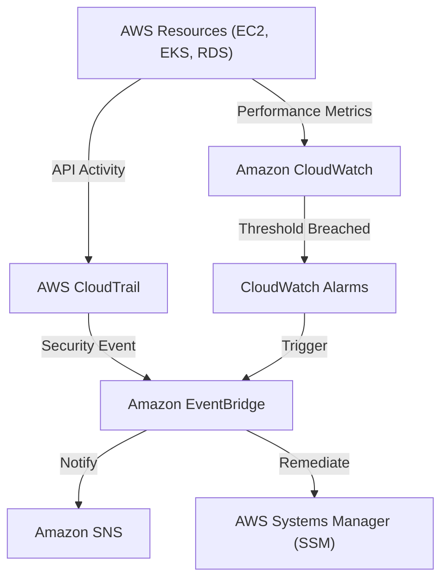

# Curriculum Overview: AWS Monitoring and Logging

> [!NOTE]
> This curriculum aligns with **Content Domain 1: Monitoring, Logging, Analysis, Remediation, and Performance Optimization** of the AWS Certified SysOps Administrator - Associate (SOA-C03) exam.

## Prerequisites

Before beginning this curriculum, learners must possess foundational knowledge in the following areas to ensure success:

* **AWS Management Fundamentals:** Proficiency in navigating the AWS Management Console and executing standard operations using the AWS Command Line Interface (CLI).
* **Core AWS Services:** An understanding of primary AWS constructs, including Amazon EC2, Amazon ECS, Amazon EKS, and Amazon VPC.
* **Identity and Access Management (IAM):** Familiarity with IAM policies, roles, and the principle of least privilege, specifically regarding resource-based policies.
* **Basic Networking & Security:** General understanding of API calls, security groups, and basic cloud networking principles.

## Module Breakdown

This curriculum is structured to progress from foundational concepts to advanced, automated remediation capabilities.

| Module | Title | Difficulty | Key Focus Area |
| :--- | :--- | :--- | :--- |
| **Module 1** | Core Observability with Amazon CloudWatch | ⭐ Beginner | Metrics, namespaces, and basic alarms |
| **Module 2** | Deep Infrastructure Monitoring | ⭐⭐ Intermediate | CloudWatch Agent on EC2, ECS, and EKS |
| **Module 3** | API Auditing & Governance | ⭐⭐ Intermediate | AWS CloudTrail and AWS Config integration |
| **Module 4** | Advanced Visualization & Open Source | ⭐⭐⭐ Advanced | Amazon Managed Service for Prometheus & Grafana |
| **Module 5** | Automated Remediation | ⭐⭐⭐ Advanced | Amazon EventBridge & Systems Manager (SSM) |

## Learning Objectives per Module

### Module 1: Core Observability with Amazon CloudWatch
* Implement and analyze standard and custom metrics within Amazon CloudWatch.
* Configure, identify, and troubleshoot CloudWatch alarms using static and dynamic thresholds.
* Create and manage customizable, shareable CloudWatch dashboards spanning multiple AWS Regions and accounts.

### Module 2: Deep Infrastructure Monitoring
* Configure the CloudWatch agent to collect system-level metrics and logs from Amazon EC2 instances.
* Extend agent-based data collection to containerized environments (Amazon ECS and Amazon EKS).
* Formulate log queries using CloudWatch Logs Insights to extract actionable data.

### Module 3: API Auditing & Governance
* Configure AWS CloudTrail to capture account activity and deliver log files securely to Amazon S3.
* Differentiate the use cases between CloudWatch (performance/health) and CloudTrail (auditing/API tracking).
* Monitor specific service integrations, such as tracking AWS Secrets Manager API requests to prevent throttling.

### Module 4: Advanced Visualization & Open Source
* Deploy and integrate Amazon Managed Service for Prometheus for container-heavy workloads.
* Design centralized observability panes using Amazon Managed Grafana.

### Module 5: Automated Remediation
* Use Amazon EventBridge to route, enrich, and deliver events based on monitoring alerts.
* Invoke AWS Systems Manager Automation runbooks to automate remediation strategies.
* Configure notifications to Amazon Simple Notification Service (Amazon SNS) from triggered alarms.

> [!IMPORTANT]
> A crucial exam objective is distinguishing *when* to use which service. Remember: **CloudTrail** is for "Who made this API call?" and **CloudWatch** is for "How is my system performing?"

### Observability Flow Architecture

The following diagram outlines the event-driven relationship between monitoring, logging, and automated remediation on AWS.



## Success Metrics

To demonstrate mastery of this curriculum, learners must achieve the following success criteria:

1. **Dashboard Unification:** Successfully provision a single, cross-region CloudWatch Dashboard that aggregates metrics from at least three different AWS services.
2. **Agent Deployment:** Deploy the CloudWatch Agent via AWS Systems Manager Run Command to a fleet of EC2 instances without manual SSH access.
3. **Closed-Loop Remediation:** Create an alarm that triggers an EventBridge rule, which successfully invokes an SSM document to restart a failed service, achieving a recovery time under 60 seconds.
4. **Exam Readiness:** Score 85% or higher on practice assessments covering SOA-C03 Domain 1 (Monitoring, Logging, Analysis, Remediation, and Performance Optimization).

### The Math of High Availability

Monitoring directly impacts the Service Level Agreement (SLA) you can offer. Your monitoring systems must catch downtime quickly to maintain high availability. The mathematical representation of Availability is:

$$
\text{Availability (\%)} = \left( \frac{\text{Total Uptime}}{\text{Total Uptime} + \text{Total Downtime}} \right) \times 100
$$

*If your CloudWatch alarm takes 5 minutes to trigger ($T_{detect}$) and your automated SSM remediation takes 2 minutes to fix the issue ($T_{remediate}$), your total downtime per incident is 7 minutes.* 

## Real-World Application

In a modern CloudOps career, configuring monitoring and logging is not just a checkbox exercise; it is the central nervous system of your infrastructure. 

### Scenario: The Throttled Application
Imagine your company uses AWS Secrets Manager for database credentials. Suddenly, your application latency spikes. By utilizing **Amazon CloudWatch**, you notice the `ClientError` metric for Secrets Manager is elevated. By querying **AWS CloudTrail**, you identify that a newly deployed microservice is stuck in a loop, requesting a secret 15,000 times per minute, hitting the service quota and costing the company unnecessary API fees ($0.05 per 10,000 API calls). 

Because you configured proper alarms, an **Amazon SNS** topic paged your on-call engineer within 60 seconds, preventing a major regional outage.

### Observability Layers

```tikz
\begin{tikzpicture}[
    node distance=1.8cm,
    box/.style={draw=black, thick, rectangle, minimum width=6cm, minimum height=1.2cm, align=center, fill=gray!10}
]
    % Nodes
    \node[box] (app) {Application Metrics \\ (StatsD / Custom CloudWatch Metrics)};
    \node[box, below of=app] (compute) {Host / Container Metrics \\ (CloudWatch Agent / Prometheus)};
    \node[box, below of=compute] (infra) {Infrastructure Audit \\ (AWS CloudTrail / AWS Config)};
    
    % Arrows
    \draw[->, thick] (app) -- (compute);
    \draw[->, thick] (compute) -- (infra);
    
    % Bracket
    \draw[decorate, decoration={brace, amplitude=10pt}, xshift=3.5cm, thick]
        (app.north east) -- (infra.south east) node[midway, right=15pt, align=center] {Comprehensive \\ Cloud \\ Observability};
\end{tikzpicture}
```

By mastering these tools, CloudOps engineers transition from purely reactive troubleshooting to proactive performance optimization and automated self-healing infrastructures.