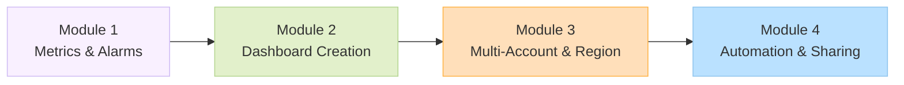
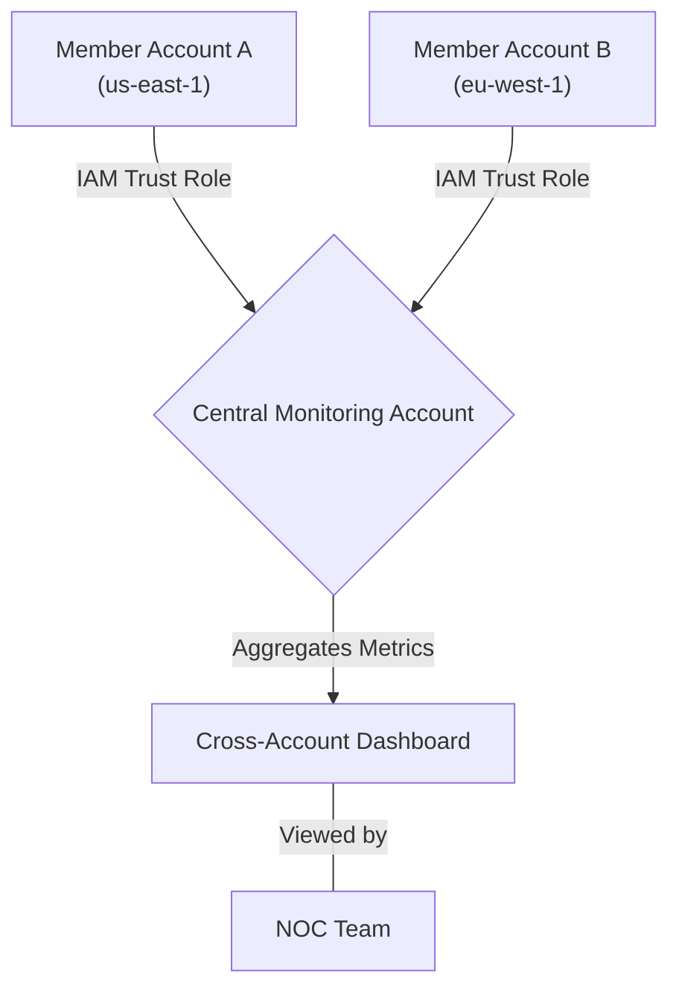

# Curriculum Overview: Advanced Amazon CloudWatch Dashboards

> [!NOTE]
> This curriculum is designed to align with the **AWS Certified SysOps Administrator - Associate (SOA-C03)** exam, specifically Content Domain 1 (Monitoring, Logging, Analysis, Remediation, and Performance Optimization), Task 1.1, Skill 1.1.4.

## Prerequisites

Before embarking on this curriculum, learners must possess foundational knowledge and access to specific AWS tools:

*   **Cloud Computing Fundamentals:** Basic understanding of AWS global infrastructure (Regions, Availability Zones).
*   **Core AWS Services:** Familiarity with Amazon EC2, Amazon RDS, and AWS IAM (Identity and Access Management).
*   **Basic Monitoring Concepts:** Prior exposure to what metrics and alarms are in a general IT context.
*   **Tooling:** Access to an AWS Account (preferably an AWS Organizations setup for multi-account practice), AWS Management Console access, and the AWS CLI configured locally.
*   **Permissions:** IAM permissions sufficient to create CloudWatch Dashboards, read metrics, and configure IAM roles for cross-account access.

## Module Breakdown

This curriculum is divided into four progressive modules, transitioning from fundamental single-account metric visualization to complex, enterprise-grade centralized observability.

| Module | Title | Focus Area | Difficulty | Est. Time |
| :--- | :--- | :--- | :--- | :--- |
| **1** | **CloudWatch Fundamentals** | Standard/Custom metrics, CloudWatch Agent, Alarms | Beginner | 2 Hours |
| **2** | **Dashboard Design** | Widgets, Layouts, Visualizing logs and alarms | Intermediate | 2 Hours |
| **3** | **Centralized Observability** | Cross-account access, Cross-region aggregation | Advanced | 3 Hours |
| **4** | **Automation & Sharing** | IaC (CloudFormation), Sharable URLs, User access | Advanced | 2 Hours |

## Learning Objectives per Module

### Module 1: CloudWatch Fundamentals
*   **Configure the CloudWatch Agent** to collect system-level metrics (e.g., memory, disk usage) from EC2 instances and containerized workloads (ECS/EKS).
*   **Implement custom metrics and namespaces** to publish application-level business data.
*   **Create and configure CloudWatch Alarms**, including composite alarms and static/dynamic thresholds.

### Module 2: Dashboard Design
*   **Design interactive dashboards** utilizing various widget types (Line charts, Stacked area, Numbers, Text/Markdown).
*   **Incorporate Alarm widgets** to visually track the health of specific infrastructure components in real-time.
*   **Use CloudWatch Logs Insights** queries directly within dashboard widgets to visualize log data trends.

### Module 3: Centralized Observability (Multi-Account & Region)
*   **Configure Cross-Account Cross-Region (CACR) dashboards** to aggregate telemetry data from multiple AWS environments into a single pane of glass.
*   **Implement IAM Trust Policies** to allow a central monitoring account to securely pull metrics from member accounts.
*   **Troubleshoot visibility issues** when aggregating metrics across disparate geographic regions.

### Module 4: Automation & Sharing
*   **Deploy Dashboards via Infrastructure as Code (IaC)** using AWS CloudFormation and AWS CLI.
*   **Generate shareable dashboard URLs** to provide read-only access to stakeholders without requiring AWS IAM credentials.
*   **Integrate dashboards with Amazon SNS and EventBridge** for automated reporting and remedial event tracking.

## Success Metrics

To ensure mastery of this curriculum, learners will be evaluated against the following success criteria:

1.  **Practical Implementation:** Successfully deploy a functioning multi-account dashboard using AWS CloudFormation that pulls CPU metrics from an EC2 instance in Account A and an RDS database in Account B.
2.  **Troubleshooting Proficiency:** Identify and resolve simulated IAM permission boundaries preventing a central account from viewing a member account's custom metrics.
3.  **Exam Readiness:** Achieve a score of 85% or higher on practice questions related to SOA-C03 Domain 1.1.4 (Dashboards, Metrics, Alarms).
4.  **Operational Efficiency:** Demonstrate the ability to extract actionable insights (e.g., identifying a bottleneck) from a custom dashboard within 2 minutes during a simulated incident response drill.

> [!IMPORTANT] 
> Validating cross-account dashboards requires careful attention to the exact naming of IAM roles (`CloudWatch-CrossAccountSharingRole`). Failure to adhere to naming conventions is the #1 reason cross-account visibility fails.

## Real-World Application

Why does this matter in a professional CloudOps career?

*   **Network Operations Centers (NOC):** Large enterprises do not log into 50 different AWS accounts to check system health. They rely on **centralized dashboards** projected on NOC screens to instantly spot regional outages or application degradation.
*   **Incident Response:** When a Sev-1 incident occurs, responders use predefined dashboards to correlate metrics (e.g., a spike in database latency matching a spike in ELB 5xx errors) to rapidly identify the root cause.
*   **Stakeholder Transparency:** Using **shareable dashboard links**, CloudOps teams can provide C-level executives or external clients with live SLA tracking (e.g., system uptime, application performance) without granting them AWS console access, thereby maintaining strict security compliance.
*   **Cost Optimization:** Centralized dashboards frequently include billing metrics and cost anomaly alarms, allowing financial teams to visualize cloud spending across all organizational units in one place.