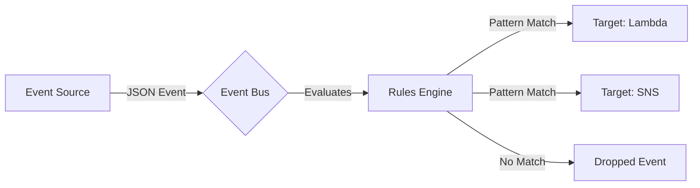
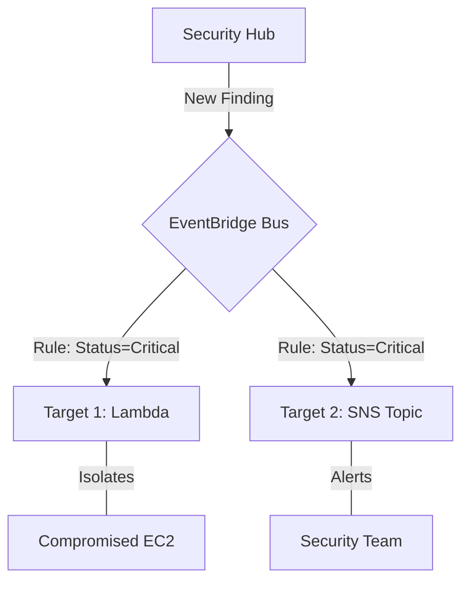

# AWS EventBridge Mastery: Routing, Enriching, Delivering, and Troubleshooting

## Prerequisites

Before embarking on this curriculum, learners must possess a foundational understanding of AWS infrastructure and operational logging. This curriculum aligns heavily with the **AWS Certified CloudOps Engineer Associate (SOA-C03)** exam (Task 1.2, Skill 1.2.2).

*   **Cloud Fundamentals:** Basic knowledge of AWS Identity and Access Management (IAM), Amazon EC2, and AWS Lambda.
*   **JSON Data Structures:** Ability to read and write JSON, as EventBridge rules and event patterns are defined entirely in JSON.
*   **Monitoring Basics:** Familiarity with Amazon CloudWatch metrics and alarms.
*   **Core Services:** High-level understanding of Amazon SNS, Amazon SQS, and AWS Systems Manager.

> [!IMPORTANT]
> If you are unfamiliar with JSON syntax, it is highly recommended to review JSON key-value pairs, nested objects, and arrays before proceeding, as EventBridge filtering relies heavily on exact structural matching.

## Module Breakdown

This curriculum is divided into five progressively challenging modules, moving from foundational concepts to advanced troubleshooting and automated remediation architectures.

| Module | Title | Difficulty | Key Focus Area |
| :--- | :--- | :--- | :--- |
| **1** | Event-Driven Architecture & Buses | Beginner | Default, Custom, and Partner Event Buses |
| **2** | Event Routing & Pattern Matching | Intermediate | JSON event patterns, filtering by attributes |
| **3** | Event Enrichment & Transformation | Intermediate | Input Transformers, payload modification |
| **4** | Event Delivery & Targets | Advanced | Lambda, Step Functions, SQS, Run Command |
| **5** | Troubleshooting & Remediation | Advanced | Metrics, Dead-Letter Queues (DLQs), failed invocations |

### The Event Processing Flow

## Learning Objectives per Module

### Module 1: Event-Driven Architecture & Buses
*   **Identify** the three types of event buses: Default, Custom, and SaaS Partner.
*   **Explain** the difference between an event-driven architecture and a polling-based architecture.

### Module 2: Event Routing & Pattern Matching
*   **Construct** EventBridge rules using predefined patterns and custom JSON.
*   **Filter** incoming events based on specific attributes (e.g., `AWSAccountID`, `Compliance.Status`, and `RecordState` from AWS Security Hub).

### Module 3: Event Enrichment & Transformation
*   **Utilize** the Input Transformer feature to map JSON variables from the event to a custom string.
*   **Format** technical JSON payloads into human-readable messages for email or Slack integration.

### Module 4: Event Delivery & Targets
*   **Configure** rules to trigger multiple AWS services concurrently.
*   **Implement** automated remediation actions using targets like Amazon EC2 Run Command, AWS Step Functions state machines, and AWS Lambda.

### Module 5: Troubleshooting Event Bus Rules
*   **Analyze** EventBridge performance metrics using Amazon CloudWatch.
*   **Isolate** rule failures using `FailedInvocations` and `TriggeredRules` metrics.
*   **Configure** Dead-Letter Queues (DLQs) using Amazon SQS to catch undeliverable events.

## Success Metrics

How will you know you have mastered this curriculum? You should be able to consistently achieve the following benchmarks:

1.  **Metric:** 100% Rule Accuracy in Lab Environments
    *   *Proof:* Successfully route a mock AWS Security Hub finding to a specific SNS topic without triggering false positives.
2.  **Metric:** Payload Transformation Competency
    *   *Proof:* Use an Input Transformer to convert a 50-line JSON instance-state-change event into a 2-line customized SMS alert.
3.  **Metric:** Troubleshooting Speed
    *   *Proof:* Identify and remediate a broken EventBridge target permissions issue within 5 minutes using CloudWatch metrics.

### Event Rule Success Formula

To ensure high reliability in your event-driven systems, always monitor your rule invocation success rate. The theoretical success rate calculation is:

$$ \text{Success Rate \%} = \left( \frac{\text{TriggeredRules} - \text{FailedInvocations}}{\text{TriggeredRules}} \right) \times 100 $$

> [!WARNING] 
> A `FailedInvocation` does not mean the rule failed to match; it means the EventBridge service lacked the IAM permissions to invoke the target, or the target service was unavailable.

## Real-World Application

In modern cloud operations, manual responses to system events are too slow. This curriculum directly supports automated security and operational remediation tasks required by CloudOps Engineers.

**Scenario: Automated Security Remediation**
AWS Security Hub automatically sends all new findings (and updates) to EventBridge. Instead of waiting for a human to read the Security Hub dashboard, you can build an EventBridge rule that immediately intercepts critical security events and isolates compromised resources.

### Remediation Architecture

### Key Takeaways for Your Career
*   **Cost Reduction:** Moving from polling (constantly asking "did something change?") to event-driven (acting only when notified) reduces API calls and compute costs.
*   **Reduced MTTR (Mean Time to Resolution):** Automating remediation through EventBridge and Systems Manager decreases the time a vulnerability is exposed from hours to milliseconds.
*   **Exam Readiness:** Mastering EventBridge routing and troubleshooting directly covers Skill 1.2.2 on the SOA-C03 exam.