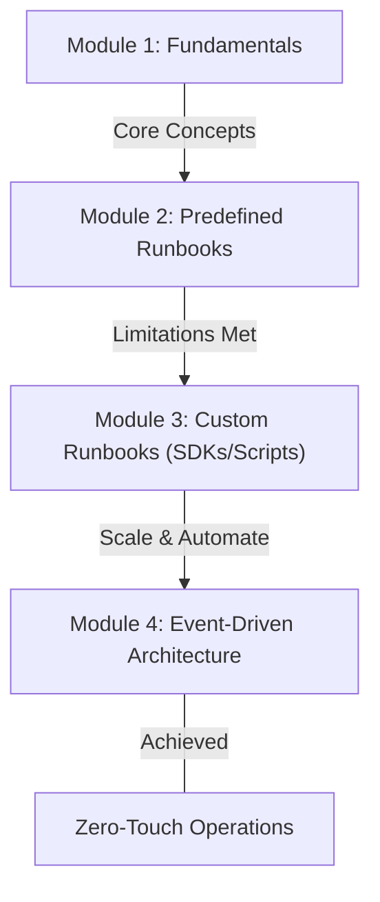

# Curriculum Overview: Systems Manager Automation Runbooks

> [!NOTE]
> This curriculum outline defines the learning path for mastering AWS Systems Manager (SSM) Automation runbooks. It covers both predefined AWS-managed runbooks and custom script-based automation (including AWS SDK integrations) to streamline operational workflows.

## Prerequisites

Before beginning this curriculum, learners must possess a foundational understanding of AWS infrastructure and scripting to effectively build and execute automation documents.

*   **AWS CLI & IAM Fundamentals:** Ability to configure the AWS Command Line Interface and assign principle of least privilege IAM roles to services.
*   **Scripting Proficiency:** Basic to intermediate knowledge of Python (Boto3) or Bash for writing custom logic.
*   **Document Formats:** Familiarity with reading and writing JSON and YAML, as these format SSM documents.
*   **Core AWS Services:** Understanding of Amazon EC2, Amazon CloudWatch (Alarms/Events), and Amazon EventBridge routing rules.

## Module Breakdown

This curriculum is structured to take you from basic automation execution to building complex, event-driven remediation pipelines using custom code.

| Module | Title | Difficulty | Core Focus |
| :--- | :--- | :--- | :--- |
| **1** | **SSM Automation Fundamentals** | Beginner | Navigating the SSM Console, understanding Document types, and execution structures. |
| **2** | **Deploying Predefined Runbooks** | Intermediate | Using AWS-authored runbooks for common operational tasks (e.g., `AWS-UpdateLinuxAmi`). |
| **3** | **Authoring Custom Runbooks** | Advanced | Writing custom YAML/JSON documents utilizing the `aws:executeScript` action with Python. |
| **4** | **Event-Driven Auto-Remediation** | Expert | Connecting EventBridge and CloudWatch to trigger SSM Automations automatically. |

### Learning Path Visualized



## Learning Objectives per Module

### Module 1: SSM Automation Fundamentals
*   **Define** the anatomy of an SSM Automation Document (Parameters, MainSteps, Outputs).
*   **Identify** required IAM permissions for SSM to execute actions on your behalf (PassRole).
*   **Explain** the difference between Command documents and Automation documents.

### Module 2: Deploying Predefined Runbooks
*   **Execute** standard AWS runbooks (e.g., `AWS-StartEC2Instance`) across multiple AWS Regions.
*   **Monitor** the progress of multi-step runbooks using the SSM Execution History console.
*   **Implement** rate control and concurrency limits when running automations against a large fleet of target instances.

### Module 3: Authoring Custom Runbooks
*   **Create** custom YAML automation documents using the `aws:executeScript` and `aws:executeAwsApi` step types.
*   **Develop** inline Python scripts utilizing the AWS SDK (Boto3) to perform complex logic that predefined steps cannot handle.
*   **Pass** dynamic outputs from one step as inputs into subsequent steps (Action Chaining).

### Module 4: Event-Driven Auto-Remediation
*   **Configure** Amazon EventBridge rules to detect state changes (e.g., Security Hub findings, EC2 state changes).
*   **Route** EventBridge events directly to an SSM Automation target, passing event details as document parameters.
*   **Troubleshoot** failed executions using CloudWatch Logs integrated with SSM step outputs.

## Success Metrics

How do you know you have mastered this curriculum? You will be evaluated against the following performance milestones.

### Evaluation Checklist
1.  **Creation:** Successfully deploy a custom YAML runbook containing at least 3 distinct steps, including one Python script.
2.  **Execution:** Trigger an automation runbook via an EventBridge pattern match without human intervention.
3.  **Auditing:** Retrieve execution logs and prove successful error handling for a deliberately failed step.

> [!TIP]
> Quantifying automation success is crucial for business value. Use the following formula to calculate the return on your automation development time:

$$ Automation\ ROI = \frac{(Manual\ Time\ per\ Task \times Execution\ Frequency) - Dev\ Time}{Dev\ Time} $$

### Concept Comparison: Predefined vs. Custom Runbooks

| Feature | Predefined Runbooks | Custom Runbooks |
| :--- | :--- | :--- |
| **Definition** | Documents authored and maintained by AWS. | Documents authored by your internal engineering team. |
| **Real-World Example** | `AWS-RestartEC2Instance` to reboot an unresponsive server. | A YAML document that queries a 3rd party API, then tags AWS resources. |
| **Maintenance** | AWS handles updates and deprecations. | You are responsible for script versioning and SDK updates. |
| **Flexibility** | Limited to the provided parameters. | Unlimited; can execute any Boto3/SDK command. |

## Real-World Application

In modern CloudOps environments (as tested in the SOA-C03 exam), manual intervention does not scale. Mastering Systems Manager Automation allows engineers to build self-healing infrastructure.

### Scenario: Automated Security Remediation
Imagine a scenario where AWS Security Hub detects an S3 bucket that has accidentally been made public. A manual response might take hours, risking data exposure. With the skills from this curriculum, you can orchestrate a near real-time resolution:

1.  **Detection:** Security Hub flags the S3 bucket.
2.  **Routing:** EventBridge captures the specific finding JSON.
3.  **Execution:** A custom SSM Automation runbook is triggered. It uses a Python (Boto3) step to evaluate the bucket policy, remove the public statement, and send a Slack notification to the security team.

### Architectural Flow

```latex
\begin{tikzpicture}
   % Nodes
   \node[draw, rounded corners, minimum height=1cm, text width=2.5cm, align=center] (evt) at (0,0) {EventBridge};
   \node[draw, rounded corners, minimum height=1cm, text width=3.5cm, align=center] (ssm) at (5,0) {SSM Automation};
   \node[draw, rounded corners, minimum height=1cm, text width=2.5cm, align=center] (sdk) at (5,-2.5) {AWS SDK (Boto3)};
   \node[draw, rounded corners, minimum height=1cm, text width=2.5cm, align=center] (res) at (10,0) {S3 Bucket};

   % Edges
   \draw[->, thick] (evt) -- node[above, draw=none, fill=white] {Trigger Rule} (ssm);
   \draw[->, thick] (ssm) -- node[right, draw=none, fill=white] {executeScript} (sdk);
   \draw[->, thick] (ssm) -- node[above, draw=none, fill=white] {Remediate} (res);
\end{tikzpicture}
```

By fully integrating these tools, you reduce operational toil, enforce strict compliance guardrails, and build a highly reliable AWS ecosystem.