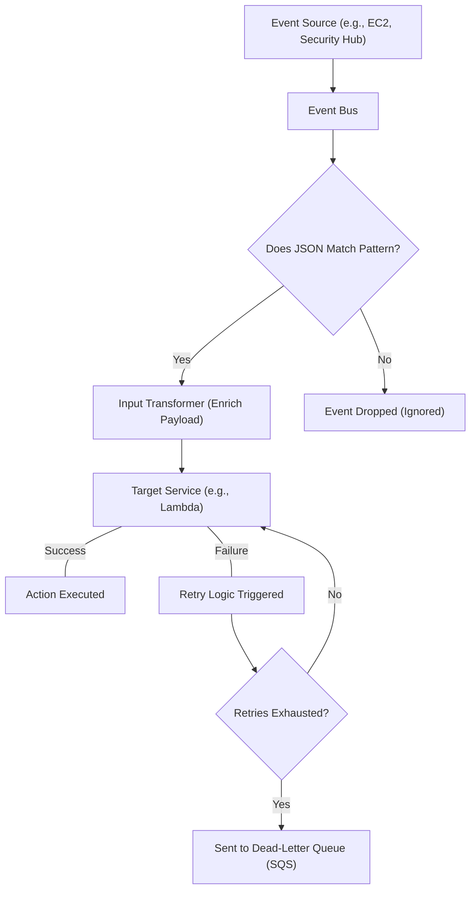
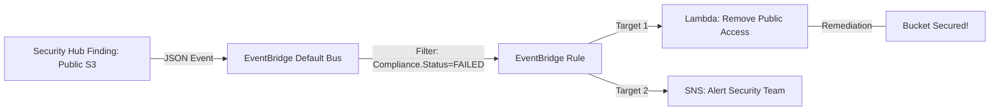

# Curriculum Overview: AWS EventBridge Routing, Enrichment, and Troubleshooting

Welcome to the comprehensive curriculum for mastering Amazon EventBridge as outlined in the AWS Certified CloudOps Engineer / SysOps Administrator Associate (SOA-C03/SOA-C02) exam guide. This curriculum will guide you through the process of routing, enriching, and delivering events, while ensuring you possess the critical skills to troubleshoot event bus rules effectively.

---

## Prerequisites

Before diving into the modules, learners should have a solid foundation in the following areas to ensure success:

*   **AWS Services Knowledge:** Familiarity with AWS Lambda, Amazon SNS, Amazon SQS, and AWS Step Functions (these will act as our primary event targets).
*   **Monitoring Concepts:** Understanding of Amazon CloudWatch metrics, alarms, and logs.
*   **JSON Data Structures:** High comfort level reading and writing JSON. EventBridge heavily relies on JSON for both the event payloads and the pattern-matching rules.
*   **IAM Policies:** Ability to configure Resource-based policies and Identity-based policies to grant EventBridge permission to invoke targets.

> [!NOTE]
> Need a refresher on when to use EventBridge versus other messaging services? Review this quick comparison:

| Feature | Amazon EventBridge | Amazon SNS | Amazon SQS |
| :--- | :--- | :--- | :--- |
| **Primary Use Case** | Event routing & filtering | High-throughput pub/sub | Decoupled message queuing |
| **Payload Modification** | Yes (via Input Transformers) | No | No |
| **Rule Filtering** | Advanced JSON pattern matching | Basic message attributes | None (receives all from SNS) |

---

## Module Breakdown

This curriculum is divided into five progressive modules. They are designed to take you from core concepts through advanced automated remediation techniques.

| Module | Title | Difficulty | Focus Area | Est. Time |
| :--- | :--- | :--- | :--- | :--- |
| **1** | **EventBus Core Architecture** | Beginner | Anatomy of Buses, Rules, and Targets | 1.5 Hours |
| **2** | **Advanced Routing & Pattern Matching** | Intermediate | JSON filtering, predefined patterns | 2.0 Hours |
| **3** | **Event Enrichment & Delivery** | Intermediate | Input Transformers, payload manipulation | 1.5 Hours |
| **4** | **Security Hub & Automated Remediation** | Advanced | Cross-service triggers, Step Functions | 2.5 Hours |
| **5** | **Troubleshooting & Reliability** | Advanced | CloudWatch metrics, DLQs, IAM permissions | 2.0 Hours |

---

## Learning Objectives per Module

### Module 1: EventBus Core Architecture
*   Differentiate between the Default Event Bus, Custom Event Buses, and Partner Event Buses.
*   Create basic rules that trigger actions across AWS services (e.g., invoking AWS Lambda or notifying an Amazon SNS topic).

### Module 2: Advanced Routing & Pattern Matching
*   Write complex EventBridge rules using filter values to match specific attributes like `AWSAccountID` or `Compliance.Status`.
*   Utilize predefined patterns (e.g., capturing Amazon EC2 state changes).

### Module 3: Event Enrichment & Delivery
*   Extract specific data from an incoming JSON event payload.
*   Format and enrich the extracted data using Input Transformers to deliver customized payloads to targets.

### Module 4: Security Hub & Automated Remediation
*   Integrate AWS Security Hub with EventBridge to capture new or updated security findings.
*   Design automated remediation workflows (e.g., invoking Amazon EC2 run commands to patch an instance) without manual human interaction.

### Module 5: Troubleshooting & Reliability
*   Identify reasons for failed event deliveries using Amazon CloudWatch metrics (e.g., `FailedInvocations` vs `DeadLetterInvocations`).
*   Configure Dead-Letter Queues (DLQs) using Amazon SQS to capture undeliverable events.
*   Diagnose Resource-based policy misconfigurations preventing target invocation.

---

## Success Metrics

How will you know you have mastered this curriculum? You should be able to consistently hit the following performance indicators:

1.  **Pattern Accuracy:** Write JSON event patterns that achieve a $100\%$ match rate for targeted events while successfully ignoring non-targeted events.
2.  **Delivery Reliability:** Configure retry policies and DLQs to ensure $P(Delivery) \approx 99.99\%$ for critical operational events.
3.  **Troubleshooting Speed:** Identify the root cause of an EventBridge delivery failure (e.g., IAM role missing `lambda:InvokeFunction`) within 5 minutes.
4.  **Exam Readiness:** Consistently score over $85\%$ on practice questions related to SOA-C03 Skill 1.2.2.

### Core Delivery Architecture
Visualizing the success path of an event is crucial for mastering these metrics:

> [!IMPORTANT]
> **Retry Logic Formula:** EventBridge attempts to deliver an event for up to 24 hours. The delay between retries increases exponentially using a backoff formula conceptually similar to:
> $$ Delay = BaseDelay \times 2^n $$
> where $n$ is the number of failed delivery attempts.

---

## Real-World Application

Mastering EventBridge is not just about passing the SysOps exam; it is the backbone of modern, event-driven automated operations (CloudOps).

### Scenario: Automated Security Remediation
Imagine your organization uses AWS Security Hub. A new finding detects that an S3 bucket has been accidentally made public. In a traditional environment, an admin would read an email, log into the console, and fix the bucket—a process taking hours. 

By applying this curriculum, you will build an event-driven flow that fixes the issue in milliseconds:

By leveraging predefined patterns and mapping out routing structures, you eliminate manual human interaction, radically reduce mean-time-to-remediation (MTTR), and ensure your AWS infrastructure remains highly reliable and continuously compliant.