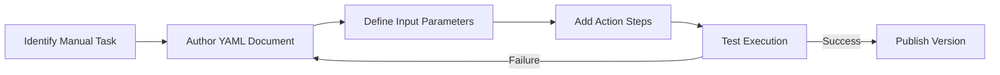
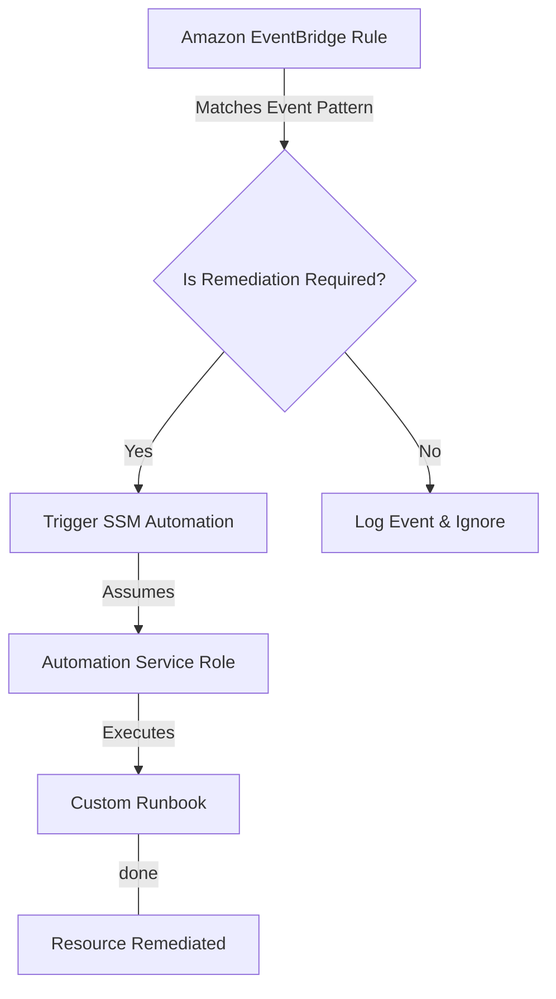

# Curriculum Overview: Automating AWS Operations with Systems Manager Runbooks

> This curriculum outline defines the learning path, modules, and success metrics for mastering AWS Systems Manager (SSM) Automation runbooks. It aligns directly with the AWS Certified CloudOps Engineer / SysOps Administrator (SOA-C03) exam domains, specifically Skill 1.2.3 and related automation tasks.

## Prerequisites

Before beginning this curriculum, learners must possess a foundational understanding of AWS core services and operations:

*   **Cloud Operations Foundation:** Familiarity with the AWS Management Console, standard operational tasks (e.g., stopping/starting EC2 instances, creating AMIs), and the AWS CLI.
*   **Identity and Access Management (IAM):** Understanding of IAM roles, policies, and the principle of least privilege, particularly how services assume roles (Service Roles vs. PassRole).
*   **Scripting Fundamentals:** Basic proficiency in Python (with the `boto3` SDK), Bash, or PowerShell is highly recommended for the custom script modules.
*   **Infrastructure as Code (IaC) Basics:** Introductory knowledge of reading JSON or YAML syntax, which is used to author custom runbook documents.

## Module Breakdown

This curriculum is structured to take you from a consumer of predefined runbooks to a creator of complex, event-driven custom automations.

| Module | Title | Difficulty | Focus Area |
| :--- | :--- | :--- | :--- |
| **Module 1** | Introduction to SSM Automation | Beginner | Concepts, Predefined Runbooks, Console Execution |
| **Module 2** | Authoring Custom Runbooks | Intermediate | YAML/JSON Syntax, Parameters, Step Execution |
| **Module 3** | Integrating AWS SDKs & Scripts | Advanced | `aws:executeScript`, Python/Boto3, Custom Logic |
| **Module 4** | Event-Driven Remediation | Advanced | Amazon EventBridge, Automated Triggers, Alarms |
| **Module 5** | Security & Lifecycle Management | Intermediate | IAM Permissions, Runbook Versioning, Approvals |

> [!NOTE]
> While this curriculum focuses heavily on Systems Manager, Module 4 will bridge heavily into Amazon EventBridge and CloudWatch to demonstrate end-to-end operational automation.

## Learning Objectives per Module

### Module 1: Introduction to SSM Automation
*   Identify the core components of AWS Systems Manager Automation.
*   Search and execute predefined AWS runbooks (e.g., `AWS-UpdateLinuxAmi`, `AWS-RestartEC2Instance`).
*   Monitor the execution status and output of automation tasks via the AWS Console.

### Module 2: Authoring Custom Runbooks
*   Structure an Automation document using YAML.
*   Define input parameters to make runbooks reusable across different resources.
*   Chain multiple action steps together (e.g., `aws:executeAwsApi`, `aws:waitForAwsResourceProperty`) where the output of one phase becomes the input of the next.

### Module 3: Integrating AWS SDKs & Scripts
*   Embed Python or PowerShell scripts directly into runbooks using the `aws:executeScript` action.
*   Utilize AWS SDKs (like Boto3 for Python) within a runbook to perform custom logic that predefined actions cannot handle.
*   Pass payloads securely between custom scripts and native SSM steps.

### Module 4: Event-Driven Remediation
*   Configure Amazon EventBridge rules to intercept AWS Health events or Security Hub findings.
*   Automatically route events to trigger an SSM Automation runbook as the target.
*   Implement zero-touch remediation pipelines for common deployment or performance issues.

### Module 5: Security & Lifecycle Management
*   Implement least privilege IAM roles for both the user initiating the runbook and the service role executing it.
*   Manage runbook versions and set default active versions for the fleet.
*   Incorporate manual approval steps (`aws:approve`) for destructive or highly-sensitive operational actions.

## Success Metrics

To ensure mastery of the material, learners will be evaluated against the following performance thresholds:

*   **Practical Lab Completion:** Successfully deploy a custom runbook that leverages a Python SDK script to identify and terminate unattached Elastic Block Store (EBS) volumes.
*   **Zero-Touch Automation:** Create an end-to-end EventBridge flow that automatically executes an SSM runbook to restart a failed web service without human intervention.
*   **Assessment Accuracy:** Score 85% or higher on a scenario-based exam covering runbook syntax, step chaining, and IAM permission troubleshooting.
*   **Efficiency Metric:** Demonstrate a measurable reduction in operational toil by replacing a multi-step manual process with a single parameterized automation execution. 

Formula for quantifying automation value:
$$ ROI = (Time_{manual} \times Frequency) - (Time_{automated} \times Frequency + Time_{development}) $$

## Real-World Application

Mastering custom and predefined SSM runbooks transforms cloud operations from a reactive, manual chore into a proactive, scalable engineering discipline. 

In modern enterprise environments, you will use these skills to:
*   **Enforce Compliance:** Automatically apply security patches to a fleet of instances every Tuesday at 2 AM using predefined SSM documents.
*   **Incident Response:** When GuardDuty detects anomalous behavior on an EC2 instance, an EventBridge rule can trigger a custom runbook to instantly isolate the instance by swapping its Security Group and taking an EBS snapshot for forensics.
*   **Cost Optimization:** Run a scheduled custom script via SSM that automatically identifies and hibernates development instances outside of business hours.
*   **Standardize Operations:** Eliminate human error by replacing lengthy wiki articles and runbooks with single-click, parameterized SSM Automations that junior operators can safely execute.