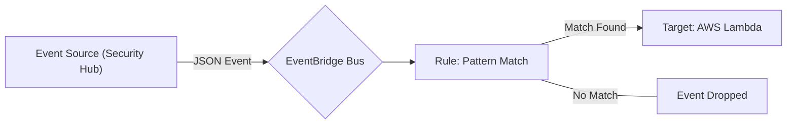
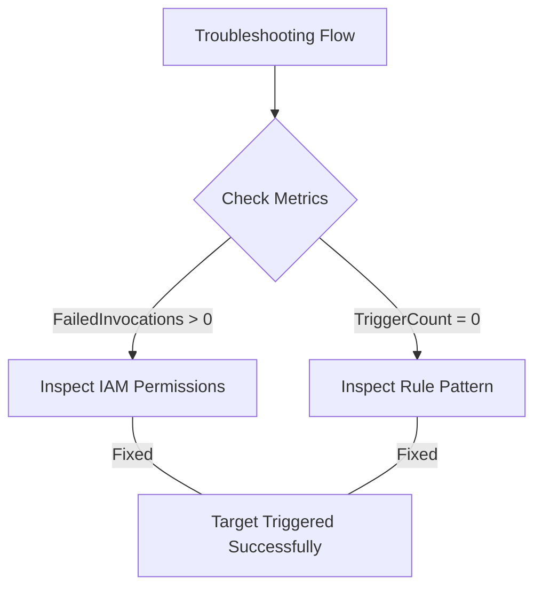

# Curriculum Overview: Amazon EventBridge Mastery

This curriculum is designed to prepare you for the AWS Certified CloudOps Engineer Associate (SOA-C03) requirements, specifically focusing on **Task 1.2, Skill 1.2.2**: Using EventBridge to route, enrich, and deliver events, and troubleshooting event bus rule issues. 

## Prerequisites

Before embarking on this curriculum, you should have a foundational understanding of the following concepts and AWS services:

*   **AWS Fundamentals:** Basic knowledge of AWS Identity and Access Management (IAM), Amazon EC2, AWS Lambda, Amazon SNS, and Amazon SQS.
*   **JSON Syntax:** Familiarity with reading and writing JSON structures, as EventBridge events and rule patterns are strictly formatted in JSON.
*   **Event-Driven Architecture:** A conceptual understanding of publish/subscribe (pub/sub) messaging models.
*   **Monitoring Tools:** Basic experience with Amazon CloudWatch metrics and AWS CloudTrail.

> [!IMPORTANT]
> Ensure you have an active AWS Sandbox account. Practicing EventBridge routing often requires provisioning companion services (like SQS or Lambda) to act as observable targets.

## Module Breakdown

The curriculum is structured progressively, taking you from core concepts to advanced troubleshooting and automation tasks.

| Module | Title | Difficulty | Core Focus |
| :--- | :--- | :--- | :--- |
| **1** | EventBridge Fundamentals | Beginner | Event buses, events vs. schedules, default vs. custom buses. |
| **2** | Event Routing & Target Integration | Intermediate | Building rules, predefined patterns, IAM permissions for targets. |
| **3** | Event Enrichment & Transformation | Intermediate | Input transformers, data extraction, modifying JSON payloads. |
| **4** | Advanced Troubleshooting & Metrics | Advanced | CloudWatch metrics, Dead-Letter Queues (DLQs), diagnosing failed invocations. |

## Learning Objectives per Module

### Module 1: EventBridge Fundamentals
*   Differentiate between the **Default Event Bus** (AWS services), **Custom Event Bus** (custom applications), and **Partner Event Bus** (SaaS integrations).
*   Understand the anatomy of an EventBridge JSON event structure.

### Module 2: Event Routing & Target Integration
*   Create EventBridge rules utilizing predefined patterns (e.g., catching Security Hub findings).
*   Apply filter values to pinpoint specific attributes such as `AWSAccountID`, `Compliance.Status`, and `RecordState`.
*   Configure rules to securely trigger actions across multiple AWS services, such as invoking AWS Lambda functions, starting AWS Step Function state machines, or publishing to Amazon SNS/SQS.

### Module 3: Event Enrichment & Transformation
*   Use the **Input Transformer** feature to parse incoming JSON and format it into human-readable text or a customized JSON payload before it reaches the target.
*   Pass specific event variables (like instance IDs or compliance status) dynamically into target execution contexts (like EC2 run commands).

### Module 4: Advanced Troubleshooting & Metrics
*   Diagnose broken EventBridge rules using Amazon CloudWatch metrics.
*   Differentiate between metric failures: e.g., `TriggerCount` = $0$ (pattern mismatch) vs. `FailedInvocations` > $0$ (target permission/configuration error).
*   Configure and utilize a **Dead-Letter Queue (DLQ)** to capture undeliverable events for later analysis.

## Success Metrics

How will you know you have mastered this curriculum? You should be able to complete the following checkpoints without relying on step-by-step documentation:

1.  **Pattern Matching Mastery:** Successfully author a custom JSON event pattern that filters EC2 `pending` state changes for only a specific subset of instance types.
2.  **Automated Remediation Deployment:** Configure an EventBridge rule that intercepts an AWS Security Hub compliance failure and successfully triggers a Systems Manager Automation runbook to remediate the resource.
3.  **Troubleshooting Resolution:** Given a scenario where an event fires but a Lambda function is not invoked, accurately identify the missing resource-based policy or IAM role deficiency.

> [!NOTE]
> **Metric to Watch:** For high-throughput environments, ensure you calculate and monitor your event processing rate limits. 
> $$Throughput_{limit} = \frac{Total\,Permitted\,Events}{Second}$$
> EventBridge can handle massive scale, but target services (like Lambda concurrency) often throttle first.

## Real-World Application

In a modern CloudOps career, manual remediation is an anti-pattern. Mastering EventBridge allows you to build self-healing infrastructure.

**Example Scenario: Security Hub Automated Remediation**
Security Hub continuously scans your environment. When it detects a vulnerability (e.g., an S3 bucket becomes public), it automatically sends all new findings and updates to EventBridge as events. 

Instead of an administrator manually reading the alert and fixing the bucket, you configure an EventBridge rule. This rule filters for `Compliance.Status == "FAILED"` and immediately routes the event to an AWS Lambda function. The function runs code to switch the bucket back to private and notifies your security team via Amazon SNS. 

By leveraging EventBridge, you transform a reactive, manual process into a near real-time, automated security response, fulfilling the core ethos of a SysOps Administrator / CloudOps Engineer.