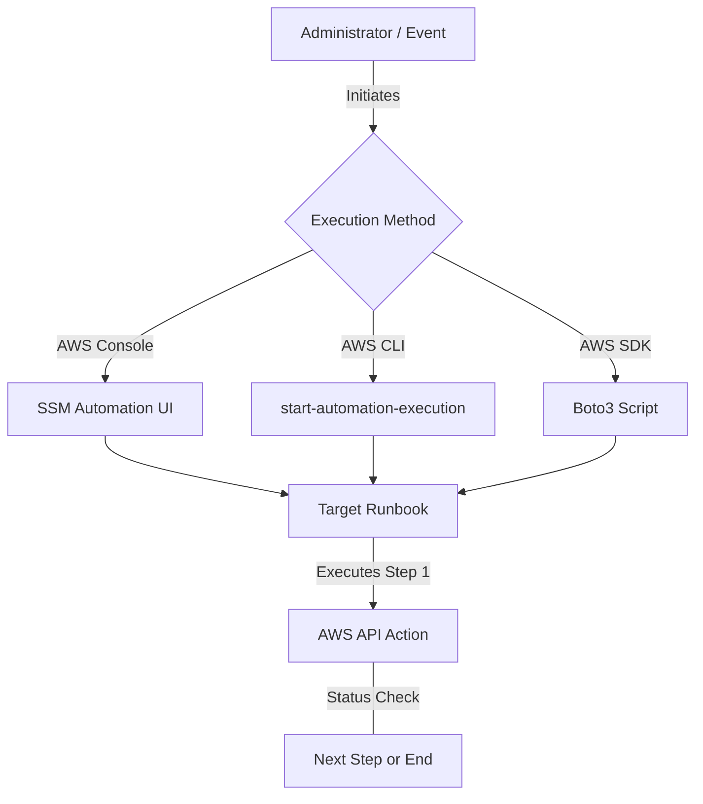
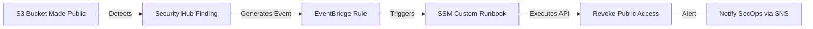

# Curriculum Overview: Automating AWS with Systems Manager (SSM) Runbooks

> This curriculum outline defines the learning pathway for mastering AWS Systems Manager (SSM) Automation. It focuses on creating, executing, and managing both predefined and custom runbooks using the AWS Console, CLI, and SDKs to seamlessly automate tasks and remediate operational issues.

## Prerequisites

Before embarking on this curriculum, learners must possess foundational knowledge of cloud operations and the AWS ecosystem. 

*   **Cloud Computing Fundamentals**: Understanding of basic AWS services, specifically Amazon EC2, Amazon S3, and Amazon CloudWatch.
*   **Identity and Access Management (IAM)**: Familiarity with the principle of least privilege, IAM roles, resource-based policies, and passing roles to AWS services.
*   **Command Line & Scripting**: 
    *   Installation and configuration of the AWS Command Line Interface (CLI).
    *   Basic proficiency in a scripting language (e.g., Python) for utilizing AWS SDKs (like Boto3).
*   **Infrastructure as Code (IaC) Basics**: Exposure to YAML or JSON syntax, which is essential for authoring custom runbooks and CloudFormation templates.

> [!IMPORTANT]
> You must have an active AWS Account with administrator or equivalent permissions to provision the necessary IAM roles and execute SSM automation documents during the hands-on labs.

## Module Breakdown

This curriculum is divided into four progressive modules, transitioning from manual operations to fully automated, event-driven remediation.

| Module | Title | Difficulty | Core Focus |
| :--- | :--- | :--- | :--- |
| **1** | **Introduction to SSM Automation** | Beginner | Exploring the SSM console, understanding the Automation service, and exploring the library of AWS-managed predefined runbooks. |
| **2** | **Executing Predefined Runbooks** | Intermediate | Running AWS-authored runbooks via the Management Console and AWS CLI to perform routine operational tasks. |
| **3** | **Authoring Custom Runbooks** | Advanced | Writing custom automation documents in YAML/JSON, embedding custom scripts (Python/PowerShell), and chaining automation steps. |
| **4** | **Event-Driven Remediation** | Expert | Integrating SSM Automation with Amazon EventBridge, AWS Security Hub, and CloudWatch Alarms for zero-touch remediation. |

### Automation Execution Flow

## Learning Objectives per Module

### Module 1: Introduction to SSM Automation
*   Identify the core components of AWS Systems Manager and its role in fleet management.
*   Navigate the SSM Document library to locate AWS-managed (`AWS-*`) runbooks.
*   Differentiate between Automation documents, Command documents, and Session documents.

### Module 2: Executing Predefined Runbooks
*   Execute predefined runbooks (e.g., `AWS-UpdateLinuxAmi`, `AWS-StartEC2Instance`) across single and multiple targets.
*   Use the AWS CLI to trigger automations using query and filter parameters (e.g., JMESPath syntax).
*   Monitor execution status and troubleshoot failed steps using SSM logs.

### Module 3: Authoring Custom Runbooks
*   Construct custom Automation documents defining input parameters, execution steps, and outputs.
*   Embed custom Python or PowerShell scripts directly within a runbook step using the `aws:executeScript` action.
*   Chain inputs and outputs so that the result of one phase becomes the input parameter for the next.

### Module 4: Event-Driven Remediation
*   Configure Amazon EventBridge rules to detect state changes (e.g., EC2 status checks or Security Hub findings).
*   Route EventBridge events to Systems Manager Automation as a target.
*   Design a closed-loop automated remediation strategy to achieve high availability without human interaction.

## Success Metrics

To ensure mastery of the curriculum, learners will be evaluated against the following success metrics:

1.  **Runbook Deployment**: Successfully author and publish a custom SSM Automation document that contains at least three chained steps (e.g., Check Status $\rightarrow$ Snapshot Volume $\rightarrow$ Restart Instance).
2.  **SDK Integration**: Write a functional Python script using Boto3 that dynamically passes parameters and triggers an SSM runbook across multiple AWS regions.
3.  **Zero-Touch Remediation**: Successfully demonstrate an architecture where a simulated failure (e.g., stopping an EC2 instance manually) automatically triggers an EventBridge rule, which invokes an SSM runbook to restore the service within 60 seconds.
4.  **Security Compliance**: Configure IAM pass-role permissions correctly so that the Automation assumes a service role rather than using the user's personal credentials.

## Real-World Application

In modern CloudOps engineering, manual human intervention for routine tasks or system failures is an anti-pattern. Systems Manager Automation runbooks are the backbone of site reliability engineering on AWS.

### Scenario: Security Incident Remediation

Imagine an organization enforcing strict security policies using AWS Security Hub. If a developer accidentally exposes an Amazon S3 bucket to the public, waiting for a human to notice the alert, log in, and secure the bucket leaves the organization vulnerable.

Using the skills from this curriculum, you can deploy the following event-driven architecture:

By chaining these services, the **Mean Time To Resolution (MTTR)** drops from hours to milliseconds. The operational efficiency gain can be modeled simply as:

$$ Efficiency\ Gain = \frac{Time_{Manual\ Triage} + Time_{Manual\ Action}}{Time_{Automated\ Detection} + Time_{SSM\ Execution}} $$

Because SSM handles the execution, robust error handling, and logging centrally, CloudOps teams can manage massive infrastructure stacks consistently, predictably, and securely at scale.