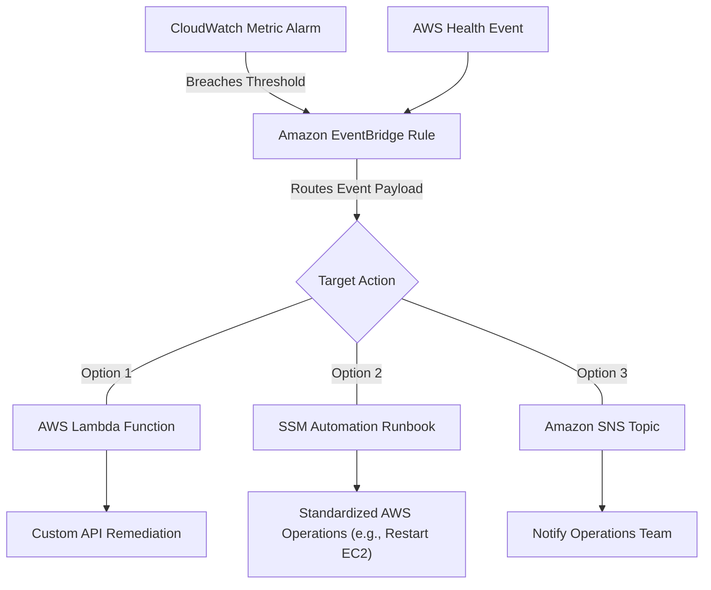

## Prerequisites

Before embarking on this curriculum centered around identifying and remediating issues using monitoring and availability metrics (aligned with Task 1.2 of the AWS SOA-C03 exam), learners should possess the following foundational knowledge and capabilities:

*   **Cloud Operations Foundation:** An understanding of the AWS Well-Architected Framework, specifically the Reliability and Operational Excellence pillars.
*   **Core AWS Services:** Hands-on experience deploying and managing Amazon EC2 instances, Amazon VPC networks, and fundamental IAM (Identity and Access Management) roles and policies.
*   **Basic Scripting:** Familiarity with Python, Bash, or JSON/YAML to understand AWS Systems Manager (SSM) Automation runbooks and AWS Lambda functions.
*   **Monitoring Fundamentals:** A high-level understanding of what metrics, logs, and traces are, and prior exposure to the AWS Management Console and AWS CLI.

> [!IMPORTANT]
> This curriculum builds directly upon foundational CloudWatch monitoring. You must be comfortable navigating CloudWatch metrics and alarms before attempting automated remediation workflows.

## Module Breakdown

This curriculum is designed to progress from foundational metric baselining to fully automated, event-driven remediation. 

| Module | Title | Focus Area | Difficulty |
| :--- | :--- | :--- | :--- |
| **Module 1** | **Baselining and Anomaly Detection** | Establishing what "normal" looks like and configuring thresholds. | Beginner |
| **Module 2** | **AWS Health & Incident Awareness** | Using AWS Health APIs and Dashboards to monitor underlying AWS infrastructure. | Intermediate |
| **Module 3** | **Event Routing with EventBridge** | Capturing state changes and routing them to target services. | Intermediate |
| **Module 4** | **Automated Remediation via SSM & Lambda** | Building custom and predefined Systems Manager runbooks for self-healing operations. | Advanced |

## Learning Objectives per Module

### Module 1: Baselining and Anomaly Detection
*   **Define Normal Operations:** Learn to baseline your applications by monitoring the normal number of allowed/blocked web requests using AWS WAF and general network traffic averages on EC2.
*   **Analyze Performance Metrics:** Evaluate Amazon CloudWatch metrics to distinguish between normal business seasonality and potential DDoS attacks or request floods.
*   **Implement Shield Advanced Events:** Understand how AWS Shield Advanced publishes event metrics to CloudWatch and centralizes findings via AWS Firewall Manager and Security Hub.

### Module 2: AWS Health & Incident Awareness
*   **Navigate the AWS Health Dashboard:** Differentiate between the public AWS Health Dashboard and the AWS Personal Health Dashboard for personalized views of resource issues and scheduled changes.
*   **Integrate Notifications:** Configure the AWS Personal Health Dashboard to aggregate cross-account events (via AWS Organizations) and push health alerts to Amazon SNS, Slack, or external ticketing systems.

### Module 3: Event Routing with EventBridge
*   **Configure Event Rules:** Create EventBridge rules to intercept state changes, AWS API calls (via CloudTrail), and custom application events.
*   **Enrich and Deliver Events:** Modify and route events to specific targets, ensuring payloads have the necessary context for downstream automation.
*   **Troubleshoot Event Buses:** Diagnose and resolve issues with failed event deliveries and misconfigured event bus rules.

### Module 4: Automated Remediation via SSM & Lambda
*   **Automate Responses:** Connect EventBridge rules to targets like AWS Lambda or AWS Systems Manager (SSM) Automation to resolve performance or availability issues.
*   **Manage SSM Runbooks:** Create, run, and modify custom and predefined Systems Manager Automation runbooks to streamline processes (e.g., automatically restarting a failed EC2 instance or expanding an EBS volume).
*   **Implement Auto Scaling:** Configure EC2 status checks and automatic recovery actions to replace degraded instances seamlessly.

## Success Metrics

How will you know you have mastered this curriculum? You should be able to check off the following competencies:

- [ ] **Baseline Establishment:** You can successfully determine the baseline network packet average for an EC2 instance and set a dynamic CloudWatch alarm for anomalies.
- [ ] **Event Routing:** You can configure an EventBridge rule that detects an AWS Health infrastructure degradation event and successfully routes it to an SNS topic.
- [ ] **Runbook Execution:** You can author a custom JSON/YAML SSM runbook that executes an AWS SDK script to quarantine an infected instance by changing its Security Group.
- [ ] **Closed-Loop Remediation:** You can design a fully automated architecture where a CloudWatch Alarm triggers EventBridge, which invokes a Lambda function to remediate the issue without human intervention.

### Visualizing the Automated Remediation Flow



## Real-World Application

In modern CloudOps, human intervention is too slow to meet strict Service Level Agreements (SLAs). If an organization experiences an unexpected spike in traffic at 3:00 AM, relying on an engineer to wake up, log into the console, and manually provision capacity or block malicious IP addresses will result in significant downtime.

### Scenario: The Traffic Spike vs. The DDoS Attack

Without baselining, any traffic spike looks like a success story. By using the skills in this curriculum, you will use CloudWatch to baseline normal traffic. When an anomaly occurs, you will automatically evaluate whether it's legitimate customer traffic (triggering Auto Scaling to add EC2 instances) or a malicious flood (triggering an SSM runbook to update AWS WAF rules and block the attack).

### Conceptualizing Baseline vs. Anomaly

The following diagram illustrates why baselining and thresholds are critical for triggering automated remediation before a system fails.

```tikz
\begin{tikzpicture}
    % Axes
    \draw[thick, ->] (0,0) -- (8,0) node[anchor=north west] {Time};
    \draw[thick, ->] (0,0) -- (0,5) node[anchor=south east] {Traffic / Metrics};
    
    % Baseline and Threshold Lines
    \draw[blue, thick, dashed] (0,1.5) -- (8,1.5) node[anchor=south west] {Expected Baseline};
    \draw[green!60!black, thick] (0,3.5) -- (8,3.5) node[anchor=south west] {CloudWatch Alarm Threshold};
    
    % Metric Line
    \draw[red, thick] 
        (0,1) -- 
        (1,1.4) -- 
        (2,1.2) -- 
        (3,1.8) -- 
        (4,1.3) -- 
        (5,4.5) node[above] {Anomaly triggers EventBridge!} -- 
        (6,2.0) node[right, font=\small] {Automated SSM Recovery} -- 
        (7,1.6) -- 
        (8,1.5);
\end{tikzpicture}
```

> [!TIP] 
> Real-world mastery of these topics not only prepares you for the SOA-C03 exam (where this domain accounts for 22% of the scored content) but directly transforms you into a proactive, "infrastructure-as-code" driven CloudOps engineer.