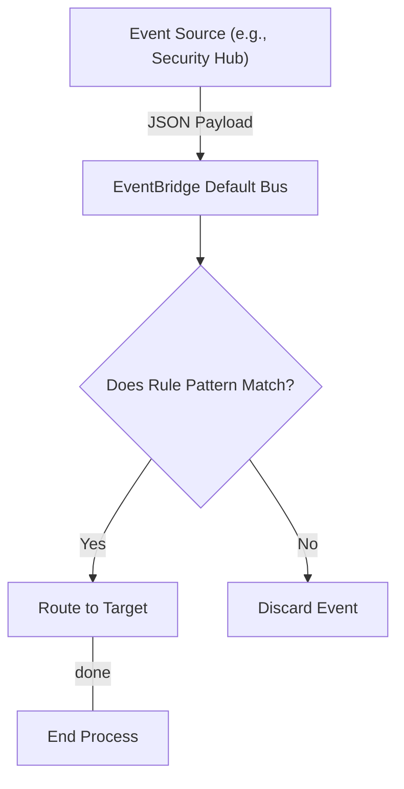
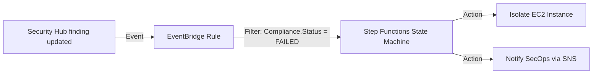

## Prerequisites

Before diving into this curriculum on AWS EventBridge, learners must have a foundational understanding of the AWS ecosystem and event-driven architecture. 

Ensure you meet the following baseline requirements:

* **AWS Foundations**: Familiarity with core services like Amazon EC2, AWS Lambda, Amazon SNS, and Amazon SQS.
* **JSON Formatting**: Ability to read, write, and parse JSON structures, as EventBridge rules rely heavily on JSON event patterns.
* **Identity and Access Management (IAM)**: Understanding of resource-based policies and execution roles required for EventBridge to invoke target services.
* **Basic Cloud Monitoring**: Prior experience with Amazon CloudWatch metrics and alarms.

> [!IMPORTANT]
> If you are not comfortable with JSON, spend an hour reviewing JSON syntax before starting Module 2. EventBridge pattern matching will fail if the JSON syntax is malformed!

---

## Module Breakdown

This curriculum is designed to take you from a basic understanding of event buses to advanced troubleshooting and payload enrichment. It follows a progressive difficulty curve.

| Module | Title | Difficulty | Est. Time |
| :--- | :--- | :--- | :--- |
| **Module 1** | EventBridge Fundamentals & Event Buses | Beginner | 2 Hours |
| **Module 2** | Event Routing & Pattern Matching | Intermediate | 3 Hours |
| **Module 3** | Event Enrichment & Transformation | Intermediate | 3 Hours |
| **Module 4** | Delivery, Targets, and Automation | Advanced | 4 Hours |
| **Module 5** | Troubleshooting Event Bus Rules | Advanced | 4 Hours |

---

## Learning Objectives per Module

### Module 1: EventBridge Fundamentals & Event Buses
* **Objective 1**: Differentiate between the *default* event bus, *custom* event buses, and *partner* event buses.
* **Objective 2**: Understand the lifecycle of an event from ingestion to delivery.

### Module 2: Event Routing & Pattern Matching
* **Objective 1**: Write precise JSON event patterns to filter incoming events.
* **Objective 2**: Apply advanced filtering techniques (e.g., prefix matching, numeric matching) to specific fields like `AWSAccountID` or `Compliance.Status`.

### Module 3: Event Enrichment & Transformation
* **Objective 1**: Utilize the **Input Transformer** to modify the JSON payload before passing it to the target.
* **Objective 2**: Extract specific variables from an incoming event and map them into a human-readable string for Amazon SNS notifications.

Click to expand: What is Event Enrichment?

Event Enrichment (via Input Transformer) allows you to strip out unnecessary data from an event and format what remains. 

**Example**: Taking a raw, 100-line Security Hub JSON finding and transforming it into a single line: *"High-severity finding detected on instance i-1234567890abcdef0"* before sending it to Slack.

### Module 4: Delivery, Targets, and Automation
* **Objective 1**: Configure various targets including AWS Lambda, Amazon EC2 Run Command, and AWS Step Functions.
* **Objective 2**: Implement Dead-Letter Queues (DLQs) using Amazon SQS to capture undelivered events.

### Module 5: Troubleshooting Event Bus Rules
* **Objective 1**: Analyze CloudWatch metrics (`FailedInvocations`, `Invocations`, `MatchedEvents`) to isolate routing failures.
* **Objective 2**: Diagnose permissions issues where EventBridge lacks the IAM role required to invoke a target.

---

## Success Metrics

How will you know when you have mastered this curriculum? You should be able to consistently demonstrate the following metrics of success:

1. **Pattern Accuracy**: You can successfully write an event pattern that matches 100% of desired events and drops 100% of unrelated noise.
2. **Transformation Capability**: You can successfully convert a nested, complex JSON event into a flat, readable format using an Input Transformer without errors.
3. **Resiliency Validation**: You can deliberately misconfigure a target and successfully capture the failed event in a Dead-Letter Queue (DLQ).
4. **Diagnostic Speed**: When presented with a failed rule, you can identify the root cause (e.g., IAM role failure vs. mismatched JSON pattern) within 5 minutes using CloudWatch metrics.

### Event Processing Math
To evaluate the cost and scale of your event-driven architecture, use this basic formula for estimating monthly EventBridge costs (excluding free tier):

$$ Cost = \left( \frac{Total\ Events}{1,000,000} \right) \times 1.00 \text{ USD} $$

> [!TIP]
> Always filter events as early as possible. You are charged for events published to custom/partner buses, but filtering state changes correctly saves money on downstream Lambda invocations.

---

## Real-World Application

Mastering EventBridge is critical for modern **CloudOps and SysOps Administrators**. It is the central nervous system for automated remediation in AWS.

### Use Case: Automated Security Remediation
When AWS Security Hub detects a non-compliant resource, manual intervention is too slow. By routing that specific finding through EventBridge, you can trigger an immediate automated response.

### Service Comparison: Choosing the Right Tool
Understanding *when* to use EventBridge over other messaging services is a crucial real-world skill:

| Feature | Amazon EventBridge | Amazon SNS | Amazon SQS |
| :--- | :--- | :--- | :--- |
| **Primary Use Case** | Event routing & choreographing | High-throughput pub/sub notifications | Decoupling & message queuing |
| **Message Retention** | No (Unless using Archives/Replay) | No | Yes (Up to 14 days) |
| **Filtering Capabilities**| Advanced JSON pattern matching | Basic message attributes | None (Processes everything) |
| **Number of Targets** | Up to 5 per rule | Millions of subscribers | 1 (Polled by consumers) |

By the end of this curriculum, you will confidently utilize EventBridge not just as a message router, but as a powerful, intelligent rule engine capable of driving complex, automated, self-healing architectures.