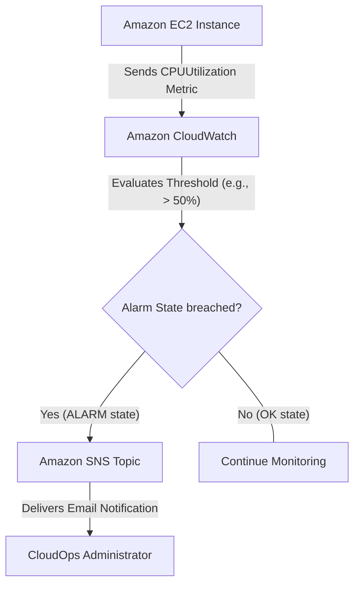

# Hands-On Lab: Implementing Monitoring, Alarms, and Remediation on AWS

## Prerequisites

Before starting this lab, ensure you have the following ready:
*   **AWS Account:** Access to an AWS account with Administrative privileges.
*   **AWS CLI:** Installed and configured (`aws configure`) with valid IAM access keys.
*   **Command Line Environment:** A bash-compatible terminal (Linux, macOS, or Windows WSL).
*   **Basic Knowledge:** Familiarity with basic EC2 concepts and CloudWatch terminology.

## Learning Objectives

By completing this 30-minute guided lab, you will be able to:
1.  Deploy an EC2 instance programmatically using the AWS CLI.
2.  Configure an Amazon Simple Notification Service (SNS) topic for alert delivery.
3.  Create an Amazon CloudWatch metric alarm based on CPU utilization thresholds.
4.  Simulate a resource bottleneck to trigger automated monitoring alerts.
5.  Understand the centralized logging and event routing concepts necessary for the SOA-C03 exam.

## Architecture Overview

The following flowchart illustrates the monitoring and alerting architecture you will build in this lab. An EC2 instance generates metrics, which are evaluated by CloudWatch. If a threshold is breached, an SNS notification is dispatched.



## Step-by-Step Instructions

### Step 1: Create an SNS Topic and Subscription

We need a notification channel to receive alerts when our compute resource experiences high CPU usage.

```bash
# 1. Create the SNS topic
aws sns create-topic --name brainybee-cpu-alerts

# NOTE: Copy the "TopicArn" from the JSON output. You will need it in the next commands.

# 2. Subscribe your email address to the topic
aws sns subscribe \
  --topic-arn <YOUR_TOPIC_ARN> \
  --protocol email \
  --notification-endpoint <YOUR_EMAIL_ADDRESS>
```

> [!IMPORTANT] 
> Check your email inbox. AWS will send a subscription confirmation link. You **must** click "Confirm subscription" before SNS will deliver alarm notifications to you.

<details>
<summary>📸 Console alternative</summary>

1. Navigate to the **Amazon SNS** console.
2. Click **Topics** on the left menu, then **Create topic**.
3. Choose **Standard** type, name it `brainybee-cpu-alerts`, and click **Create topic**.
4. On the topic details page, click **Create subscription**.
5. Choose **Email** as the protocol, enter your email address, and click **Create subscription**.
6. Check your email and confirm the subscription.
</details>

### Step 2: Launch the Target EC2 Instance

We will launch a lightweight Amazon Linux 2 EC2 instance that we can monitor.

```bash
aws ec2 run-instances \
  --image-id resolve:ssm:/aws/service/ami-amazon-linux-latest/amzn2-ami-hvm-x86_64-gp2 \
  --count 1 \
  --instance-type t2.micro \
  --tag-specifications 'ResourceType=instance,Tags=[{Key=Name,Value=brainybee-monitor-lab}]'

# NOTE: From the output, copy the "InstanceId" (e.g., i-0abcd1234efgh5678).
```

> 📸 Screenshot: Expected Output
> `"InstanceId": "i-0123456789abcdef0",`

<details>
<summary>📸 Console alternative</summary>

1. Navigate to the **EC2** console.
2. Click **Launch Instance**.
3. Name the instance `brainybee-monitor-lab`.
4. Leave Amazon Linux 2 and `t2.micro` selected.
5. Select **Proceed without a key pair** (we won't need SSH for this specific metric test).
6. Click **Launch instance**.
7. Go to the instances view and copy the **Instance ID**.
</details>

### Step 3: Create a CloudWatch Metric Alarm

Now, let's tie the instance metrics to our notification topic. We'll set the alarm to trigger if the average CPU utilization exceeds 50% for 1 evaluation period of 5 minutes (300 seconds).

```bash
aws cloudwatch put-metric-alarm \
  --alarm-name "brainybee-cpu-alarm" \
  --alarm-description "Triggers when CPU exceeds 50 percent" \
  --metric-name CPUUtilization \
  --namespace AWS/EC2 \
  --statistic Average \
  --period 300 \
  --threshold 50 \
  --comparison-operator GreaterThanThreshold \
  --dimensions Name=InstanceId,Value=<YOUR_INSTANCE_ID> \
  --evaluation-periods 1 \
  --alarm-actions <YOUR_TOPIC_ARN>
```

> [!TIP] 
> In a production environment, you typically set `--evaluation-periods` higher (e.g., 3 periods of 5 minutes) to prevent false positives from brief CPU spikes.

<details>
<summary>📸 Console alternative</summary>

1. Navigate to the **CloudWatch** console.
2. On the left pane, click **Alarms** > **All alarms**, then **Create alarm**.
3. Click **Select metric** > **EC2** > **Per-Instance Metrics**.
4. Search for your Instance ID, select `CPUUtilization`, and click **Select metric**.
5. Under Conditions, choose **Greater/Equal**, set threshold to `50`.
6. Click **Next**.
7. Under Actions, configure the alarm state to send a notification to your existing `brainybee-cpu-alerts` SNS topic.
8. Give it a name like `brainybee-cpu-alarm` and save.
</details>

## Checkpoints

Let's verify that our resources were correctly provisioned.

### Checkpoint 1: Verify EC2 State
Run the following command to ensure your instance is running:
```bash
aws ec2 describe-instances \
  --instance-ids <YOUR_INSTANCE_ID> \
  --query "Reservations[0].Instances[0].State.Name"
```
*Expected result:* `"running"`

### Checkpoint 2: Verify Alarm State
Run this command to check the current state of your alarm:
```bash
aws cloudwatch describe-alarms \
  --alarm-names "brainybee-cpu-alarm" \
  --query "MetricAlarms[0].StateValue"
```
*Expected result:* `"INSUFFICIENT_DATA"` (initially, as metrics take a few minutes to arrive) followed by `"OK"`.

## Clean-Up / Teardown

> [!WARNING] 
> Remember to run the teardown commands to avoid ongoing charges. Even though `t2.micro` is free-tier eligible, leaving idle resources running is bad practice.

Run the following commands to delete the resources created during this lab:

```bash
# 1. Delete the CloudWatch Alarm
aws cloudwatch delete-alarms --alarm-names "brainybee-cpu-alarm"

# 2. Terminate the EC2 Instance
aws ec2 terminate-instances --instance-ids <YOUR_INSTANCE_ID>

# 3. Delete the SNS Topic
aws sns delete-topic --topic-arn <YOUR_TOPIC_ARN>
```

Verify that the instance has begun shutting down:
```bash
aws ec2 describe-instances --instance-ids <YOUR_INSTANCE_ID> --query "Reservations[0].Instances[0].State.Name"
```
*(Should return `"shutting-down"` or `"terminated"`)*

## Troubleshooting

| Issue / Error Message | Probable Cause | Fix |
| :--- | :--- | :--- |
| **Did not receive email alert** | Email address not confirmed in SNS. | Check your email (and spam folder) for the AWS SNS confirmation link and click it. |
| **Alarm stuck in INSUFFICIENT_DATA** | The instance is terminated or the `InstanceId` dimension is wrong. | Double check your `InstanceId`. EC2 basic monitoring sends metrics every 5 minutes; wait 5 minutes. |
| **InvalidParameterValue Exception** | The SNS Topic ARN provided in the alarm action is incorrect. | Ensure you copied the exact ARN format: `arn:aws:sns:REGION:ACCOUNT_ID:brainybee-cpu-alerts`. |

## Stretch Challenge

**Difficulty:** Exploratory / Challenge

Instead of just notifying a human via email, how can we automate a response? 

**Your Challenge:** Use **Amazon EventBridge** to detect when the CloudWatch Alarm state changes to `ALARM`. Configure the EventBridge rule to trigger an **AWS Systems Manager (SSM) Automation Runbook** (specifically the `AWS-RestartEC2Instance` runbook) to automatically reboot the instance when the CPU spikes.

<details>
<summary>Click to show high-level solution steps</summary>

1. Open the EventBridge Console.
2. Create a new Rule with an Event Pattern.
3. Match the event pattern to `source: aws.cloudwatch`, `detail-type: CloudWatch Alarm State Change`, and target your specific alarm name.
4. Set the Target to `Systems Manager Automation`.
5. Select the document `AWS-RestartEC2Instance`.
6. Pass the `InstanceId` as an input parameter to the Automation document.
7. Ensure EventBridge creates or uses an IAM role with permissions to execute SSM runbooks.
</details>

## Cost Estimate

| Service | Resource | Estimated Cost |
| :--- | :--- | :--- |
| **Amazon EC2** | 1x `t2.micro` (Free Tier eligible) | $0.00 (if under 750 hrs/month) or ~$0.0116/hour |
| **Amazon CloudWatch** | 1 Custom Alarm (Standard Resolution) | $0.10 per alarm / month (Prorated) |
| **Amazon SNS** | 1 Email Notification | First 1,000 emails/month free |

**Total Estimated Cost for 30 minutes:** **$0.00** (Free Tier) or **<$0.02** (Non-Free Tier).

## Concept Review

Understanding the various AWS monitoring and operational services is critical for Domain 1 of the SOA-C03 exam.

### CloudWatch Alarm States

A CloudWatch alarm is fundamentally a state machine. It transitions between three states depending on the incoming metric stream:

```tikz
\begin{tikzpicture}[>=stealth, auto, node distance=4cm, state/.style={circle, draw, minimum size=2.5cm, align=center, fill=blue!10, font=\sffamily}]
    \node[state] (ok) {OK};
    \node[state, right=4cm of ok] (alarm) {ALARM};
    \node[state, below=2cm of ok, xshift=2cm] (insuf) {INSUFFICIENT\\DATA};

    \draw[->, thick] (ok) to[bend left] node[above] {Metric > Threshold} (alarm);
    \draw[->, thick] (alarm) to[bend left] node[below] {Metric < Threshold} (ok);
    \draw[->, thick] (ok) -- node[left, xshift=-0.5cm] {Missing Data} (insuf);
    \draw[->, thick] (alarm) -- node[right, xshift=0.5cm] {Missing Data} (insuf);
    \draw[->, thick] (insuf) to[bend left=45] node[left] {Data Arrives} (ok);
\end{tikzpicture}
```

### Observability Tools Comparison

| Service | Primary Use Case | Key Feature for SysOps |
| :--- | :--- | :--- |
| **Amazon CloudWatch** | Performance monitoring & actionable alerting | Metrics collection, Dashboards, Alarms, Logs Insights |
| **AWS CloudTrail** | API auditing & account governance | Records "Who did what, when, and from where" |
| **AWS Config** | Resource configuration tracking | Evaluates state compliance against rules (e.g., "Are all EBS volumes encrypted?") |
| **Amazon EventBridge** | Event-driven architecture router | Connects state changes (like EC2 stopping) to targets (like Lambda or SNS) |

By chaining these tools together (e.g., CloudWatch metrics -> EventBridge -> Systems Manager Runbook), you create the robust, automated remediation environments heavily tested on the AWS Certified CloudOps Engineer exam.
