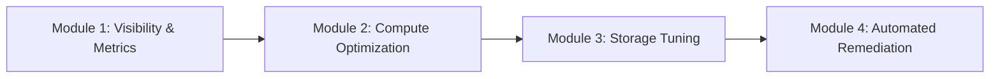
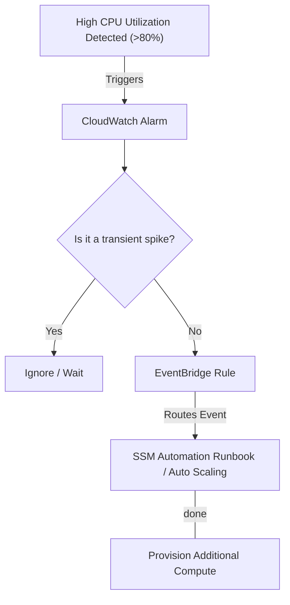

# AWS Compute Optimization & Performance Remediation

Welcome to the curriculum overview for optimizing compute resources and remediating performance problems using AWS tools. This guide outlines the structured learning path to master performance metrics, resource tagging, and automated remediation on AWS, strictly aligned with the AWS Certified CloudOps / SysOps Administrator (SOA-C03) domains.

## Prerequisites

Before diving into this curriculum, learners must possess a foundational understanding of core AWS services and cloud computing principles. 

* **AWS Console & CLI Fluency:** Ability to navigate the AWS Management Console and execute basic programmatic commands using the AWS CLI.
* **Core Service Knowledge:** Familiarity with deploying and managing Amazon EC2, Amazon S3, and Amazon EBS.
* **Basic Networking:** Understanding of VPCs, subnets, and routing concepts.
* **Well-Architected Framework:** Awareness of the six pillars, specifically the *Cost Optimization* and *Performance Efficiency* pillars.
* **IAM Principles:** Understanding of the principle of least privilege and role-based access control.

> [!IMPORTANT]
> If you are unfamiliar with the AWS CLI, please review JMESPath syntax for filtering JSON output, as it is heavily utilized in operational automation.

## Module Breakdown

This curriculum is divided into four progressively complex modules, transitioning from foundational visibility to advanced automated remediation.



| Module | Title | Difficulty | Core AWS Tools | Estimated Time |
| :--- | :--- | :--- | :--- | :--- |
| **1** | Visibility, Tagging, & Metrics | Beginner | CloudWatch, Resource Tags, Cost Explorer | 2 Weeks |
| **2** | Compute Rightsizing & Optimization | Intermediate | EC2, Compute Optimizer, Trusted Advisor | 2 Weeks |
| **3** | Storage Performance Tuning | Intermediate | EBS, S3, EFS | 2 Weeks |
| **4** | Automated Remediation & Scaling | Advanced | EventBridge, Systems Manager (SSM), Lambda | 3 Weeks |

## Learning Objectives per Module

### Module 1: Visibility, Tagging, & Metrics
* **Implement Cost Allocation Tags:** Design and enforce a tagging strategy to categorize and track AWS costs across different environments and teams.
* **Analyze CloudWatch Metrics:** Interpret default and custom metrics for EC2, EBS, and S3. 
* **Configure CloudWatch Agent:** Install and configure the CloudWatch agent to collect OS-level metrics (e.g., Memory Utilization, which is *not* collected by default).

### Module 2: Compute Rightsizing & Optimization
* **Utilize AWS Compute Optimizer:** Differentiate between the default (14-day lookback) and Enhanced Infrastructure Metrics (3-month lookback) versions to generate EC2 rightsizing recommendations.
* **Assess Workloads for Spot Instances:** Identify flexible, stateless workloads that qualify for EC2 Spot Instances to achieve significant cost savings.
* **Implement EC2 Auto Scaling:** Configure dynamic, scheduled, and predictive scaling strategies based on real-time performance metrics.

### Module 3: Storage Performance Tuning
* **Analyze EBS Performance:** Troubleshoot IOPS and throughput bottlenecks, and seamlessly modify EBS volume types to increase performance efficiency.
* **Optimize S3 Access Patterns:** Implement S3 Transfer Acceleration, multi-part uploads, and AWS DataSync to enhance data transfer speeds.
* **Evaluate Shared Storage:** Select and optimize Amazon EFS and Amazon FSx solutions for specific multi-instance use cases.

### Module 4: Automated Remediation & Scaling
* **Configure Event-Driven Remediation:** Use Amazon EventBridge rules to detect state changes or CloudWatch Alarm triggers.
* **Execute SSM Automation Runbooks:** Create and run predefined or custom AWS Systems Manager runbooks to automatically resolve configuration or performance issues.
* **Manage Incident Responses:** Integrate AWS Health events with external notification systems (like Slack or PagerDuty) via EventBridge.

### Optimization Features Comparison Table

| Feature / Service | Free Tier / Default Capability | Paid / Enhanced Capability |
| :--- | :--- | :--- |
| **Compute Optimizer** | 14-day metric lookback, max 3 recommendations | 3-month lookback ($0.000336/hr per resource) |
| **CloudWatch EC2 Metrics** | Basic hypervisor metrics (CPU, Disk I/O, Network) | OS-level metrics via CloudWatch Agent (Memory, Disk Space) |
| **AWS Trusted Advisor** | Core security & basic checks | Full suite of cost, performance, and fault tolerance checks |

## Success Metrics

How will you know you have mastered this curriculum? You should be able to confidently check off the following capabilities:

- [ ] **Metric Interpretation:** You can look at a 14-day CloudWatch CPU and Memory graph and definitively recommend whether to downsize, upsize, or change the instance family.
- [ ] **Cost Reduction:** You can identify at least three underutilized or orphaned resources in an AWS account using Trusted Advisor and Cost Explorer.
- [ ] **Storage Resolution:** Given an application experiencing high latency, you can successfully determine if the EBS volume has depleted its burst balance and upgrade the volume type without downtime.
- [ ] **Automation Creation:** You can write an EventBridge rule that detects a specific operational failure and automatically triggers an SSM runbook to restart the associated service.

## Real-World Application

In a production cloud environment, performance and cost are constantly at odds. Engineers must continually balance the two to avoid wasting money on over-provisioned infrastructure while ensuring systems don't crash under load.

### Scenario: The Black Friday Traffic Spike
Imagine an e-commerce platform approaching a major sale event. Without optimization, the company might just deploy massive EC2 instances 24/7 to handle the load, wasting thousands of dollars.

Using the skills from this curriculum, an engineer would:
1. Use **Compute Optimizer** to rightsize the baseline fleet.
2. Implement **Auto Scaling Groups (ASGs)** tied to **CloudWatch** CPU and Request Count metrics to scale out only when traffic surges.
3. Create an **EventBridge -> SSM Automation** workflow to automatically replace any instances that fail their EC2 status checks during the peak load.



### Cost vs. Performance Tradeoff Curve

Understanding where to position your workloads on the efficiency curve is the core theme of this curriculum.

```tikz
\begin{tikzpicture}[scale=1.2]
\draw[<->, thick] (0,4) node[above] {Performance (IOPS / CPU)} -- (0,0) -- (5,0) node[right] {Cost (\$)};

\draw[thick, blue] (0,0.5) to[out=20,in=250] (4,3.5);

\node[circle, fill=red, inner sep=1.5pt] at (2.2, 1.4) {};
\node[right, font=\small] at (2.3, 1.2) {Optimized (Rightsized)};

\node[circle, fill=gray, inner sep=1.5pt] at (3.8, 3.1) {};
\node[left, font=\small] at (3.7, 3.3) {Over-provisioned};

\node[circle, fill=gray, inner sep=1.5pt] at (0.8, 0.7) {};
\node[right, font=\small] at (0.9, 0.6) {Under-provisioned (Risky)};

\draw[dashed] (2.2,0) -- (2.2,1.4);
\draw[dashed] (0,1.4) -- (2.2,1.4);
\end{tikzpicture}
```

By mastering AWS tagging, metrics, and automation tools, you will transition from merely keeping systems running to actively engineering highly efficient, self-healing cloud architectures.