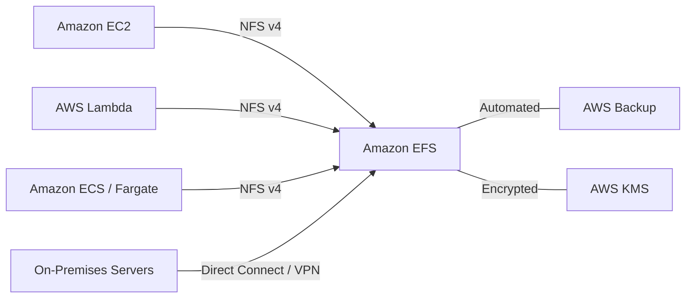
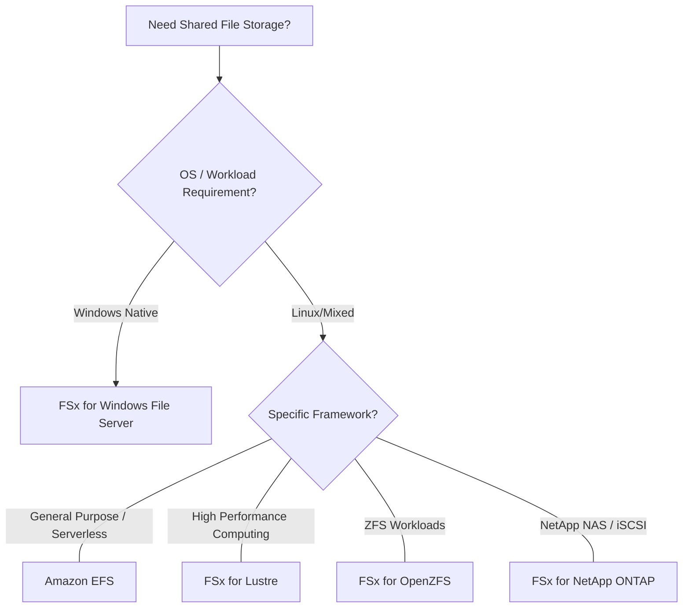

# AWS Shared Storage Solutions: EFS & FSx Curriculum Overview

This curriculum overview is designed for aspiring CloudOps Engineers and SysOps Administrators preparing for the SOA-C02/SOA-C03 exams. It focuses specifically on the critical skills required to evaluate, select, and optimize shared storage solutions in AWS, including Amazon Elastic File System (Amazon EFS) and the Amazon FSx family.

---

## Prerequisites

Before diving into this curriculum, learners must possess a foundational understanding of the following concepts:

*   **AWS Compute Fundamentals:** Familiarity with Amazon EC2, Amazon ECS, AWS Fargate, Amazon EKS, and AWS Lambda.
*   **Basic Storage Concepts:** Understanding the difference between block storage (EBS), object storage (S3), and file storage.
*   **Networking Basics:** Knowledge of Virtual Private Clouds (VPCs), subnets, and security groups.
*   **File System Protocols:** High-level familiarity with NFS (Network File System), SMB (Server Message Block), and basic Linux/Windows OS administration.

> [!IMPORTANT] 
> This curriculum aligns directly with **Skill 1.3.4** of the AWS Certified CloudOps Engineer Associate (SOA-C03) Exam Guide: *Evaluate and select shared storage solutions (for example, Amazon Elastic File System [Amazon EFS], Amazon FSx), and optimize the solutions (for example, EFS lifecycle policies) for specific use cases and requirements.*

---

## Module Breakdown

This curriculum is structured to take you from foundational understanding to advanced architectural decision-making.

| Module | Title | Difficulty | Core Focus |
| :--- | :--- | :--- | :--- |
| **Module 1** | Introduction to Amazon EFS | ⭐ | EFS architecture, mounting via NFS v4, EC2/Serverless integration. |
| **Module 2** | The Amazon FSx Ecosystem | ⭐⭐ | Differentiating FSx for Lustre, OpenZFS, Windows File Server, and NetApp ONTAP. |
| **Module 3** | Evaluating & Selecting Storage | ⭐⭐⭐ | Workload matching, performance requirements, and hybrid-storage configurations. |
| **Module 4** | Performance & Cost Optimization | ⭐⭐⭐ | EFS Lifecycle Policies, storage classes (Standard vs. One Zone), throughput scaling. |
| **Module 5** | Data Management & Fault Tolerance | ⭐⭐⭐⭐ | Integration with AWS Backup, KMS encryption, and multi-AZ architectures. |

### EFS Architecture Overview

To understand the scope of Module 1, review the following diagram showing how EFS integrates seamlessly with multiple compute environments simultaneously:

---

## Learning Objectives per Module

By completing this curriculum, you will master the following objectives:

**Module 1: Introduction to Amazon EFS**
*   Provision a serverless, elastic file system that scales to petabytes automatically.
*   Connect thousands of concurrent Amazon EC2 instances to EFS with strong consistency and file-locking.
*   Differentiate between EFS Standard and EFS One Zone storage classes.

**Module 2: The Amazon FSx Ecosystem**
*   Identify the four distinct Amazon FSx offerings and their underlying technologies.
*   Deploy fully managed file systems that offer sub-millisecond latencies.
*   Configure hybrid-enabled approaches by allowing on-premises access to FSx file systems.

**Module 3: Evaluating & Selecting Storage**
*   Map specific workload requirements (e.g., Big Data, web serving, HPC) to the correct shared storage service.
*   Use SMB, NFS, or iSCSI protocols appropriately based on the chosen FSx backend.

**Module 4: Performance & Cost Optimization**
*   Design EFS Lifecycle Policies to transition infrequently accessed data to cooler, cost-effective storage tiers.
*   Calculate cost-to-performance ratios using basic formulas like $Cost_{total} = (Storage_{hot} \times Rate_{hot}) + (Storage_{cold} \times Rate_{cold})$.

**Module 5: Data Management & Fault Tolerance**
*   Automate backup operations using AWS Backup without degrading file system performance.
*   Ensure data security by implementing automatic encryption at rest and in transit via AWS KMS.

### Storage Selection Decision Tree

Module 3 culminates in mastering the architectural decision process. The diagram below illustrates the foundational logic you will learn to apply:

---

## Success Metrics

How will you know you have successfully mastered this curriculum? 

1.  **Exam Readiness:** You can consistently score 90%+ on SOA-C03 practice questions related to Skill 1.3.4 (Storage optimization and selection).
2.  **Architectural Fluency:** Given a hypothetical enterprise scenario (e.g., "We are migrating a Linux-based Big Data analytics application with petabytes of data"), you can immediately identify the optimal solution (e.g., *Amazon EFS* or *FSx for Lustre*) and defend your choice.
3.  **Hands-On Validation:** You have successfully completed AWS documentation walkthroughs, including:
    *   Creating an EFS file system and mounting it to two separate EC2 instances.
    *   Configuring an AWS Backup plan that successfully executes a sub-seven-day backup of an active EFS file system.
    *   Setting up an EFS Lifecycle Policy to move files to EFS Infrequent Access (IA) after 30 days.

> [!TIP] 
> **Study Metric:** AWS Backup typically handles $100 \text{ MB/s}$ for large files and $500 \text{ files/s}$ for smaller files. A key success metric is being able to mathematically estimate backup windows for diverse datasets.

---

## Real-World Application

Understanding how to evaluate and optimize shared storage is not just an exam requirement—it is a critical day-to-day function of a Cloud Architect or SysOps Administrator.

*   **Cost Control in the Enterprise:** Without lifecycle policies, enterprise shared storage costs can spiral out of control. Moving 80% of an organization's unused files to EFS Infrequent Access via a simple lifecycle rule can reduce storage bills by up to 92%. 
*   **High-Performance Computing (HPC):** In industries like genomics research, financial modeling, or video rendering, standard file systems create bottlenecks. Knowing when to deploy **Amazon FSx for Lustre** ensures compute clusters aren't left idle waiting for data, saving massive amounts of EC2 compute costs.
*   **Hybrid Cloud Migrations:** Many enterprises are locked into legacy NetApp or ZFS appliances. By leveraging **FSx for NetApp ONTAP** or **FSx for OpenZFS**, SysOps Administrators can seamlessly bridge on-premises data centers with the AWS Cloud, enabling phased migrations without rewriting application code or abandoning familiar administrative tools.

<strong>Click to expand: The SysOps Sandbox Challenge</strong>

Before taking your certification exam, build this in your sandbox account:
1. Provision an **EFS File System** (Standard storage).
2. Launch two **EC2 Linux instances** in different Availability Zones.
3. Mount the EFS volume to both instances.
4. Write a file from Instance A and read it immediately from Instance B to prove strong consistency.
5. Enable **AWS Backup** for the EFS volume and run an on-demand job.

*Remember to tear down your resources to avoid unexpected charges!*

