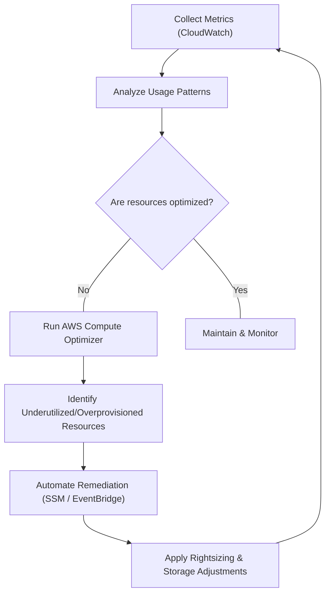

# Curriculum Overview: Optimize Compute Resources & Remediate Performance

Welcome to the curriculum overview for optimizing AWS compute resources and remediating performance issues. This guide is aligned with the AWS Certified CloudOps Engineer / SysOps Administrator Associate (SOA-C03) standards, specifically focusing on Cloud Financial Management and Resource Performance Optimization.

## Prerequisites

Before diving into this curriculum, learners must possess a foundational understanding of core AWS services and operational best practices. 

* **AWS Compute Fundamentals:** Working knowledge of Amazon EC2 (instances, Auto Scaling Groups, AMIs) and AWS Lambda.
* **Storage Basics:** Familiarity with Amazon EBS volume types and Amazon S3 storage classes.
* **Observability Concepts:** Basic understanding of Amazon CloudWatch (metrics, alarms, dashboards) and AWS CloudTrail.
* **AWS Management Tools:** Proficiency with the AWS Management Console and the AWS CLI (including querying JSON output with JMESPath).

> [!IMPORTANT]
> **CloudWatch Agent Requirement:** To fully grasp compute memory optimization, you must understand that EC2 memory utilization is *not* captured by default. It requires the installation and configuration of the CloudWatch agent on the guest OS.

## Module Breakdown

This curriculum is divided into five progressive modules, moving from foundational monitoring concepts to advanced automated remediation and financial optimization.

| Module | Title | Difficulty | Core Services | Estimated Time |
| :--- | :--- | :--- | :--- | :--- |
| **1** | Observability & Tagging Foundations | Beginner | CloudWatch, Resource Groups | 2 Hours |
| **2** | Analyzing Compute Metrics | Intermediate | Compute Optimizer, EC2, Lambda | 3 Hours |
| **3** | Storage & Database Optimization | Intermediate | EBS, S3, RDS Performance Insights | 3 Hours |
| **4** | Automated Remediation | Advanced | EventBridge, Systems Manager (SSM) | 4 Hours |
| **5** | Cloud Financial Management | Advanced | Cost Explorer, Trusted Advisor, Budgets | 2 Hours |

## Module Objectives

### Module 1: Observability & Tagging Foundations
* Apply **Cost Allocation Tags** to categorize and track AWS costs accurately.
* Implement custom CloudWatch metrics and namespaces to capture application-level performance.
* Create multi-account and cross-region CloudWatch Dashboards to gain global visibility.

### Module 2: Analyzing Compute Metrics
* Evaluate workloads using **AWS Compute Optimizer** to identify rightsizing opportunities.
* Differentiate between default (14-day) and Enhanced Infrastructure Metrics (3-month) in Compute Optimizer.
* Assess resource usage patterns to qualify compute workloads for EC2 Spot Instances and Savings Plans.

### Module 3: Storage & Database Optimization
* Analyze Amazon EBS performance metrics (IOPS, throughput) and troubleshoot bottlenecks.
* Optimize Amazon S3 performance using S3 Transfer Acceleration, multipart uploads, and lifecycle policies.
* Monitor Amazon RDS metrics using Performance Insights to modify configurations for peak efficiency.

### Module 4: Automated Remediation
* Configure **Amazon EventBridge** rules to route system events (e.g., high CPU utilization) to remediation targets.
* Run predefined and custom **AWS Systems Manager (SSM) Automation runbooks** to fix configuration issues.
* Implement automated instance recovery and auto-scaling policies triggered by CloudWatch alarms.

### Module 5: Cloud Financial Management
* Identify and remediate underutilized resources using AWS Trusted Advisor and AWS Cost Explorer.
* Set up AWS Budgets and Cost Anomaly Detection to proactively prevent budget overruns.

## Visual Anchors

### The Optimization Lifecycle Flowchart

The following diagram illustrates the continuous lifecycle of monitoring, analyzing, and optimizing compute resources in AWS.



### The Cost vs. Performance Trade-off

Optimization is about finding the "sweet spot" between high performance (low latency) and low cost. Over-provisioning increases costs unnecessarily, while under-provisioning degrades performance.

```tikz
\begin{tikzpicture}
  % Axes
  \draw[<->, thick] (0,4) node[above] {Cost / Latency} -- (0,0) -- (5,0) node[right] {Compute Provisioning};
  
  % Curves
  \draw[thick, blue, domain=0.4:4.5] plot (\x, {1.5/\x}); % Latency/Performance issue curve
  \draw[thick, red, domain=0:4.5] plot (\x, {0.8*\x}); % Cost curve
  
  % Labels
  \node[blue, right] at (4.5, 0.4) {Application Latency};
  \node[red, right] at (4.5, 3.6) {Infrastructure Cost};
  
  % Sweet Spot
  \filldraw[black] (1.37, 1.1) circle (2pt);
  \draw[dashed] (1.37, 0) -- (1.37, 4);
  \node[above right] at (1.37, 1.1) {Rightsizing Sweet Spot};
\end{tikzpicture}
```

## Success Metrics

How will you know you have mastered this curriculum? You should be able to consistently demonstrate the following in a live or simulated AWS environment:

1. **Diagnostic Accuracy:** Successfully identify the root cause of an EC2 or EBS performance bottleneck within 5 minutes using CloudWatch metrics and Compute Optimizer recommendations.
2. **Financial Efficiency:** Demonstrate the ability to reduce a simulated monthly AWS bill by at least 15% through rightsizing, terminating idle resources, and recommending Spot Instances where applicable.
3. **Automation Readiness:** Write and successfully deploy an EventBridge rule that triggers an SSM Automation runbook to automatically restart an unresponsive EC2 instance.
4. **Data Interpretation:** Correctly extract, query, and interpret JMESPath filtered JSON output from the AWS CLI regarding resource tags and CloudWatch alarm states.

## Formula / Concept Box

To effectively track optimization, keep these foundational formulas and configurations in mind:

$$ \text{Optimization Savings} = (\text{Current Hourly Cost} - \text{Rightsized Hourly Cost}) \times 730 \text{ hours} $$

| Tool | Primary Purpose | Cost |
| :--- | :--- | :--- |
| **CloudWatch Metrics** | Real-time monitoring of resource utilization. | Free tier available; custom metrics billed. |
| **Compute Optimizer** | Rightsizing recommendations (EC2, ASG, EBS, Lambda). | Default (14 days) is Free. Enhanced (3 months) is Paid. |
| **Trusted Advisor** | Best practices checklist (Cost, Performance, Security). | Basic is Free; Full checks require Business Support. |
| **Cost Explorer** | Visualizing and forecasting AWS spending patterns. | Free to view; API access is billed. |

## Real-World Application

In an enterprise cloud environment, **resource sprawl** and **over-provisioning** are two of the most significant sources of wasted capital. Engineers often provision massive EC2 instances "just to be safe" during initial launches.

Imagine you are a CloudOps Engineer for an e-commerce platform. Following a major holiday sale, you notice your AWS bill has doubled, yet CloudWatch metrics indicate that CPU utilization across your fleet never exceeded 15%. 

By applying the skills from this curriculum, you will use **AWS Compute Optimizer** to identify exactly which instances can be downgraded to smaller families (e.g., moving from `c5.2xlarge` to `c5.large`), use **AWS Cost Explorer** to quantify the savings, and implement **Cost Allocation Tags** to attribute the remaining infrastructure costs to specific development teams. This not only remediates the performance-to-cost ratio but ensures your cloud infrastructure remains lean, highly available, and aligned with the AWS Well-Architected Framework's Cost Optimization pillar.