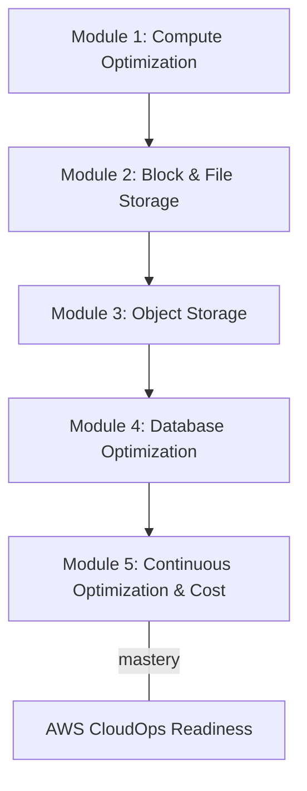
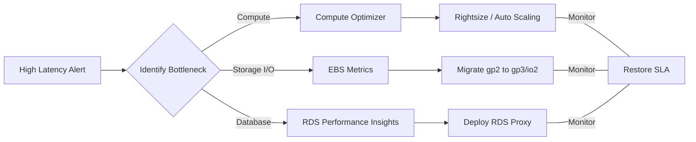

## Prerequisites

Before diving into the performance optimization strategies for AWS compute, storage, and database resources, learners must have a solid foundational understanding of cloud operations. Ensure you meet the following prerequisites to maximize your success in this curriculum:

*   **AWS Cloud Practitioner Knowledge:** Familiarity with the AWS Global Infrastructure, basic cloud concepts, and the AWS Shared Responsibility Model.
*   **Core Services Experience:** Hands-on experience provisioning Amazon EC2 instances, creating S3 buckets, and deploying basic Amazon RDS databases.
*   **Networking Fundamentals:** Understanding of VPCs, subnets, route tables, and security groups.
*   **CLI & Console Proficiency:** Ability to navigate the AWS Management Console and execute basic commands using the AWS Command Line Interface (CLI).
*   **Basic Monitoring Concepts:** Introductory knowledge of Amazon CloudWatch metrics, logs, and alarms.

> [!IMPORTANT]
> If you are unfamiliar with reading performance metrics such as CPU Utilization, Disk Read/Write Operations, or Network In/Out, we highly recommend reviewing foundational AWS monitoring concepts before starting Module 1.

---

## Module Breakdown

This curriculum is designed to progressively build your expertise in identifying bottlenecks and implementing optimizations across the three pillars of AWS workloads: Compute, Storage, and Databases. 

| Module | Topic | Difficulty | Estimated Time |
| :--- | :--- | :--- | :--- |
| **Module 1** | EC2 & Compute Optimization | Intermediate | 3 Hours |
| **Module 2** | Block & Shared File Storage (EBS, EFS, FSx) | Intermediate | 4 Hours |
| **Module 3** | Object Storage & Data Transfer (S3) | Intermediate | 3 Hours |
| **Module 4** | Relational Database Optimization (RDS) | Advanced | 4 Hours |
| **Module 5** | Continuous Optimization & Cost | Advanced | 2 Hours |

---

## Learning Objectives per Module

### Module 1: Compute Optimization
*   **Analyze compute metrics:** Identify rightsizing opportunities by interpreting CloudWatch metrics and using **AWS Compute Optimizer**.
*   **Remediate performance problems:** Transition workloads to appropriate instance families (e.g., from General Purpose to Compute Optimized).
*   **Optimize networking & placement:** Implement EC2 placement groups (Cluster, Partition, Spread) to reduce network latency and enable enhanced networking capabilities like the Elastic Network Adapter (ENA).

### Module 2: Block & Shared File Storage (EBS, EFS, FSx)
*   **Troubleshoot EBS IOPS issues:** Monitor Amazon EBS performance metrics and calculate IOPS limits. 
    *   *Formula for gp2 baseline IOPS:* $$IOPS = \text{Volume Size in GB} \times 3$$
*   **Optimize Volume Types:** Transition between `gp2`, `gp3`, `io1`, and `io2` based on workload requirements to improve performance and reduce cost.
*   **Evaluate Shared Storage:** Select and optimize Amazon EFS and Amazon FSx based on specific throughput and access patterns, utilizing EFS lifecycle policies for cost efficiency.

### Module 3: Object Storage & Data Transfer (S3)
*   **Accelerate Data Transfer:** Implement **S3 Transfer Acceleration**, AWS DataSync, and multipart uploads to maximize throughput for large datasets.
*   **Enhance Storage Efficiency:** Design S3 Lifecycle policies to automatically transition data to appropriate storage classes (e.g., Standard-IA, Glacier) without degrading access performance for hot data.

### Module 4: Database Optimization (RDS)
*   **Monitor RDS Metrics:** Utilize **Amazon RDS Performance Insights** and CloudWatch alarms to identify slow queries and database load bottlenecks.
*   **Increase Performance Efficiency:** Apply proactive recommendations, configure Read Replicas to offload read traffic, and implement **RDS Proxy** to manage unpredictable spikes in database connections.

### Module 5: Continuous Optimization & Cost
*   **Align Performance with Cost:** Use AWS Cost Explorer and Cost Anomaly Detection to ensure that performance tuning does not lead to unchecked spending.
*   **Automate Remediation:** Run custom and predefined Systems Manager Automation runbooks to automate tuning tasks.

---

## Success Metrics

How will you know you have mastered this curriculum? You should be able to consistently achieve the following benchmarks:

*   [ ] **Metric Analysis Proficiency:** Successfully interpret a CloudWatch dashboard showing degraded application performance and accurately identify whether the bottleneck is CPU, Disk I/O, or Database Connections.
*   [ ] **Rightsizing Execution:** Use AWS Compute Optimizer to recommend changes for at least 5 simulated over-provisioned or under-provisioned resources.
*   [ ] **Storage Optimization:** Convert a standard S3 bucket into an optimized lifecycle-managed bucket and upgrade an EBS `gp2` volume to `gp3` while tuning IOPS and throughput independently.
*   [ ] **Database Tuning:** Successfully configure an RDS Proxy and demonstrate a reduction in database connection overhead during a load-testing simulation.
*   [ ] **Exam Readiness:** Score 85% or higher on the performance optimization domain questions for the AWS Certified SysOps Administrator/CloudOps Engineer (SOA-C03) practice exams.

---

## Real-World Application

In a professional CloudOps or SysOps engineering role, performance optimization is rarely a one-time task; it is a continuous cycle of monitoring, tuning, and cost-management. 

Consider a scenario where an e-commerce platform experiences severe latency during a holiday flash sale. By applying the skills from this curriculum, you will be able to execute the following operational flow:

### The Business Impact
1.  **Cost Reduction:** Moving a 1,000 GB `gp2` volume to `gp3` can reduce storage costs by up to 20% while allowing you to provision IOPS and throughput independently of storage capacity.
2.  **Reliability & Customer Trust:** Implementing RDS Proxy ensures that sudden bursts of traffic do not overwhelm your database connections, preventing downtime and lost revenue.
3.  **Operational Excellence:** Leveraging Systems Manager Automation runbooks transforms manual, error-prone tuning steps into consistent, repeatable, and scalable operations.

> [!TIP]
> Always remember the AWS Well-Architected Framework: Performance efficiency isn't just about making things faster; it's about using computing resources efficiently to meet system requirements, and maintaining that efficiency as demand changes and technologies evolve.