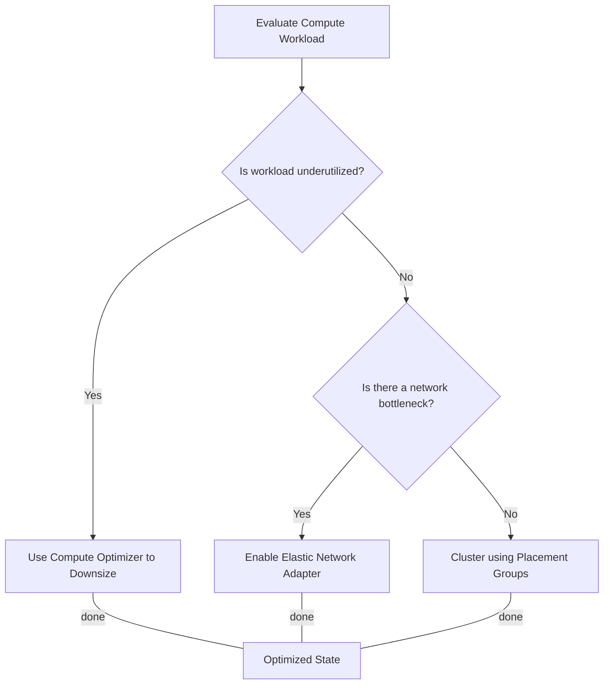

# Curriculum Overview: AWS Performance Optimization Strategies

> [!NOTE]
> This curriculum maps directly to the AWS Certified SysOps Administrator/CloudOps Engineer (SOA-C03) Exam Guide, specifically **Task 1.3: Implement performance optimization strategies for compute, storage, and database resources**.

## Prerequisites

Before diving into performance optimization, learners must possess a foundational understanding of AWS infrastructure and operational tools. 

*   **AWS Core Services Knowledge:** Familiarity with configuring and deploying core services such as Amazon EC2, Amazon S3, Amazon RDS, and Amazon VPC.
*   **Monitoring Fundamentals:** Basic understanding of AWS CloudWatch, including how to read standard metrics (CPU utilization, IOPS, Network In/Out) and configure basic alarms.
*   **Command Line & Console Proficiency:** Ability to navigate the AWS Management Console and execute standard commands using the AWS Command Line Interface (CLI).
*   **Basic Cloud Economics:** Understanding of OpEx (Operational Expenditure) billing models and the fundamental differences between On-Demand, Reserved, and Spot pricing.

## Module Breakdown

This curriculum is divided into four progressive modules, transitioning from foundational compute components to complex database and shared storage architectures.

| Module | Title | Primary AWS Services | Difficulty Progression |
| :--- | :--- | :--- | :--- |
| **Module 1** | **Compute Rightsizing & Tuning** | EC2, Compute Optimizer, Auto Scaling | Beginner 🟢 |
| **Module 2** | **Block & Object Storage Optimization** | EBS, S3, DataSync, S3 Transfer Acceleration | Intermediate 🟡 |
| **Module 3** | **Shared File Systems Optimization** | EFS, FSx, EFS Lifecycle Policies | Intermediate 🟡 |
| **Module 4** | **Database Performance Management** | RDS, Performance Insights, RDS Proxy | Advanced 🔴 |

## Learning Objectives per Module

### Module 1: Compute Rightsizing & Tuning
*   **Analyze EC2 Metrics:** Identify bottlenecks using CloudWatch metrics and resolve performance problems utilizing resource tags and AWS tools.
*   **Implement AWS Compute Optimizer:** Utilize machine learning-backed recommendations to rightsize instances (e.g., downsizing from an over-provisioned `m5.large` to a `t3.medium`).
*   **Optimize Networking and Placement:** Configure Enhanced Networking via the Elastic Network Adapter (ENA) and utilize EC2 Placement Groups to minimize inter-node latency.



### Module 2: Block & Object Storage Optimization
*   **Tune Amazon EBS Volumes:** Analyze EBS performance metrics. Optimize volume types to match the workload (e.g., migrating from `gp2` to `gp3` to independently scale IOPS and throughput, saving costs).
*   **Enhance S3 Data Transfer:** Implement S3 Transfer Acceleration and multipart uploads for large file ingestion.
*   **Manage S3 Lifecycles:** Configure S3 Lifecycle policies to automatically transition infrequently accessed data to cooler storage tiers (e.g., S3 Standard to S3 Glacier).

### Module 3: Shared File Systems Optimization
*   **Evaluate File Storage Solutions:** Differentiate between Amazon EFS and Amazon FSx to select the optimal shared storage for specific use cases (e.g., FSx for Windows File Server for legacy .NET apps).
*   **Apply EFS Lifecycle Policies:** Configure EFS to transition files that haven't been accessed in 30 days to the EFS Infrequent Access (EFS IA) storage class to reduce costs by up to 92%.

### Module 4: Database Performance Management
*   **Monitor RDS Metrics:** Set up CloudWatch alarms for critical RDS metrics like `DiskQueueDepth` and `FreeableMemory`.
*   **Utilize RDS Performance Insights:** Analyze database load and identify expensive SQL queries using Performance Insights proactive recommendations.
*   **Implement RDS Proxy:** Configure Amazon RDS Proxy to pool and share database connections, preventing connection exhaustion during application traffic spikes.

## Success Metrics

To ensure mastery of the curriculum, learners will be evaluated against the following performance benchmarks:

1.  **Metric Interpretation:** Successfully identify the root cause of a simulated performance bottleneck within 5 minutes using CloudWatch and Performance Insights.
2.  **Rightsizing Execution:** Given an over-provisioned AWS environment, reduce monthly projected spend by at least 15% without violating the workload's minimum CPU/RAM requirements.
3.  **Storage Throughput Calculation:** Accurately calculate and provision the necessary IOPS and throughput for a high-transaction database workload. 
    
    *A foundational formula utilized in these calculations is:*
    $$ \text{IOPS} = \frac{\text{Throughput (Bytes per second)}}{\text{I/O Request Size (Bytes)}} $$

4.  **Architectural Validation:** Successfully deploy an auto-scaling, highly available web application connected to an RDS database via RDS Proxy, demonstrating zero downtime during a simulated traffic surge.

```tikz
\begin{tikzpicture}[scale=1.2]
  % Axes
  \draw[->, thick] (0,0) -- (6,0) node[right] {\mbox{Time (Days)}};
  \draw[->, thick] (0,0) -- (0,4) node[above] {\mbox{Utilization / Cost}};
  
  % Over-provisioned threshold
  \draw[dashed, red, thick] (0,3) -- (6,3) node[right] {\mbox{Static Provisioning (Waste)}};
  
  % Optimized/Elastic provisioning
  \draw[dashed, green!60!black, thick] (0,1.5) -- (6,1.5) node[right] {\mbox{Rightsized Baseline}};
  
  % Actual workload curve
  \draw[thick, blue] (0,0.5) to[out=20,in=180] (1.5,1.2) to[out=0,in=180] (3,2.8) to[out=0,in=180] (4.5,1.0) to[out=0,in=180] (6,1.8);
  
  % Labels
  \node[blue] at (3,3.1) {\mbox{Traffic Spike}};
  \node[align=center] at (3,-0.7) {\mbox{Rightsizing minimizes the gap between}\\\mbox{provisioned capacity and actual workload. }};
\end{tikzpicture}
```

## Real-World Application

> [!IMPORTANT] 
> **Why this matters:** In the modern enterprise, "cloud waste" is a multi-billion dollar problem. The skills developed in this curriculum form the backbone of **Cloud Financial Management (FinOps)** and **Site Reliability Engineering (SRE)**.

### Career Impact
Cloud engineers and SysOps administrators are rarely tasked *only* with keeping systems online; they are expected to make systems run efficiently. 

### Concrete Example: The E-Commerce Black Friday Event
Consider an e-commerce platform anticipating a massive traffic spike.
*   **Without Optimization:** The engineering team statically provisions massive `r5.24xlarge` database instances and oversized `io2` EBS volumes year-round, resulting in hundreds of thousands of dollars in wasted operational expenditure.
*   **With Optimization (Curriculum Applied):** The SysOps Administrator uses **RDS Proxy** to handle connection pooling during the traffic spike, utilizes **Compute Optimizer** to scale application servers elastically, and sets **S3 Lifecycle Policies** to automatically archive old transaction logs to Glacier. The platform stays online during the surge, and the monthly AWS bill drops by 40%.

Mastering these optimization strategies transforms you from a system maintainer into a strategic asset who directly influences a company's profit margins and operational reliability.