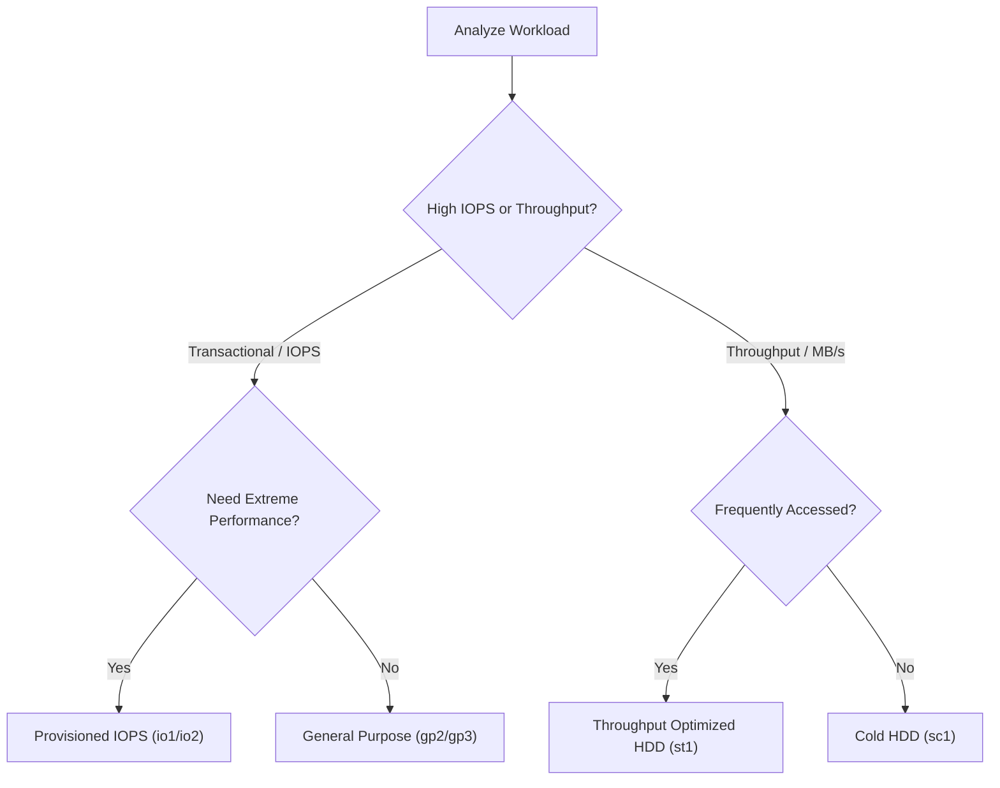

# Curriculum Overview: Amazon EBS Performance, Troubleshooting, and Optimization

Welcome to the comprehensive curriculum for analyzing, troubleshooting, and optimizing Amazon Elastic Block Store (Amazon EBS). This course track aligns with the AWS Certified SysOps Administrator - Associate (SOA-C03) exam objectives (Task 1.3.2) and focuses on ensuring block storage architectures are performant, reliable, and cost-effective.

---

## Prerequisites

Before diving into EBS performance tuning and troubleshooting, learners must have a foundational understanding of the following concepts:

*   **Cloud Computing Basics:** Familiarity with the AWS Well-Architected Framework, specifically the Performance Efficiency and Cost Optimization pillars.
*   **Amazon EC2 Fundamentals:** Understanding of the EC2 instance lifecycle, how instances attach to storage, and basic network traffic concepts.
*   **Storage Paradigms:** Knowledge of raw, unformatted block storage versus file and object storage, and why block storage is preferred for databases and boot volumes.
*   **AWS Management Tools:** Basic proficiency navigating the AWS Management Console and utilizing the AWS CLI for querying resources.

---

## Module Breakdown

This curriculum is structured into four progressive modules, transitioning from foundational block storage concepts to advanced troubleshooting and optimization techniques.

| Module | Title | Difficulty | Core Focus |
| :--- | :--- | :--- | :--- |
| **Module 1** | EBS Architecture & Volume Types | Beginner | Storage classes, IOPS vs. Throughput, Pricing models |
| **Module 2** | Monitoring EBS with CloudWatch | Intermediate | Key metrics (`BurstBalance`, `VolumeQueueLength`) |
| **Module 3** | Troubleshooting Performance Issues | Advanced | Identifying bottlenecks, network contention, and snapshot latency |
| **Module 4** | Cost & Performance Optimization | Advanced | Rightsizing, EBS-Optimized instances, Fast Snapshot Restore |

> [!NOTE] 
> The modules are designed to be taken sequentially, as the optimization techniques in Module 4 heavily rely on the metric analysis skills developed in Module 2.

---

## Learning Objectives per Module

### Module 1: EBS Architecture & Volume Types
*   Differentiate between the eight different Amazon EBS volume types (e.g., `gp2`, `gp3`, `io1`, `io2`, `st1`, `sc1`).
*   Identify workload characteristics to determine if an application is transaction-intensive (requires high IOPS) or throughput-intensive (requires high MB/s).
*   Evaluate the pricing models associated with storage size versus provisioned performance.

### Module 2: Monitoring EBS with CloudWatch
*   Define and track critical EBS CloudWatch metrics, including `VolumeReadBytes`, `VolumeWriteBytes`, `VolumeReadOps`, and `VolumeWriteOps`.
*   Analyze `VolumeQueueLength` to determine the number of pending I/O requests and assess host-to-EBS network link health.
*   Monitor `BurstBalance` for `gp2`, `st1`, and `sc1` volumes to predict and alert on performance throttling.

<details>
<summary>Click to expand: Deeper Dive into Burst Balance</summary>
Certain volume types operate on a burst bucket model. They accrue I/O credits when idle and consume them during heavy traffic. If the `BurstBalance` metric reaches 0%, the volume is throttled to its baseline performance level, causing significant application latency.
</details>

### Module 3: Troubleshooting Performance Issues
*   Diagnose I/O bottlenecks by correlating `VolumeQueueLength` with operating system-level metrics.
*   Identify the "latency penalty" associated with initializing volumes from EBS Snapshots.
*   Distinguish between EBS volume limits and EC2 instance-level bandwidth limits.

### Module 4: Cost & Performance Optimization
*   Enable and configure EBS-optimization on supported Amazon EC2 instances to separate storage traffic from standard network traffic.
*   Implement Fast Snapshot Restore (FSR) to bypass initialization latency for critical recovery operations.
*   Rightsize volume I/O and capacity based on historical CloudWatch data to eliminate over-provisioning.

---

## Visual Anchors

### Workload to Volume Type Decision Matrix
Understanding how to map workload requirements to the correct volume type is a critical SysOps skill. Use this decision tree to optimize both performance and cost.



### Burst Balance Depletion Over Time
This diagram illustrates how an intensive workload depletes the burst credit balance of a `gp2` volume over time, eventually leading to performance throttling.

```tikz
\begin{tikzpicture}
  % Grid and Axes
  \draw[step=1cm,gray,very thin,dashed] (0,0) grid (6,4);
  \draw[thick, ->] (0,0) -- (6.5,0) node[anchor=north] {Time (Hours)};
  \draw[thick, ->] (0,0) -- (0,4.5) node[anchor=east] {Burst Balance (\%)};
  
  % Y-axis labels
  \node[anchor=east] at (0,4) {100};
  \node[anchor=east] at (0,0) {0};
  
  % Plot curve (simulating depletion then flattening)
  \draw[very thick, blue] (0,4) .. controls (2,4) and (3,1) .. (4,0) -- (6,0);
  
  % Annotations
  \node[align=center, font=\small] at (1.5, 3.5) {High I/O Demand\\(Credits Consumed)};
  \node[align=center, font=\small, red] at (4.5, 0.5) {Throttling Starts\\(Baseline IOPS)};
  
  % Point of exhaustion
  \filldraw[red] (4,0) circle (2pt);
\end{tikzpicture}
```

---

## Success Metrics

How do you know you have mastered this curriculum? You will be able to successfully:

1.  **Metric Interpretation:** Look at a CloudWatch dashboard showing high `VolumeQueueLength` and low `BurstBalance` and immediately diagnose an under-provisioned `gp2` volume.
2.  **Cost Reduction:** Audit an AWS account using Cost Explorer and identify oversized provisioned IOPS (`io1`/`io2`) volumes that can be safely downgraded to `gp3` based on historical usage metrics.
3.  **Architectural Optimization:** Successfully provision an EC2 instance with EBS-optimization enabled, ensuring that standard network traffic does not contend with storage I/O.
4.  **Disaster Recovery SLA Compliance:** Implement Fast Snapshot Restore to ensure an initialized volume is ready for production immediately, meeting aggressive RTO (Recovery Time Objective) targets.

---

## Real-World Application

**Why does this matter in the field?**

Imagine you are the SysOps Administrator for a high-traffic e-commerce platform during a flash sale. Your backend relational database is running on an EC2 instance backed by a standard `gp2` EBS volume. As thousands of users simultaneously add items to their carts, the database performs heavy, random read/write operations.

Without an understanding of EBS performance:
*   The `gp2` burst bucket entirely depletes.
*   The `BurstBalance` drops to zero, and the volume throttles to its baseline IOPS.
*   The `VolumeQueueLength` spikes as I/O requests back up.
*   Users experience extreme latency, shopping carts fail to load, and the company loses significant revenue.

By applying the skills in this curriculum, you would proactively monitor these metrics via CloudWatch alarms. You would recognize the bottleneck and seamlessly modify the volume type to `gp3` or `io2` (Provisioned IOPS), adjust the EC2 instance type to one that supports a higher EBS-optimized throughput, and ensure your system handles the flash sale smoothly.