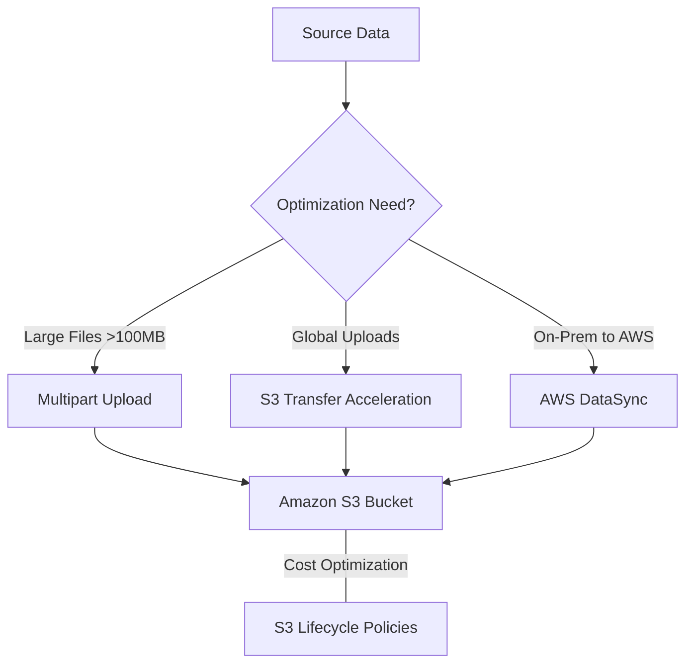
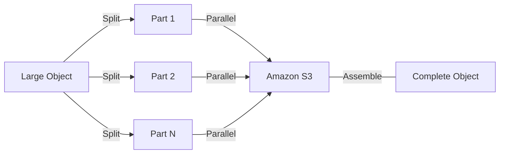

# Curriculum Overview: Amazon S3 Performance & Optimization Strategies

> [!NOTE]
> This curriculum overview defines the learning path for mastering Amazon S3 performance and optimization strategies, a critical component of the AWS Certified SysOps Administrator / CloudOps Engineer Associate (SOA-C03) exam.

## Prerequisites

Before beginning this curriculum, learners must possess the following foundational knowledge and technical setups:

*   **AWS Fundamentals**: Understanding of AWS Identity and Access Management (IAM), basic networking (VPC), and regions.
*   **Amazon S3 Basics**: Familiarity with creating S3 buckets, uploading objects, and basic S3 storage classes (Standard, Glacier, etc.).
*   **Command Line Experience**: Basic proficiency with the AWS CLI to execute storage commands.
*   **Concept of Bandwidth & Throughput**: General understanding of network latency, bandwidth limits, and parallel processing.

## Module Breakdown

This curriculum is divided into four progressive modules, moving from basic data transfer mechanisms to advanced automated lifecycle management.

| Module | Topic Focus | Difficulty | Estimated Time |
| :--- | :--- | :--- | :--- |
| **Module 1** | AWS DataSync & S3 Batch Replication | Intermediate | 2 Hours |
| **Module 2** | S3 Transfer Acceleration | Intermediate | 1.5 Hours |
| **Module 3** | S3 Multipart Uploads | Advanced | 2 Hours |
| **Module 4** | S3 Lifecycle Policies | Intermediate | 2 Hours |

### Architectural Flow of Optimization Methods

## Learning Objectives per Module

### Module 1: AWS DataSync & S3 Batch Replication
*   **Objective 1**: Configure AWS DataSync to migrate large datasets from on-premises datacenters to Amazon S3 securely.
*   **Objective 2**: Implement S3 Batch Replication to copy existing S3 objects across accounts or regions while preserving metadata and version IDs.
*   **Real-World Example**: Migrating a 50TB legacy on-premises file server to Amazon S3 without saturating the corporate internet connection.

### Module 2: S3 Transfer Acceleration
*   **Objective 1**: Enable and configure S3 Transfer Acceleration on existing S3 buckets.
*   **Objective 2**: Utilize the AWS CLI to route uploads through the `s3-accelerate.amazonaws.com` endpoint.
*   **Objective 3**: Evaluate performance gains using the Amazon S3 Transfer Accelerator Speed Comparison tool.
*   **Real-World Example**: A mobile app with users in Europe uploading 4K videos to an S3 bucket hosted in the `us-east-1` region.

### Module 3: S3 Multipart Uploads
*   **Objective 1**: Identify the appropriate use cases for multipart uploads (objects >100MB).
*   **Objective 2**: Implement multithreaded parallel uploads to maximize available network bandwidth.
*   **Objective 3**: Recover from network interruptions by pausing and resuming part uploads without restarting the entire file transfer.
*   **Real-World Example**: Uploading a 5GB database backup file over a spotty, inconsistent remote network connection.

### Module 4: S3 Lifecycle Policies
*   **Objective 1**: Design and apply Transition actions to move aging data to cheaper storage tiers (e.g., S3 Standard to Standard-IA).
*   **Objective 2**: Implement Expiration actions to automatically delete objects (e.g., compliance logs) after a mandated retention period.
*   **Objective 3**: Filter lifecycle rules using object tags and prefixes to target specific subsets of data.
*   **Real-World Example**: Moving monthly financial reports to Glacier after 30 days, and permanently deleting them after 7 years to save costs.

## Success Metrics

How will you know you have mastered this curriculum? You should be able to successfully complete the following criteria:

1.  **Benchmarking Mastery**: Successfully use the S3 Speed Comparison tool and demonstrate a 20%+ increase in upload speed using Transfer Acceleration for cross-continent data transfers.
2.  **Resiliency Testing**: Simulate a network failure during a 1GB file upload and successfully resume the upload using S3 Multipart Upload APIs.
3.  **Cost Optimization Automation**: Create an active S3 Lifecycle rule via the AWS CLI that successfully transitions objects with the prefix `logs/` to S3 Glacier after 90 days.
4.  **Migration Execution**: Successfully configure a DataSync task or S3 Batch Replication job that replicates at least 1,000 objects across regions while maintaining all object metadata.

> [!IMPORTANT]  
> The SOA-C03 exam heavily tests your ability to choose the *correct* performance optimization strategy based on the scenario constraints (e.g., cost vs. speed). Mastery means knowing *when* to use each tool, not just *how*.

## Real-World Application

Optimizing Amazon S3 is rarely just an academic exercise; it directly impacts an organization's bottom line and user experience.

*   **Global User Experience**: If your business relies on user-generated content (like a social media app), slow upload times lead to user abandonment. S3 Transfer Acceleration routes these uploads through AWS Edge Locations, dramatically reducing latency and improving the customer experience.
*   **Disaster Recovery & Migrations**: During a full application migration, downtime must be minimized. Features like Multipart Uploads and AWS DataSync ensure that terabytes of data can be moved efficiently, utilizing maximum bandwidth and recovering instantly from transient network drops.
*   **Financial CloudOps (FinOps)**: Storing petabytes of data indefinitely in S3 Standard is prohibitively expensive. By mastering S3 Lifecycle Policies, CloudOps engineers automate the archival process, potentially saving organizations tens of thousands of dollars annually without sacrificing compliance or data durability.

> [!TIP]
> Always remember: Any single S3 object larger than 100MB should be evaluated for Multipart Uploads. AWS actively recommends this threshold for optimal network resilience and throughput.