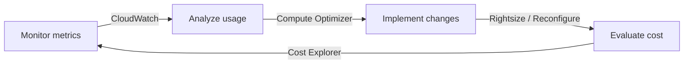
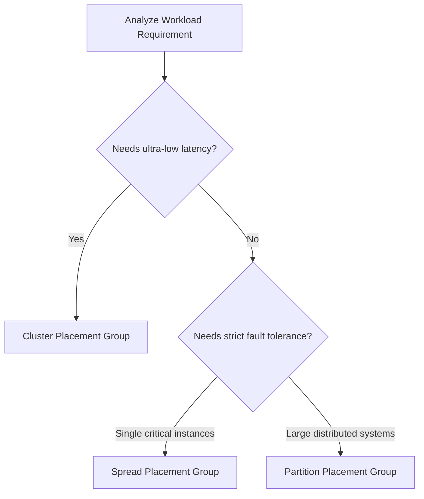

## Prerequisites

Before diving into the optimization and monitoring of Amazon EC2 environments, learners must have a foundational understanding of AWS cloud architecture. Ensure you meet the following baseline requirements:

*   **Cloud Computing Fundamentals:** Understanding of virtualization concepts (e.g., hypervisors) and the AWS Shared Responsibility Model.
*   **EC2 Basics:** Ability to launch, stop, and terminate standard Amazon EC2 instances.
*   **AWS Networking Basics:** Familiarity with Virtual Private Clouds (VPCs), subnets, and standard IP routing.
*   **Storage Fundamentals:** Basic knowledge of Block Storage concepts and Amazon Elastic Block Store (EBS) volumes.
*   **IAM Foundation:** Understanding of Identity and Access Management (IAM) roles for EC2 instances.

## Module Breakdown

This curriculum is structured to take you from foundational monitoring concepts to advanced performance and cost-tuning techniques for EC2 workloads.

| Module | Title | Primary Focus | Difficulty Level |
| :--- | :--- | :--- | :--- |
| **Module 1** | EC2 Compute Monitoring & Sizing | Compute Optimizer, T-series burstable instances, CPU credits | Beginner to Intermediate |
| **Module 2** | EC2 Storage Optimization | EBS volume types, IOPS, Instance Store capabilities | Intermediate |
| **Module 3** | EC2 Networking & Placement | Elastic Network Adapters, Placement Groups (Cluster, Spread, Partition) | Advanced |
| **Module 4** | Automated Remediation | EventBridge, Auto Scaling, Systems Manager (SSM) | Advanced |

> [!NOTE] 
> While these modules are presented linearly, the optimization cycle is continuous. Real-world applications often require cross-module application (e.g., resizing an instance while simultaneously moving it to a new placement group).

## Learning Objectives per Module

### Module 1: EC2 Compute Monitoring & Sizing
*   **Analyze Performance Metrics:** Use Amazon CloudWatch to track CPU utilization, memory (via CloudWatch Agent), and disk I/O.
*   **Evaluate Burstable Instances:** Understand the Credit Specification for T2, T3, and T3a instance types. Calculate accumulated CPU credits and optimize for unpredictable workloads.
*   **Rightsize with AWS Tools:** Apply recommendations from AWS Compute Optimizer and AWS Trusted Advisor to identify underutilized resources.

### Module 2: EC2 Storage Optimization
*   **Differentiate Storage Tiers:** Compare Amazon EBS (persistent block storage) with EC2 Instance Store (ephemeral, high-speed NVMe storage).
*   **Tune EBS Performance:** Monitor EBS metrics and troubleshoot IOPS/throughput bottlenecks to improve performance and reduce costs.
*   **Apply Lifecycle Policies:** Understand when to use Amazon EFS or Amazon FSx shared storage in conjunction with EC2 instances.

### Module 3: EC2 Networking & Placement
*   **Deploy Placement Groups:** Strategically place instances within an Availability Zone to meet specific workload demands.
*   **Optimize Network Interfaces:** Enable and configure the Elastic Network Adapter (ENA) for enhanced networking capabilities.
*   **Troubleshoot Connectivity:** Utilize VPC Flow Logs and VPC Reachability Analyzer to resolve EC2 network path issues.

### Module 4: Automated Remediation
*   **Automate Responses:** Use Amazon EventBridge rules to route performance alerts to AWS Lambda or Systems Manager Automation.
*   **Manage Elasticity:** Configure EC2 Auto Scaling groups with dynamic, scheduled, and predictive scaling policies.
*   **Execute Runbooks:** Run custom and predefined SSM Automation runbooks to streamline EC2 remediation tasks.

### Visualizing the Optimization Lifecycle

## Success Metrics

How will you know you have mastered this curriculum? By the end of this course, you should be able to consistently demonstrate the following:

1.  **Metric-Driven Decisions:** You can confidently look at a CloudWatch dashboard and determine if an EC2 instance is CPU-bound, memory-bound, or I/O-bound.
2.  **Architectural Accuracy:** Given a specific scenario (e.g., "HPC cluster requiring microsecond latency" vs. "Critical database requiring high fault tolerance"), you can select the correct EC2 Placement Group without hesitation.
3.  **Cost Reduction:** You can successfully identify an over-provisioned architecture and reduce compute costs by at least 20% by implementing Spot Instances, Savings Plans, or simply rightsizing instance families.
4.  **Automated Resilience:** You can build an EventBridge rule that automatically executes an SSM runbook when an EC2 instance fails a status check, requiring zero manual intervention.

### Placement Group Decision Matrix

To aid in your success, refer to this critical decision tree for EC2 Placement Groups:

## Real-World Application

Why does optimizing EC2 capabilities matter in a career setting?

### 1. Massive Cost Savings at Scale
In enterprise environments, compute costs often make up the largest portion of the monthly AWS bill. By mastering tools like AWS Compute Optimizer and understanding burstable instance credits (T-series), CloudOps Engineers can save their organizations tens of thousands of dollars annually. Every dollar saved on over-provisioned EC2 instances is a dollar that can be re-invested into innovation.

### 2. High-Performance Computing (HPC)
Fields like genomics, financial modeling, and machine learning rely heavily on network performance. Utilizing **Cluster Placement Groups** alongside **Elastic Network Adapters (ENA)** allows distributed nodes to communicate with microsecond latency. If these aren't configured correctly, high-end graphic and compute jobs will bottleneck at the network layer, wasting expensive instance hours.

### 3. Fault-Tolerant Big Data
When running large Hadoop, Cassandra, or Kafka clusters, hardware failures are inevitable. By deploying these systems across **Partition Placement Groups**, you ensure that a single rack failure in an AWS data center only affects a subset of your nodes, preventing total system collapse.

> [!IMPORTANT] 
> **The "Day 2" Operations Reality:** Provisioning an EC2 instance takes minutes. Managing, optimizing, and paying for it happens for the rest of its lifecycle. This curriculum bridges the gap between simply building architecture and sustainably operating it.