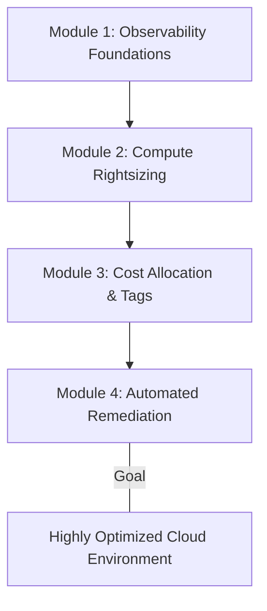

## Prerequisites

To successfully complete this curriculum and dive deep into performance metrics, resource tags, and AWS optimization tools, learners should have:

- **Core AWS Knowledge**: Familiarity with foundational AWS services including Amazon EC2, Amazon EBS, Amazon S3, IAM, and VPCs.
- **Console & CLI Proficiency**: Experience navigating the AWS Management Console and running basic AWS Command Line Interface (CLI) commands.
- **Basic Systems Administration**: Understanding of standard system performance metrics such as CPU utilization, memory allocation, Disk I/O, and network throughput.
- **Foundational Cloud Economics**: A basic grasp of how cloud resources are billed (e.g., hourly compute pricing, storage tiers, instance sizing).

## Module Breakdown

This curriculum is structured to take you from foundational monitoring concepts to advanced, automated remediation. 



| Module | Title | Difficulty | Key Focus |
|---|---|---|---|
| **1** | Observability & Metrics | Beginner | Amazon CloudWatch, Custom Metrics, Logging |
| **2** | Compute Rightsizing | Intermediate | AWS Compute Optimizer, EC2/EBS Metrics |
| **3** | Tagging & Cost Management | Intermediate | Resource Tags, AWS Cost Explorer, Budgets |
| **4** | Automated Remediation | Advanced | EventBridge, Systems Manager (SSM), Lambda |

## Learning Objectives per Module

### Module 1: Observability & Metrics
- Configure and analyze standard and custom **Amazon CloudWatch** metrics.
- Set up static and dynamic CloudWatch Alarms for anomalous resource behavior.
- Use the **CloudWatch Agent** to extract OS-level metrics (e.g., memory utilization) from EC2 instances, as memory relies on passing data from the OS to CloudWatch.

### Module 2: Compute Rightsizing
- Utilize **AWS Compute Optimizer** to analyze 14-day default metrics (or 3-month enhanced metrics).
- Interpret recommendations to right-size EC2 instances, Auto Scaling Groups (ASGs), EBS volumes, and AWS Lambda function memory sizes.
- Modify EBS volume types to optimize IOPS and throughput while minimizing costs.

### Module 3: Tagging & Cost Management
- Implement robust **cost allocation tags** to categorize resources by department, environment, or project.
- Leverage **AWS Cost Explorer** and **AWS Trusted Advisor** to identify underutilized or unused resources.
- Assess workload usage patterns to qualify for **EC2 Spot Instances** and **Savings Plans**.

### Module 4: Automated Remediation
- Create **Amazon EventBridge** rules that route performance alerts or state changes to remediation targets.
- Execute predefined or custom **AWS Systems Manager (SSM) Automation runbooks** to fix common configuration issues and streamline processes.
- Automate instance recovery and manage fleet updates across nodes.

## Success Metrics

How will you know you have mastered the curriculum?

- **Optimization Efficiency**: You can confidently identify over-provisioned EC2 instances and successfully transition them to right-sized instances with zero downtime.
- **Automation Execution**: You can build a functioning EventBridge rule that triggers an SSM Runbook or Lambda function when an EC2 instance exceeds an alarming CPU threshold.
- **Cost Reduction**: You can successfully apply resource tags, analyze them in Cost Explorer, and project a tangible reduction in AWS spend. The basic calculation should yield positive net savings: $Net \ Savings = (C_{old} - C_{new}) \times Hours$.

```tikz
\begin{tikzpicture}
  % Axes
  \draw[->, thick] (0,0) -- (7,0) node[right] {\mbox{Time}};
  \draw[->, thick] (0,0) -- (0,5) node[above] {\mbox{Resource Provisioning}};
  
  % Unoptimized line
  \draw[red, thick] (0,4) -- (2,4) -- (4,4) node[above] {\mbox{Static Over-provisioned}} -- (6,4);
  
  % Optimized line
  \draw[green!60!black, thick] (0,1) to[out=20, in=180] (2,3) to[out=0, in=180] (4,1.5) to[out=0, in=180] (6,2.5);
  \node[green!60!black, right] at (6,2.5) {\mbox{Dynamic Right-sized Workload}};
  
  % Threshold
  \draw[dashed, blue] (0,3.5) -- (6,3.5);
  \node[blue, right] at (6,3.5) {\mbox{Peak Demand}};
\end{tikzpicture}
```

## Real-World Application

> [!IMPORTANT] 
> Mastering these skills transforms you from a traditional system administrator into a proactive **Cloud Operations and FinOps Engineer**.

**Scenario: The E-Commerce Traffic Spike**
Imagine you manage the infrastructure for a rapidly growing online retailer. 

Without performance optimization and automated remediation:
- **Over-provisioning**: You might blindly scale up resources ahead of a sale, paying thousands of dollars for idle compute capacity.
- **Under-provisioning**: A sudden viral traffic spike could exhaust system memory, crashing the site. Because default EC2 metrics do not track memory, you would lack visibility into the true bottleneck.

By applying this curriculum:
1. You deploy the **CloudWatch Agent** across instances to ensure granular memory tracking.
2. You regularly use **AWS Compute Optimizer** to identify exactly which instance families perform best for your specific application profile based on historical data.
3. You deploy an **EventBridge and SSM Automation** pipeline to add capacity precisely when metrics trend upward, and scale down immediately when the rush ends.

This optimized approach saves the organization money, ensures high availability, and allows the engineering team to rely on automated systems rather than manual late-night interventions.