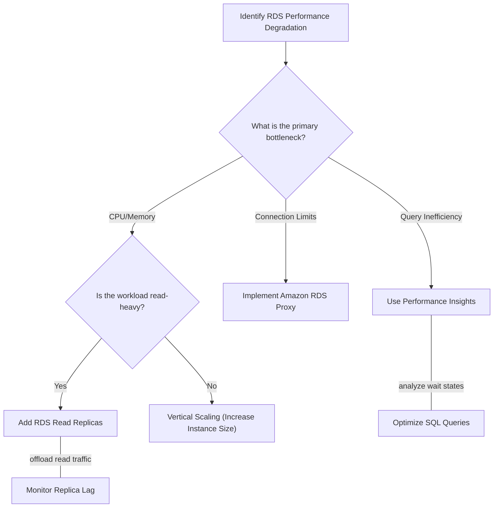

# Curriculum Overview: Optimizing and Monitoring Amazon RDS Performance

Welcome to the curriculum overview for mastering Amazon RDS performance monitoring and optimization. This guide is aligned with the AWS Certified SysOps Administrator / CloudOps Engineer requirements (Task 1.3.5), focusing on diagnosing database bottlenecks, leveraging Amazon RDS Performance Insights, configuring CloudWatch alarms, and implementing structural enhancements like RDS Proxy and Auto Scaling.

## Prerequisites

Before embarking on this curriculum, learners must possess foundational knowledge in the following areas:

*   **AWS Management Console & CLI:** Ability to navigate the AWS console, configure CLI profiles, and execute basic programmatic commands.
*   **Relational Database Fundamentals:** Understanding of basic database concepts like queries, connections, CPU utilization, and input/output operations per second (IOPS).
*   **Basic CloudWatch Knowledge:** Familiarity with viewing metrics and understanding the concept of a monitoring dashboard.
*   **Networking Basics:** An understanding of Virtual Private Clouds (VPCs), subnets, and security groups as they apply to database instances.

## Module Breakdown

This curriculum is structured to take you from foundational monitoring concepts to advanced performance remediation strategies. 

| Module | Title | Difficulty | Core Focus |
| :--- | :--- | :--- | :--- |
| **Module 1** | RDS Monitoring Fundamentals | Beginner | CloudWatch metrics, Enhanced Monitoring, Log exports |
| **Module 2** | Deep Dive: Performance Insights | Intermediate | Database load analysis, Wait states, Proactive recommendations |
| **Module 3** | Structural Performance Optimization | Advanced | Horizontal vs. Vertical Scaling, Read Replicas, RDS Proxy |
| **Module 4** | Automated Remediation & Alarms | Advanced | EventBridge integration, AWS Lambda triggers, Alarm thresholds |

### Optimization Decision Matrix Flowchart

The following flowchart illustrates the high-level decision-making process taught throughout this curriculum when addressing database performance bottlenecks:



## Learning Objectives per Module

### Module 1: RDS Monitoring Fundamentals
*   **Identify** and analyze core Amazon CloudWatch metrics for RDS (e.g., `CPUUtilization`, `FreeableMemory`, `DatabaseConnections`, `ReadIOPS`, `WriteIOPS`).
*   **Configure** Enhanced Monitoring to gather sub-minute OS-level metrics and understand the difference between hypervisor-level and OS-level data.
*   **Export** database logs (error, general, slow query) to Amazon CloudWatch Logs for centralized querying via CloudWatch Logs Insights.

### Module 2: Deep Dive: Performance Insights
*   **Analyze** the Performance Insights dashboard to identify the exact SQL queries causing database load.
*   **Interpret** wait states (e.g., `CPU`, `IO:DataFileRead`, `Lock`) to pinpoint whether a bottleneck is compute, storage, or concurrency related.
*   **Implement** Performance Insights proactive recommendations to resolve identified issues.

### Module 3: Structural Performance Optimization
*   **Deploy** Amazon RDS Proxy to pool and share database connections, preventing connection exhaustion and reducing failover times.
*   **Differentiate** between and implement vertical scaling (instance size upgrades) and horizontal scaling (Aurora/RDS Read Replicas).
*   **Evaluate** the use of Amazon ElastiCache (Redis/Memcached) as an optimization layer to cache frequently accessed data and reduce direct RDS load.

### Module 4: Automated Remediation & Alarms
*   **Establish** CloudWatch Alarms using static and anomaly detection thresholds for critical metrics.
*   **Automate** responses using Amazon EventBridge rules to trigger AWS Systems Manager Automation runbooks or AWS Lambda functions when database thresholds are breached.
*   **Configure** Aurora Auto Scaling to dynamically adjust the number of Aurora Replicas based on CPU utilization or active connections.

## Success Metrics

How will you know you have mastered this curriculum? By the end of this track, you should be able to independently achieve the following benchmarks:

1.  **Diagnostic Accuracy:** Given a simulated production outage, correctly identify the root cause within 5 minutes using Performance Insights and CloudWatch dashboards.
2.  **Architectural Optimization:** Successfully implement an RDS Proxy in a lab environment that reduces connection overhead by at least 40% during a load test.
3.  **Automated Resilience:** Create an automated workflow where a breached `CPUUtilization` alarm automatically triggers an Aurora Auto Scaling event or notifies a Slack channel via EventBridge and SNS.
4.  **Cost-to-Performance Ratio:** Demonstrate the ability to right-size an over-provisioned database instance using AWS Compute Optimizer and historical metric analysis.

### Visualizing Alarm Thresholds

Understanding how to effectively set alarms is a critical success metric. The diagram below illustrates a standard CloudWatch metric behavior against a defined static threshold.

```tikz
\begin{tikzpicture}[x=1.5cm, y=1cm]
  % Grid and Axes
  \draw[lightgray, very thin] (0,0) grid (5,5);
  \draw[thick, ->] (0,0) -- (5.5,0) node[right] {\mbox{Time (mins)}};
  \draw[thick, ->] (0,0) -- (0,5.5) node[above] {\mbox{CPU \%}};

  % Labels
  \node[left] at (0,1) {\mbox{20}};
  \node[left] at (0,2) {\mbox{40}};
  \node[left] at (0,3) {\mbox{60}};
  \node[left] at (0,4) {\mbox{80}};
  \node[left] at (0,5) {\mbox{100}};
  \node[below] at (1,0) {\mbox{5}};
  \node[below] at (2,0) {\mbox{10}};
  \node[below] at (3,0) {\mbox{15}};
  \node[below] at (4,0) {\mbox{20}};
  \node[below] at (5,0) {\mbox{25}};

  % Threshold Line
  \draw[red, dashed, very thick] (0,4) -- (5.2,4) node[right] {\mbox{Alarm (80\%)}};

  % Metric Line
  \draw[blue, thick] (0,1) -- (1,1.5) -- (2,3) -- (3,4.5) -- (4,2.5) -- (5,2);
  
  % Highlight Breach
  \filldraw[red] (2.66, 4) circle (2pt);
  \node[above, red] at (3, 4.6) {\mbox{Breach Triggered}};
\end{tikzpicture}
```

## Real-World Application

In modern cloud architectures, the database is often the most critical and least flexible component of the stack. 

> [!IMPORTANT]
> A poorly optimized database can lead to cascading failures across your entire application. 

Consider a rapidly growing e-commerce application. During a flash sale, the number of incoming Lambda function requests spikes. Because Lambda scales instantly, thousands of functions attempt to open concurrent connections to the RDS database. Without optimization, the database will exhaust its connection limits, resulting in throttled requests, dropped queries, and a complete application outage.

By applying the concepts in this curriculum, an engineer would:
1.  **Monitor:** Use CloudWatch to foresee the connection spike.
2.  **Diagnose:** Use Performance Insights to see that resources are locked waiting for connection availability.
3.  **Remediate:** Implement **Amazon RDS Proxy** to gracefully pool and queue those thousands of Lambda connections into a manageable stream for the database.
4.  **Scale:** Implement **Aurora Auto Scaling** to automatically add Read Replicas to handle the heavy catalog-read traffic during the sale.

Mastering these skills transitions an engineer from reactive troubleshooting to proactive cloud financial management and reliability architecting.