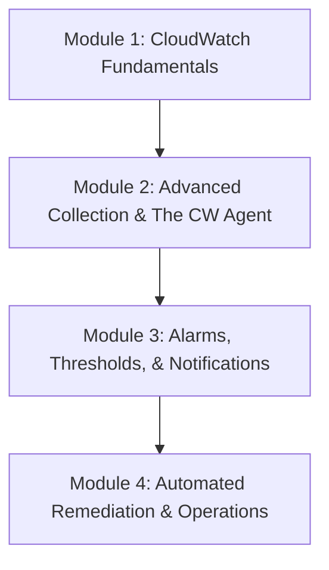
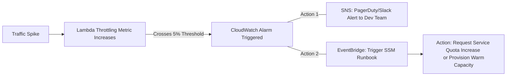

# Amazon CloudWatch Metrics and Alarms: Curriculum Overview

> [!NOTE]
> This curriculum aligns with the AWS Certified SysOps Administrator - Associate (SOA-C03) exam domain: **Monitoring, Logging, Analysis, Remediation, and Performance Optimization**.

## Prerequisites

Before embarking on this curriculum, learners must possess a foundational understanding of the AWS ecosystem to ensure they can fully grasp advanced monitoring concepts. 

* **Compute Services Fluency:** Basic understanding of Amazon EC2, AWS Lambda, Amazon ECS, and Amazon EKS.
* **Operational Foundations:** Proficiency using the AWS Management Console and the AWS Command Line Interface (CLI).
* **IAM Principles:** Knowledge of Identity and Access Management (IAM) roles and policies, specifically the principle of least privilege required for resource monitoring.
* **Networking Basics:** Understanding of VPCs, subnets, and security groups to comprehend network-level metrics.

## Module Breakdown

This curriculum is structured to take you from foundational monitoring concepts to advanced, automated remediation strategies. 

| Module | Core Focus | Difficulty | Estimated Time |
| :--- | :--- | :--- | :--- |
| **1. Fundamentals** | Metrics, Namespaces, Dashboards | Beginner | 2 Hours |
| **2. CW Agent** | EC2/Container Logs & Custom Metrics | Intermediate | 3 Hours |
| **3. Alarms & SNS** | Static/Dynamic Thresholds, Composite Alarms | Intermediate | 3 Hours |
| **4. Remediation** | EventBridge, SSM Automation Runbooks | Advanced | 4 Hours |

## Learning Objectives per Module

### Module 1: CloudWatch Fundamentals
* **Analyze Standard Metrics:** Interpret default metrics reported by AWS services at 1-minute and 5-minute intervals (e.g., Lambda invocations, execution time, errors, and throttling).
* **Implement Custom Metrics:** Define and publish custom business or application-level metrics to specific CloudWatch Namespaces.
* **Design Dashboards:** Create customizable, cross-region, and cross-account CloudWatch dashboards to visualize health across the entire AWS infrastructure.

### Module 2: Advanced Collection & The CW Agent
* **Deploy the CloudWatch Agent:** Configure and manage the CW Agent on EC2 instances to collect granular OS-level metrics (e.g., memory utilization, disk space) and application logs.
* **Monitor Containers:** Implement monitoring for Amazon Elastic Container Service (ECS) and Elastic Kubernetes Service (EKS) clusters.
* **Log Analytics:** Utilize CloudWatch Logs Insights to query log streams (e.g., filtering Lambda log streams for `RequestID`, billed duration, and memory size).

### Module 3: Alarms, Thresholds, & Notifications
* **Configure CloudWatch Alarms:** Set up static and anomaly-detection (dynamic) thresholds to monitor resource health.
* **Build Composite Alarms:** Combine multiple alarms to reduce alarm fatigue and trigger actions only when specific multi-condition criteria are met.
* **Implement Notifications:** Configure alarms to push alerts to Amazon Simple Notification Service (SNS) topics for email, SMS, or third-party ticketing integration.

> [!TIP]
> Remember the key Lambda metrics that typically drive alarms: **Errors** (logic/runtime failures), **Execution Time** (slowest 1-5% of responses), and **Throttling** (concurrency limits reached).

### Module 4: Automated Remediation & Operations
* **Event-Driven Architectures:** Use Amazon EventBridge to route state changes and enrich events.
* **Automate Remediation:** Trigger custom or predefined AWS Systems Manager (SSM) Automation runbooks to self-heal infrastructure.
* **Auto Scaling Integration:** Trigger EC2 Auto Scaling policies or RDS Aurora Add Replica policies based on sustained alarm states.

### Core Formula: Calculating Metric Impact
Understanding the mathematical relationship of metrics is crucial for setting effective alarms. For example, to calculate the application error rate for AWS Lambda:

$$\text{Error Rate (\%)} = \left( \frac{\text{Total Errors}}{\text{Total Invocations}} \right) \times 100$$

## Success Metrics

How do you know you have mastered this curriculum? A successful candidate will be able to demonstrate the following hands-on capabilities:

1. **Independent Remediation:** Successfully configure an alarm that detects high CPU utilization on an EC2 instance, triggers EventBridge, and executes an SSM runbook to automatically restart the instance.
2. **Visibility Architecture:** Build a unified CloudWatch Dashboard that displays custom metrics, Lambda error rates, and EC2 memory utilization in a single pane of glass.
3. **Troubleshooting Prowess:** Given a simulated Lambda throttling event, successfully query CloudWatch Logs Insights to isolate the affected `RequestID`s and identify the capacity constraint.
4. **Cost-Aware Monitoring:** Ensure custom metrics and extensive log ingestion are optimized to prevent unnecessary AWS spend.

## Real-World Application

In modern Cloud Operations (CloudOps), **monitoring is not just about watching graphs; it is about building self-healing systems.** 

Imagine a scenario where an e-commerce platform goes viral. Suddenly, your AWS Lambda functions experience a 500% spike in traffic. Without proper monitoring, your functions will throttle silently, leading to a degraded customer experience and lost revenue. 

By applying the concepts in this curriculum, you establish a resilient architecture:

Mastering CloudWatch Metrics and Alarms empowers you to transition from a reactive administrator (putting out fires) to a proactive CloudOps Engineer (preventing the fires from starting). This is a critical skill set for maintaining the **Operational Excellence** and **Reliability** pillars of the AWS Well-Architected Framework.