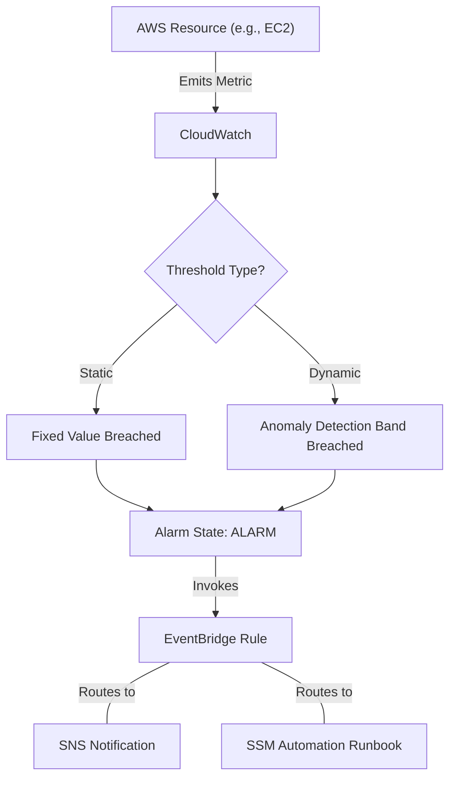

# Curriculum Overview: Configure CloudWatch Alarms and Anomaly Detection

Welcome to the curriculum overview for configuring Amazon CloudWatch alarms, implementing anomaly detection, and orchestrating automated remediation. This learning path aligns closely with the AWS Certified CloudOps Engineer - Associate (SOA-C03) content domains, specifically focusing on **Monitoring, Logging, Analysis, Remediation, and Performance Optimization**.

## Prerequisites

Before diving into this curriculum, learners must possess foundational knowledge and practical skills within the AWS ecosystem:

*   **AWS Management Tools**: Proficiency in navigating the AWS Management Console and executing standard operations via the AWS CLI.
*   **Compute & Containers Framework**: Understanding of Amazon EC2 instance lifecycles, and a basic grasp of container orchestration using Amazon ECS or EKS.
*   **Networking Basics**: Familiarity with Amazon VPC components, including subnets, route tables, and Internet Gateways.
*   **Identity and Access Management (IAM)**: Ability to provision least-privilege IAM roles and policies.
*   **Well-Architected Framework**: Familiarity with the Operational Excellence and Reliability pillars.

> [!WARNING] 
> Attempting these modules without a firm grasp of IAM roles may lead to permissions errors when configuring alarms to trigger EventBridge rules or Systems Manager (SSM) Runbooks.

## Module Breakdown

The curriculum is structured progressively, starting from foundational metric collection and advancing into automated, AI-driven remediation strategies.

| Module | Topic Focus | Difficulty | Estimated Time |
| :--- | :--- | :--- | :--- |
| **Module 1** | CloudWatch Metrics & The CloudWatch Agent | Beginner | 2 Hours |
| **Module 2** | Static Alarms & SNS Notifications | Intermediate | 3 Hours |
| **Module 3** | Anomaly Detection & Dynamic Thresholds | Intermediate | 2.5 Hours |
| **Module 4** | Automated Remediation via EventBridge & SSM | Advanced | 4 Hours |
| **Module 5** | Cloud Financial Management & Budget Alarms | Intermediate | 1.5 Hours |

## Learning Objectives per Module

### Module 1: CloudWatch Metrics & The CloudWatch Agent
*   Configure and deploy the CloudWatch agent to collect system-level metrics (e.g., memory utilization, disk space) from Amazon EC2 instances.
*   Implement custom metrics and namespaces for business-specific applications.
*   Create customizable and shareable CloudWatch dashboards for multi-account and cross-region visibility.

### Module 2: Static Alarms & SNS Notifications
*   Set up static thresholds to monitor performance efficiency and operational health.
*   Configure Amazon Simple Notification Service (SNS) topics to dispatch alerts to email, SMS, or external ticketing systems.
*   Create composite alarms to reduce alert fatigue by combining multiple alarm states.

### Module 3: Anomaly Detection & Dynamic Thresholds
*   Enable Machine Learning-powered anomaly detection on standard and custom metrics.
*   Configure dynamic thresholds that adapt to natural metric patterns (e.g., daily or weekly traffic cycles).
*   Understand the statistical models underlying anomaly detection, represented conceptually by analyzing standard deviations from a predicted baseline:
    $$ z = \frac{x - \mu}{\sigma} $$
    *(Where $x$ is the metric value, $\mu$ is the expected baseline, and $\sigma$ is the standard deviation.)*

### Module 4: Automated Remediation via EventBridge & SSM
*   Use EventBridge to route, enrich, and deliver CloudWatch alarm state-change events.
*   Trigger AWS Systems Manager (SSM) Automation runbooks to auto-remediate configuration or availability issues (e.g., restarting a failed service).
*   Implement automated instance recovery utilizing EC2 status checks.

### Module 5: Cloud Financial Management & Budget Alarms
*   Configure AWS Budgets to track daily, monthly, or quarterly spend against predefined thresholds.
*   Attach budget actions (such as applying Service Control Policies or IAM policies) to prevent provisioning new resources during a budget overrun.

> [!TIP]
> Setting a budget action to require *manual approval* is a best practice when first configuring and testing budget automated actions. This prevents any accidental production outages caused by aggressive cost-saving automation.

## Visualizing the Monitoring Lifecycle

Understanding the flow of data from resource creation to automated response is critical. The following flowchart demonstrates the incident response architecture taught in this curriculum:



## Success Metrics

How will you know you have mastered the curriculum? You should be able to consistently demonstrate the following outcomes:

1.  **Zero-Touch Remediation**: Successfully architect an environment where a simulated failure (e.g., stopping an application service) is automatically detected by CloudWatch and fully remediated via an SSM Runbook within 5 minutes, requiring no human intervention.
2.  **Alert Accuracy**: Reduce false positive alerts by effectively implementing composite alarms and anomaly detection bands instead of brittle static thresholds.
3.  **Cost Control**: Demonstrate the successful configuration of an AWS Cost Budget that accurately predicts a spend overage and issues a localized SNS alert before the invoice cycle ends.

### Visualizing Anomaly Detection

To grasp Success Metric #2, you must understand how anomaly detection differentiates from static thresholds. The visualization below illustrates how dynamic bands adapt to expected variations over time, whereas static thresholds may trigger false positives during expected spikes.

```tikz
\begin{tikzpicture}[x=1.5cm, y=1.5cm]
    % Axes
    \draw[->, thick] (0,0) -- (6,0) node[anchor=north] {Time (Hours)};
    \draw[->, thick] (0,0) -- (0,4) node[anchor=east] {CPU \%};

    % Anomaly band (Expected behavior)
    \draw[fill=blue!10, draw=none] 
        (0,1.5) .. controls (1.5,1.8) and (3,1.0) .. (4.5,2.5) -- (6,2.0)
        -- (6,3.0) -- (4.5,3.5) .. controls (3,2.0) and (1.5,2.8) .. (0,2.5) -- cycle;

    % Actual Metric line
    \draw[thick, blue] 
        (0,2) .. controls (1.5,2.3) and (3,1.5) .. (4,2.5) 
        -- (4.5, 3.8) node[anchor=south] {Anomaly Trigger!} 
        -- (5.5, 2.5) -- (6, 2.5);

    % Threshold line (static)
    \draw[dashed, red, thick] (0,3.2) -- (6,3.2) node[anchor=south east] {Static Threshold (90\%)};

    % Labels
    \node at (2.5, 1.3) {\small ML Expected Band};
\end{tikzpicture}
```

## Real-World Application

Why does this matter in a professional CloudOps career? In modern enterprise environments, systems must be scalable, highly available, and resilient. Human intervention is too slow for critical infrastructure.

Consider an e-commerce platform during a flash sale:
*   **The Problem:** Unpredictable traffic spikes cause compute bottlenecks.
*   **The Old Way:** A static alarm triggers at 80% CPU. An on-call engineer wakes up, logs in, evaluates the situation, and manually spins up new instances. The delay causes dropped shopping carts and lost revenue.
*   **The CloudOps Way:** CloudWatch Anomaly Detection notices the metric trending outside the expected predictive band before it even hits 80%. It triggers an EventBridge rule that immediately scales up the Auto Scaling Group (ASG) and alerts the team via Slack that the action was taken.

By mastering CloudWatch Alarms and Anomaly Detection, you transition from reactive system administration to proactive, automated site reliability engineering—the core competency of an AWS Certified CloudOps Engineer.