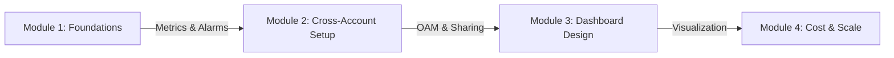
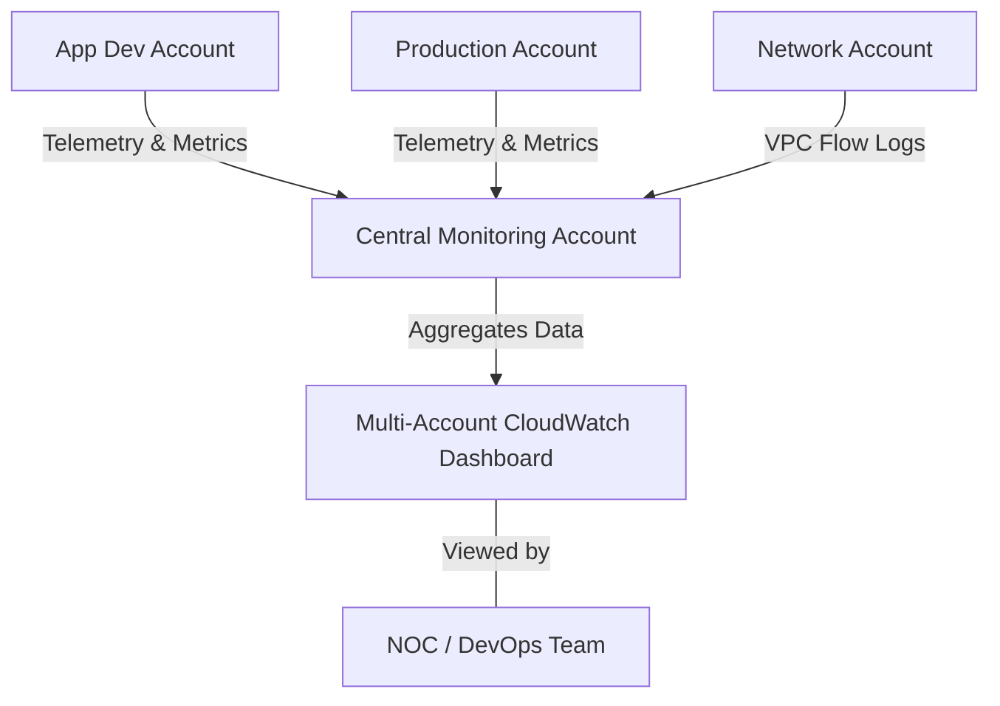

# Curriculum Overview: Design CloudWatch Dashboards for Multi-Account Visibility

Welcome to the curriculum for designing and implementing centralized monitoring solutions on AWS. This guide outlines the path to mastering Amazon CloudWatch across multiple AWS accounts, enabling you to build a "single pane of glass" for complex, enterprise-grade cloud environments.

## Prerequisites

Before diving into multi-account observability, learners must have a solid foundation in core AWS operations and organizational management. 

*   **AWS Organizations & IAM**: Understanding of how AWS Organizations manages multiple accounts, Service Control Policies (SCPs), and cross-account IAM roles.
*   **Basic Amazon CloudWatch**: Familiarity with single-account CloudWatch components, including standard metrics, custom metrics, namespaces, and basic alarms.
*   **AWS Well-Architected Framework**: Knowledge of the Operational Excellence and Reliability pillars.
*   **AWS CLI & JSON**: Comfort executing commands programmatically and parsing JSON/JMESPath outputs.

> [!IMPORTANT]
> If you are unfamiliar with the concept of a "Management Account" versus a "Member Account" in AWS Organizations, it is highly recommended to review AWS Control Tower and Organization basics before proceeding.

## Module Breakdown

This curriculum is divided into progressive modules that take you from foundational concepts to advanced, cross-account implementations.

| Module | Focus Area | Difficulty | Core Activity |
| :--- | :--- | :--- | :--- |
| **1. CloudWatch Fundamentals** | Single-account metrics and custom namespaces | Beginner | Publishing custom application metrics to CloudWatch. |
| **2. Cross-Account Configuration** | Observability Access Manager (OAM) setup | Intermediate | Establishing sharing links between source and monitoring accounts. |
| **3. Centralized Dashboarding** | Visualizing cross-region and cross-account data | Advanced | Building unified dashboards using math and dynamic widgets. |
| **4. Cost & Lifecycle Optimization** | Monitoring costs via Cost Explorer & Budgets | Intermediate | Implementing guardrails and anomaly detection alarms. |

## Learning Objectives per Module

### Module 1: CloudWatch Fundamentals
*   **Define and publish** custom business-specific and application-level metrics to CloudWatch.
*   **Configure** static and dynamic threshold alarms for resource health.
*   **Analyze** metric mathematical expressions to derive new insights from raw data (e.g., $ErrorRate = \frac{Errors}{TotalRequests} \times 100$).

### Module 2: Cross-Account Configuration
*   **Architect** a centralized monitoring environment using a designated Monitoring Account and multiple Source Accounts.
*   **Implement** cross-account sharing policies using AWS IAM and Observability Access Manager (OAM).
*   **Secure** metric telemetry to ensure least privilege access across organizational boundaries.

### Module 3: Centralized Dashboarding
*   **Design** CloudWatch Dashboards for multi-account visibility, aggregating data from disparate AWS regions and accounts.
*   **Utilize** CloudWatch Logs Insights to query application data centrally.
*   **Integrate** AWS Health events and EventBridge rules to display organizational health alerts.

### Module 4: Cost & Lifecycle Optimization
*   **Evaluate** AWS Cost Explorer dashboards to identify multi-account spend anomalies.
*   **Configure** AWS Budgets and Cost Anomaly Detection to trigger centralized alerts.

## Success Metrics

How will you know you have mastered this curriculum? You will have achieved success when you can independently verify the following:

1.  **Architecture Verification**: You can successfully provision a central "Monitoring Account" that receives telemetry from at least two "Member Accounts" without manual IAM assumption.
2.  **Visual Verification**: You have built a functional CloudWatch Dashboard that displays EC2 CPU utilization and custom application metrics side-by-side from Account A (us-east-1) and Account B (eu-west-1).
3.  **Security Verification**: You have successfully implemented SCP guardrails that prevent unauthorized modification of the central monitoring configurations.

## Real-World Application

In enterprise environments, companies rarely operate within a single AWS account. A standard landing zone deployment via AWS Control Tower often results in dozens (or hundreds) of isolated accounts—such as separate accounts for Sandbox, Development, Staging, and Production.

Without cross-account dashboards, a Network Operations Center (NOC) engineer investigating a system-wide outage would have to manually log into 15 different AWS accounts to check database metrics, load balancer health, and EC2 performance.

### The Multi-Account Architecture

### Single-Account vs. Multi-Account Monitoring

| Feature | Single-Account Monitoring | Multi-Account Centralized Monitoring |
| :--- | :--- | :--- |
| **Visibility** | Limited to local workloads. | Global oversight of the entire AWS Organization. |
| **Troubleshooting** | Requires context switching (logging in/out). | "Single Pane of Glass" correlation across services. |
| **Security & Auditing** | Developers may have access to production logs. | Strict separation of duties; developers view dashboards centrally without production access. |

> [!TIP]
> Centralized monitoring is a core tenet of the **Operational Excellence** pillar of the AWS Well-Architected Framework. Mastering this skill bridges the gap between an associate-level operator and a professional-level cloud engineer.