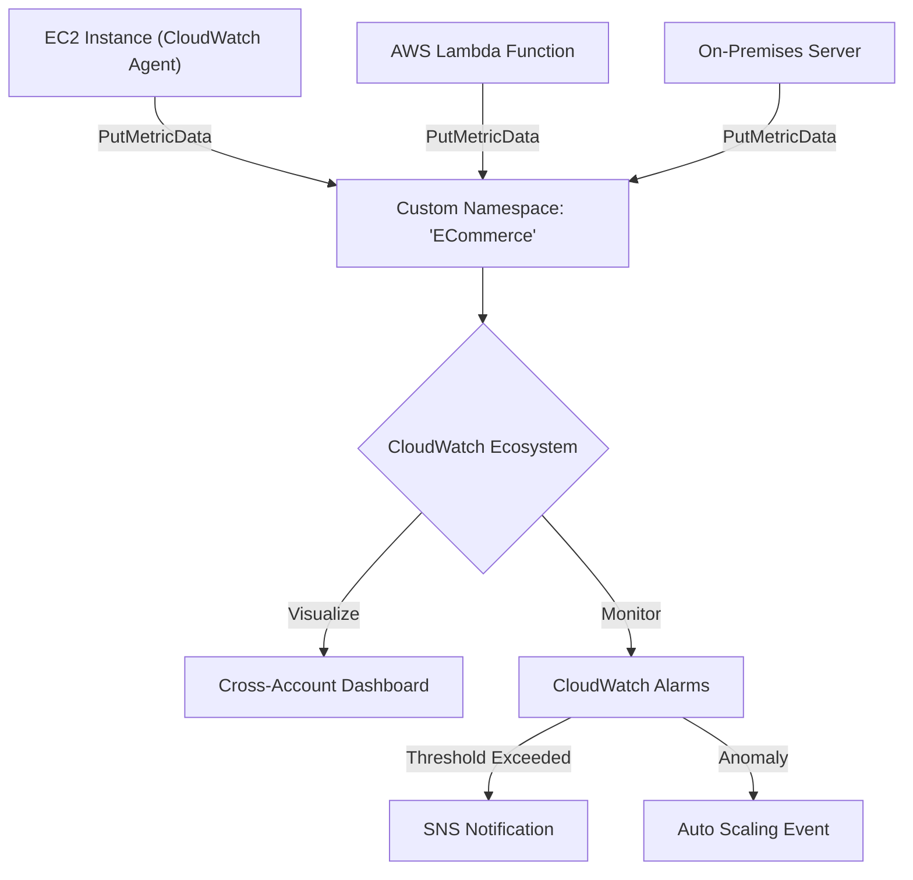
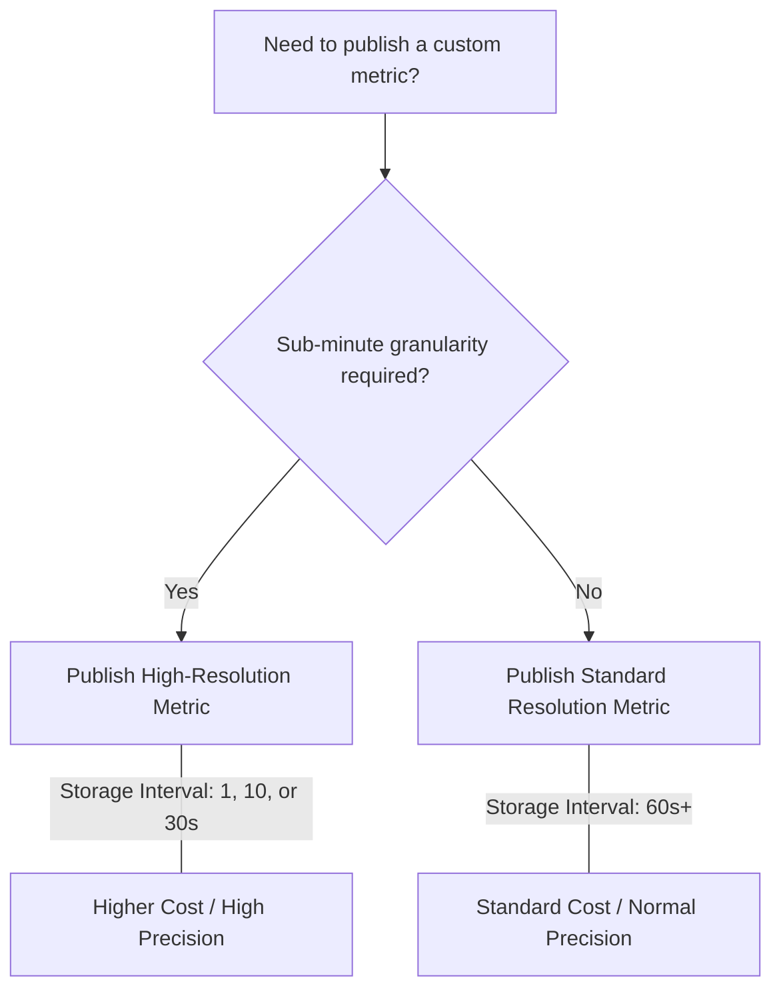

# Curriculum Overview: Implement Custom Metrics and Namespaces

Welcome to the curriculum overview for implementing custom metrics and namespaces in Amazon CloudWatch. This guide outlines the essential path for AWS SysOps Administrators and CloudOps Engineers to master application-level monitoring, high-resolution metrics, and centralized dashboarding in AWS.

## Prerequisites

Before diving into this curriculum, learners must possess a foundational understanding of the following concepts:

*   **AWS CLI & SDK Basics:** Ability to execute basic commands and configure profiles to interact with AWS programmatically.
*   **Standard CloudWatch Knowledge:** Familiarity with default CloudWatch metrics (e.g., `CPUUtilization`, `NetworkIn`) automatically provided by AWS services.
*   **IAM Fundamentals:** Understanding of policies, roles, and the principle of least privilege, specifically regarding permissions like `cloudwatch:PutMetricData`.
*   **Compute Services:** Basic experience operating Amazon EC2 instances and AWS Lambda functions.

---

## Module Breakdown

This curriculum is divided into a progressive learning path, moving from conceptual design to advanced multi-account visualization.

| Module | Title | Difficulty | Description |
| :--- | :--- | :--- | :--- |
| **Module 1** | Foundations of Custom Metrics & Namespaces | Beginner | Understanding the anatomy of a CloudWatch metric, namespaces, and dimensions. |
| **Module 2** | Publishing Application-Level Metrics | Intermediate | Using the AWS CLI, SDKs, and the CloudWatch Agent to push business-specific data. |
| **Module 3** | Resolution & Retention Strategies | Intermediate | Navigating Standard vs. High-Resolution metrics and their cost implications. |
| **Module 4** | Advanced Serverless Monitoring | Advanced | Implementing Lambda Insights, tracking dead letter errors, and organizing resources. |
| **Module 5** | Multi-Account Dashboards & Alarms | Advanced | Designing cross-region and cross-account dashboards for centralized monitoring. |

### Metric Data Point Calculation

When designing your metric architecture, you must understand how data points are aggregated over time. The number of data points generated per hour can be calculated as:

$$ Data\_Points/Hour = \frac{3600 \text{ seconds}}{Resolution\_Interval \text{ (seconds)}} $$

> [!NOTE] 
> High-resolution metrics significantly increase the volume of data points ingested, directly impacting both granular visibility and CloudWatch costs.

---

## Learning Objectives per Module

By completing this curriculum, learners will achieve the following targeted objectives:

### Module 1: Foundations
*   **Define** the structure of a custom metric, including the relationship between Namespaces, Metric Names, and Dimensions.
*   **Differentiate** between AWS/ service namespaces and custom business namespaces.

### Module 2: Publishing Application-Level Metrics
*   **Publish** custom metrics using the `PutMetricData` API.
*   **Configure** the unified CloudWatch Agent on Amazon EC2 to collect OS-level and application-level metrics.

### Module 3: Resolution & Retention Strategies
*   **Implement** high-resolution metrics for mission-critical applications.
*   **Evaluate** when to use standard (60-second) vs. high-resolution (10-second or 30-second) metrics based on cost and observability needs.

### Module 4: Advanced Serverless Monitoring
*   **Enable and analyze** AWS Lambda Insights to capture deeper metrics (CPU usage, memory, network routing).
*   **Organize** distributed serverless components using AWS Resource Groups for consolidated monitoring.

### Module 5: Multi-Account Dashboards & Alarms
*   **Design** CloudWatch Dashboards that aggregate metrics across multiple AWS Regions and Accounts.
*   **Configure** CloudWatch alarms with static and dynamic anomaly detection thresholds on custom metrics.

---

## Visualizing the Flow

Below is an architectural overview of how various AWS resources publish custom metrics into CloudWatch and how those metrics are subsequently utilized.

### Resolution Decision Matrix

Choosing the right metric resolution is critical. The following flowchart guides the decision-making process for standard vs. high-resolution metrics.

> [!WARNING] 
> High-resolution alarms are evaluated more frequently (every 10 or 30 seconds), which means they can trigger alerts much faster than standard 1-minute alarms, but at a higher operational cost.

---

## Success Metrics

How do you know you have successfully mastered this topic? You should be able to check off the following competencies:

*   [ ] **CLI Proficiency:** Successfully push a custom metric using `aws cloudwatch put-metric-data` without errors.
*   [ ] **Agent Configuration:** Successfully install and configure the CloudWatch agent on an EC2 instance to push a custom memory or disk metric.
*   [ ] **Dashboards:** Build a CloudWatch Dashboard that displays metrics from at least two different AWS accounts or regions simultaneously.
*   [ ] **Serverless Insight:** Enable Lambda Insights on a function and successfully query the resulting application-level metrics (e.g., dead letter errors, unreserved concurrent executions).
*   [ ] **Troubleshooting:** Use CloudWatch Logs Insights to search across multiple log groups to investigate anomalies detected by a custom metric alarm.

---

## Real-World Application

Why does implementing custom metrics and namespaces matter in a professional CloudOps career?

### Bridging Infrastructure and Business Value

Default AWS metrics tell you if your server's CPU is at 90%, but they *cannot* tell you if your users are experiencing errors during checkout. By defining **application-level custom metrics**, a CloudOps engineer bridges the gap between raw infrastructure health and actual business performance.

**Example Scenario: E-Commerce Order Processing**

Instead of monitoring just the Lambda function execution duration, a business can publish a custom metric to a namespace called `ECommerce/Checkout`:

*   **Metric Name:** `FailedTransactions`
*   **Dimension:** `PaymentGateway=Stripe`
*   **Resolution:** High-Resolution (10 seconds)

If the `FailedTransactions` metric spikes, a CloudWatch Alarm instantly notifies the operations team, allowing them to route traffic to a backup payment gateway before the CPU or Network metrics ever show a sign of strain. 

### Cross-Account Visibility in Enterprise Environments
In large enterprises, applications are typically spread across multiple AWS accounts (e.g., Development, Staging, Production). Mastering multi-account, cross-region dashboards ensures that Site Reliability Engineers (SREs) have a "single pane of glass" to view the health of loosely coupled microservices without having to constantly switch AWS account profiles.