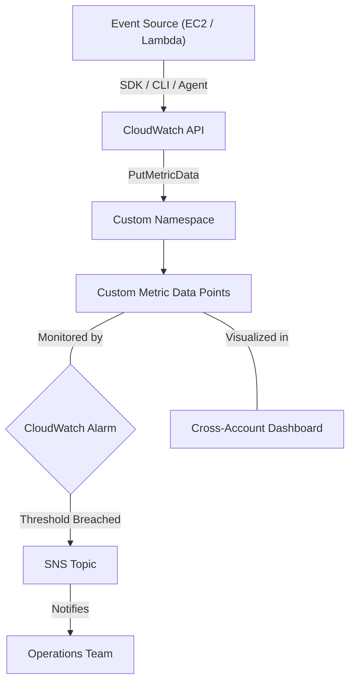

# Curriculum Overview: Implementing Custom Metrics and Namespaces

> This curriculum outline defines the topics, objectives, and progression for mastering AWS CloudWatch Custom Metrics and Namespaces. This material is heavily aligned with the monitoring and observability domains of the AWS Certified CloudOps Engineer / SysOps Administrator (SOA-C03) exams.

## Prerequisites

Before diving into the implementation of custom metrics and namespaces, learners must have a foundational understanding of the following AWS concepts:

* **AWS Management Console & CLI:** Ability to execute basic programmatic commands and navigate the console.
* **Standard CloudWatch Metrics:** Familiarity with default metrics provided by AWS services (e.g., EC2 CPUUtilization).
* **IAM Fundamentals:** Understanding of roles, policies, and the principle of least privilege (specifically the `cloudwatch:PutMetricData` permission).
* **Basic Application Architecture:** Understanding of how applications execute on EC2, containers (ECS/EKS), or AWS Lambda.

---

## Module Breakdown

This curriculum is divided into three sequential modules, starting with conceptual foundations and progressing to advanced, multi-account observability.

| Module | Title | Difficulty | Focus Area |
| :--- | :--- | :--- | :--- |
| **Module 1** | Foundations of Custom Observability | Beginner | Namespaces, Metric Structures, and the `PutMetricData` API |
| **Module 2** | High-Resolution & Serverless Monitoring | Intermediate | Lambda Insights, Standard vs. High-Resolution, Resource Groups |
| **Module 3** | Centralized Visualization & Alarms | Advanced | Cross-account dashboards, Anomaly detection, Automated remediation |

### Architectural Flow of Custom Metrics

The following diagram illustrates the lifecycle of a custom metric, from application generation to actionable insights.



---

## Learning Objectives per Module

### Module 1: Foundations of Custom Observability
* **Define Custom Namespaces:** Isolate application-specific or business-level metrics away from AWS default namespaces (`AWS/*`).
* **Publish Business-Specific Metrics:** Use the AWS CLI and SDKs to push application-level metrics (e.g., "Shopping Cart Checkouts" or "Memory Usage").
* **Understand Metric Math:** Perform mathematical operations on existing standard and custom metrics.

### Module 2: High-Resolution & Serverless Monitoring
* **Differentiate Resolution Types:** Configure metrics to be either standard resolution ($T_{standard} = 60\mbox{s}$) or high resolution ($T_{high} = 10\mbox{s}$ or $30\mbox{s}$).
* **Implement Lambda Insights:** Enable optional Lambda Insights to capture deeper metrics (CPU, Memory, Networking) beyond default invocations and errors.
* **Utilize AWS Resource Groups:** Organize serverless applications logically to view aggregate metrics and logs easily.

> [!TIP]
> Standard metrics aggregate data every 60 seconds. High-resolution metrics can track data down to 1-second intervals (commonly configured at 10 or 30 seconds), which is critical for sub-minute alarm triggering.

### Visualizing Metric Resolution

```tikz
\begin{tikzpicture}
  % Axes
  \draw[thick, ->] (0,0) -- (8,0) node[right] {Time (seconds)};
  \draw[thick, ->] (0,0) -- (0,3.5) node[above] {Data Points};

  % Standard Resolution (60s)
  \draw[blue, thick, dashed] (0,1.5) -- (7,1.5) node[right, text=blue] {Standard (60s)};
  \filldraw[blue] (1,1.5) circle (3pt);
  \filldraw[blue] (7,1.5) circle (3pt);

  % High Resolution (10s)
  \draw[red, thick] (0,2.5) -- (7,2.5) node[right, text=red] {High Res (10s)};
  \filldraw[red] (1,2.5) circle (3pt);
  \filldraw[red] (2,2.5) circle (3pt);
  \filldraw[red] (3,2.5) circle (3pt);
  \filldraw[red] (4,2.5) circle (3pt);
  \filldraw[red] (5,2.5) circle (3pt);
  \filldraw[red] (6,2.5) circle (3pt);
  \filldraw[red] (7,2.5) circle (3pt);

  % Labels
  \node at (4, -0.6) {Comparison of Data Ingestion Frequencies};
\end{tikzpicture}
```

### Module 3: Centralized Visualization & Alarms
* **Design CloudWatch Dashboards:** Create centralized dashboards to view metrics across different regions and AWS accounts.
* **Configure Dynamic Alarms:** Set up CloudWatch anomaly detection using machine learning to trigger notifications based on metric deviations rather than static thresholds.
* **Query Associated Logs:** Use CloudWatch Logs Insights alongside your custom metrics to pinpoint the exact log entries causing metric spikes.

---

## Success Metrics

How will you know you have mastered this curriculum? You should be able to complete the following performance milestones:

1. **CLI Execution:** Successfully push a custom metric using the `aws cloudwatch put-metric-data` command with zero syntax errors.
2. **High-Resolution Alarms:** Create a CloudWatch Alarm on a high-resolution metric that triggers an SNS notification within 10 seconds of a breach.
3. **Dashboard Creation:** Build a cross-account CloudWatch Dashboard that combines standard EC2 metrics with custom business metrics in a single view.
4. **Log Insights Integration:** Successfully write a JMESPath query or CloudWatch Logs Insights query to filter application logs grouped via AWS Resource Groups.

> [!IMPORTANT]
> Custom metrics incur charges based on the number of metrics, API requests, and dashboard widgets. Always tear down exploratory metrics to avoid unexpected AWS bills.

---

## Real-World Application

Why does implementing custom metrics and namespaces matter in a professional CloudOps career?

* **Bridging the Gap Between IT and Business:** Standard AWS metrics tell you if a server is healthy (CPU, Disk I/O). Custom metrics tell you if the *business* is healthy (e.g., `FailedLoginAttempts`, `OrdersProcessedPerHour`). 
* **Memory Monitoring:** By default, AWS cannot see inside the OS of an EC2 instance. Without the CloudWatch Agent publishing custom metrics, you cannot monitor memory or disk space utilization.
* **Granular Serverless Tuning:** With Lambda functions loosely coupled across microservices, tracking custom metrics and utilizing Lambda Insights is the only way to accurately debug memory leaks and execution bottlenecks at scale.