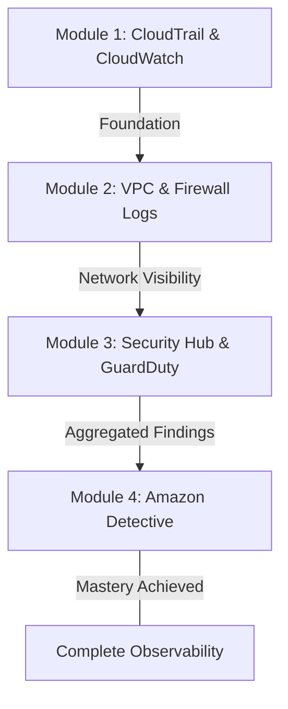
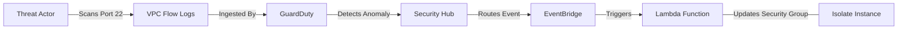

# Centralized Logging and Analysis: Curriculum Overview

> [!NOTE]
> This curriculum provides a comprehensive learning path to mastering centralized logging, auditing, and threat analysis across AWS environments. It is strongly aligned with the AWS Certified CloudOps Engineer and SysOps Administrator (SOA-C03) domains.

## Prerequisites

Before diving into Centralized Logging and Analysis, learners must have foundational knowledge in several AWS domains to ensure success.

*   **AWS Fundamentals:** Proficiency in navigating the AWS Management Console and executing commands using the AWS CLI.
*   **Identity and Access Management (IAM):** A solid understanding of IAM policies, roles, groups, and the principle of least privilege.
*   **Basic Networking:** Familiarity with VPC architecture, including subnets, route tables, and Internet Gateways.
*   **Storage Services:** Practical knowledge of Amazon S3, specifically bucket policies and object lifecycle management.

Click to expand: Required IAM Permissions Refresher

To implement centralized logging at scale, you must understand cross-account permissions. For example, routing AWS Network Firewall logs to a centralized S3 bucket requires explicitly granting `s3:GetBucketPolicy` and `s3:PutBucketPolicy` to the Firewall Manager service. Understanding these trust relationships is mandatory.

## Module Breakdown

This curriculum is structured sequentially to take you from foundational event logging to advanced, machine-learning-powered security investigation.

| Module | Topic focus | Difficulty | Estimated Pacing |
|---|---|---|---|
| **1** | **Foundational Auditing & Logging** | Beginner | 2 Weeks |
| **2** | **Network & Firewall Log Centralization** | Intermediate | 2 Weeks |
| **3** | **Threat Detection & Aggregation** | Advanced | 3 Weeks |
| **4** | **Advanced Visualization & Analysis** | Expert | 2 Weeks |

## Learning Objectives per Module

### Module 1: Foundational Auditing & Logging
*   **Configure AWS CloudTrail:** Enable multi-region trails and capture data events to establish a comprehensive account audit trail.
*   **Centralize Logs with CloudWatch:** Integrate CloudTrail and EC2/Container agents with Amazon CloudWatch Logs for real-time monitoring.
*   **Query Log Data:** Use CloudWatch Logs Insights and JMESPath syntax to perform complex filter queries on system and application logs.

### Module 2: Network & Firewall Log Centralization
*   **Deploy AWS Firewall Manager:** Centralize Network Firewall and DNS Firewall policies across an entire AWS Organization.
*   **Configure Flow Logs:** Capture network traffic flow and implement alert logging for `DROP` or `ALERT` actions.
*   **Secure Log Storage:** Route firewall and DNS logs to centralized Amazon S3 buckets using correct reserved prefix formats.

### Module 3: Threat Detection & Aggregation
*   **Enable Amazon GuardDuty:** Utilize metadata streams from CloudTrail, DNS logs, and VPC flow logs for intelligent threat detection.
*   **Centralize Findings:** Deploy AWS Security Hub to aggregate alerts from GuardDuty, Inspector, Macie, and third-party partner tools.
*   **Automate Remediation:** Configure Amazon EventBridge to route high-priority security events to targets like AWS Lambda or Systems Manager.

> [!IMPORTANT]
> GuardDuty is a managed service that operates independently from your workload resources. This means it evaluates logs at the infrastructure layer, causing zero performance impact on your underlying EC2 instances or containers.

### Module 4: Advanced Visualization & Analysis
*   **Deploy Amazon Detective:** Automate the ingestion of historical event data to conduct rapid root-cause security investigations.
*   **Analyze Behavioral Activity:** Utilize Detective's machine learning and graph theory visualizations to track suspicious behavioral baselines.
*   **Correlate Data:** Contextually link changes in network traffic volume or user activity directly to active GuardDuty findings.

### Service Comparison Table

Understanding the distinction and interplay between these logging and analysis tools is critical to the curriculum:

| Service | Primary Function | Key Input Data Sources | Output / Action |
|---|---|---|---|
| **CloudTrail** | API Auditing | Internal AWS API calls | Raw JSON logs delivered to S3/CloudWatch |
| **Security Hub** | Posture Management | GuardDuty, Inspector, AWS Config | Unified dashboard, compliance standard scores |
| **GuardDuty** | Threat Detection | VPC Flow Logs, DNS logs, CloudTrail | Actionable security findings and alerts |
| **Detective** | Incident Investigation | GuardDuty findings, Flow Logs | Interactive visual graphs, behavioral baselines |

## Success Metrics

How will you know you have mastered the Centralized Logging and Analysis curriculum?

*   **Operational Validation:** You can successfully trace a simulated malicious IP address from a raw VPC Flow Log, through a GuardDuty finding, and into an automated EventBridge remediation trigger.
*   **Query Proficiency:** You can consistently write accurate CloudWatch Logs Insights queries to extract specific application error codes across a multi-account AWS architecture.
*   **Cost Management Proficiency:** You understand the billing dimensions for ingestion-heavy services and can optimize them.

**Cost Calculation Concept:**
Amazon Detective and CloudWatch logging costs scale dynamically based on ingestion volume. The baseline formula for calculating monthly logging cost is:
$$ \text{Total Cost} = \sum_{i=1}^{n} (\text{Data Ingested}_i \times \text{Rate}_i) + \text{Storage Retention Cost} $$
*(Where $i$ represents distinct log sources like CloudTrail events, VPC Flow Logs, and DNS logs).* 

You will be assessed on your ability to minimize $ \text{Data Ingested} $ by tuning firewall drop actions and log filters.

## Real-World Application

In a professional CloudOps environment, centralized logging is the non-negotiable backbone of security, compliance, and systems troubleshooting.

*   **Regulatory Compliance:** Frameworks such as PCI-DSS, HIPAA, and SOC2 mandate immutable, centralized audit trails. Services like Security Hub provide prepackaged standard validations to prove continuous compliance to auditors.
*   **Rapid Incident Response:** When an active security breach occurs, cloud engineers do not have the time to manually SSH into instances or pull logs from dozens of fragmented accounts. Amazon Detective aggregates this data into visual storylines instantly, slashing Mean Time to Resolution (MTTR).
*   **Automated Defense Workflows:** Centralized logging is not just passive storage. By funneling all aggregated findings into Security Hub and EventBridge, modern organizations can automatically quarantine compromised instances before human operators even receive the page.

> [!TIP]
> In a real-world scenario, always test your centralized logging architecture in an isolated sandbox account. Use the AWS IAM Policy Simulator to validate cross-account S3 bucket policies before rolling them out broadly via AWS Organizations.