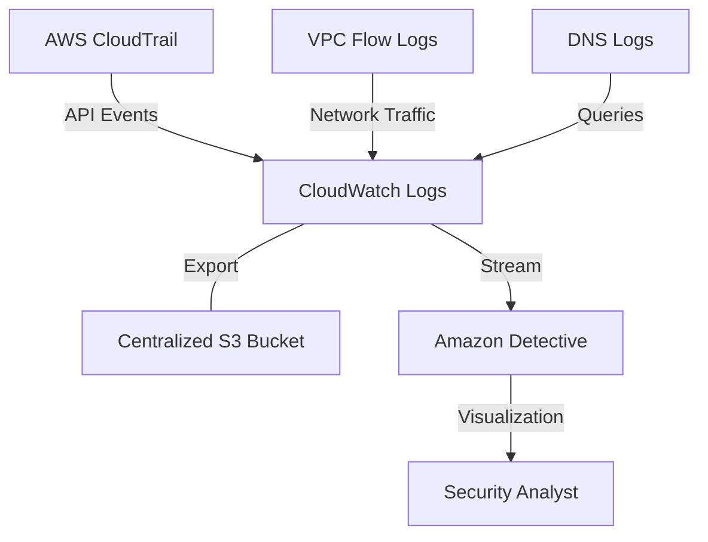

# Curriculum Overview: Centralized Logging and Analysis on AWS

Centralized logging and analysis form the backbone of security auditing, operational monitoring, and automated remediation in cloud environments. This curriculum overview outlines the journey to mastering AWS auditing, log management, and advanced security visualization tools such as AWS CloudTrail, Amazon CloudWatch Logs Insights, AWS Security Hub, and Amazon Detective.

## Prerequisites

Before embarking on this curriculum, learners must possess a foundational understanding of AWS operations and basic monitoring tools. 

*   **AWS Management Console & CLI:** Ability to navigate the console and execute commands programmatically using `aws` CLI.
*   **CloudWatch Fundamentals:** Prior experience configuring standard CloudWatch metrics, namespaces, and alarms.
*   **Networking Basics:** Understanding of VPCs, subnets, and standard TCP/IP traffic flow.
*   **IAM Core Concepts:** Familiarity with the principle of least privilege, roles, and identity-based policies.

> [!IMPORTANT]
> If you are unfamiliar with JSON data parsing, it is highly recommended to review **JMESPath syntax** before starting. You will rely heavily on it to extract specific data from AWS CLI JSON responses during log analysis.

## Module Breakdown

The curriculum is structured progressively, starting with foundational auditing and moving toward advanced, multi-account security analytics.

| Module | Title | Focus Area | Difficulty | Est. Time |
| :--- | :--- | :--- | :--- | :--- |
| **1** | **Foundations of Auditing** | AWS CloudTrail, Account Auditing | Beginner | 2 Weeks |
| **2** | **Log Aggregation & Queries** | CloudWatch Logs Insights, Log Streams | Intermediate | 2 Weeks |
| **3** | **Network Traffic Logging** | VPC Flow Logs, Firewall Manager Logging | Intermediate | 2 Weeks |
| **4** | **Centralized Security Posture** | Security Hub, GuardDuty | Advanced | 3 Weeks |
| **5** | **Advanced Threat Analytics** | Amazon Detective, Root Cause Analysis | Advanced | 2 Weeks |

### Architectural Flow of Centralized Logging



## Learning Objectives per Module

### Module 1: Foundations of Auditing
*   **Configure AWS CloudTrail:** Enable multi-region trails and configure data events for comprehensive account auditing.
*   **Integrate with CloudWatch:** Route real-time CloudTrail data into CloudWatch Logs for immediate threshold alarming.

### Module 2: Log Aggregation & Queries
*   **Master CloudWatch Logs Insights:** Perform complex searches on application and system logs using purpose-built query syntax.
*   **Design Dashboards:** Create cross-region and cross-account dashboards for centralized monitoring visibility.

### Module 3: Network Traffic Logging
*   **Configure Firewall Manager Logging:** Enable centralized flow logging and alert logging to capture network traffic matching DROP or ALERT rules.
*   **Manage S3 Permissions:** Apply proper bucket policies (`s3:GetBucketPolicy` and `s3:PutBucketPolicy`) to allow Firewall Manager cross-account log delivery.

### Module 4: Centralized Security Posture
*   **Deploy AWS Security Hub:** Aggregate findings from AWS services and third parties into a centralized dashboard.
*   **Automate Compliance:** Enforce foundational security best practices (PCI, CIS AWS Foundations) using Security Hub's predefined standards.
*   **Enable GuardDuty:** Utilize machine learning streams of metadata to identify potential threats without managing underlying EC2 resources.

<details>
<summary>Click to expand: Deep Dive into GuardDuty vs Security Hub</summary>

| Feature | Amazon GuardDuty | AWS Security Hub |
| :--- | :--- | :--- |
| **Primary Function** | Threat detection and active monitoring. | Centralized posture management and compliance validation. |
| **Data Sources** | VPC Flow Logs, CloudTrail, DNS Logs. | GuardDuty, Macie, Inspector, 3rd Party Firewalls. |
| **Output** | Security *Findings* (e.g., Suspicious API calls). | Security *Dashboards* and Compliance Scores. |

</details>

### Module 5: Advanced Threat Analytics
*   **Visualize with Amazon Detective:** Analyze the extent of security issues using prebuilt data aggregations and graph theory visualizations.
*   **Perform Root Cause Analysis:** Link changes in traffic volume and API activity directly to GuardDuty findings.

## Success Metrics

To ensure mastery of the curriculum, learners will be evaluated against the following practical success metrics:

*   **Configuration Accuracy:** Successfully configure an S3 bucket with strict bucket policies allowing cross-account Firewall Manager log ingestion.
*   **Query Proficiency:** Write CloudWatch Logs Insights queries to isolate HTTP 500 errors within a 5-minute operational window.
*   **Threat Triage Time:** Reduce Mean Time to Resolution (MTTR) during simulated security incidents by utilizing Amazon Detective's visual graphs.
*   **Cost Management Awareness:** Accurately project the costs of running Amazon Detective based on data ingestion rates.

### Cost Estimation Formula
Understanding data ingestion costs is a critical success metric for SysOps Administrators.

$$ \text{Total Monthly Cost} = \sum_{i=1}^{n} (V_i \times R) $$

*Where:*
*   $V_i$ = Volume of ingested data source (CloudTrail, VPC Flow Logs, GuardDuty) in GB
*   $R$ = AWS Regional Rate per GB

## Real-World Application

In modern enterprise cloud environments, resolving incidents quickly requires sifting through millions of events. Centralized logging prevents the "needle in a haystack" problem. 

**Scenario:** A compromised set of IAM credentials begins spinning up unauthorized EC2 instances in an unused AWS Region (a common cryptojacking attack).

1.  **Detection:** AWS GuardDuty flags the anomalous API behavior.
2.  **Aggregation:** The finding is immediately pushed to AWS Security Hub, updating the organization's compliance score and notifying the security team.
3.  **Investigation:** The engineer opens Amazon Detective to visually map the compromised IAM role's activity across the entire AWS Organization over the last 48 hours.
4.  **Remediation:** Using EventBridge, an automated Systems Manager (SSM) runbook revokes the IAM role's active sessions and terminates the rogue instances.

### Amazon Detective Data Sources

The power of centralized analysis relies on overlapping data sources. The diagram below illustrates the three primary data streams that feed into Amazon Detective's machine learning engine to build analytical graphs.

```tikz
\begin{tikzpicture}
  % Draw the overlapping circles representing log sources
  \draw[thick, fill=blue!10, opacity=0.8] (0,0) circle (2.2cm);
  \draw[thick, fill=red!10, opacity=0.8] (3,0) circle (2.2cm);
  \draw[thick, fill=green!10, opacity=0.8] (1.5,-2.2) circle (2.2cm);
  
  % Labels for the circles
  \node at (-0.5, 0.5) {\textbf{CloudTrail}};
  \node at (3.5, 0.5) {\textbf{VPC Flow Logs}};
  \node at (1.5, -3) {\textbf{GuardDuty Findings}};
  
  % Center intersection
  \node at (1.5, -0.6) {\textbf{Amazon}};
  \node at (1.5, -1.1) {\textbf{Detective}};
\end{tikzpicture}
```

Mastering these centralized logging tools ensures you can transition from reactive troubleshooting to proactive, automated, and visually-driven cloud operations.