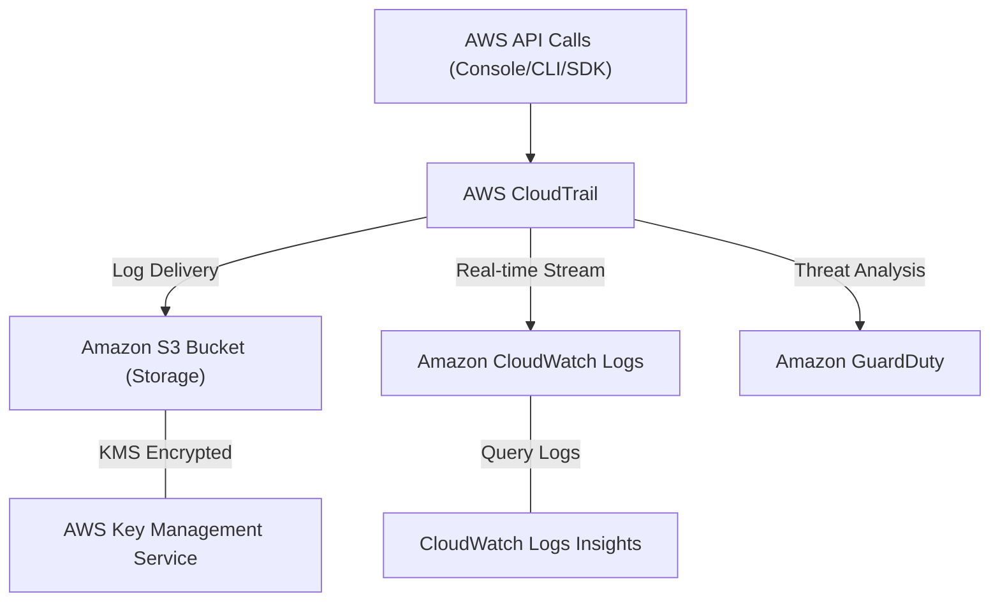
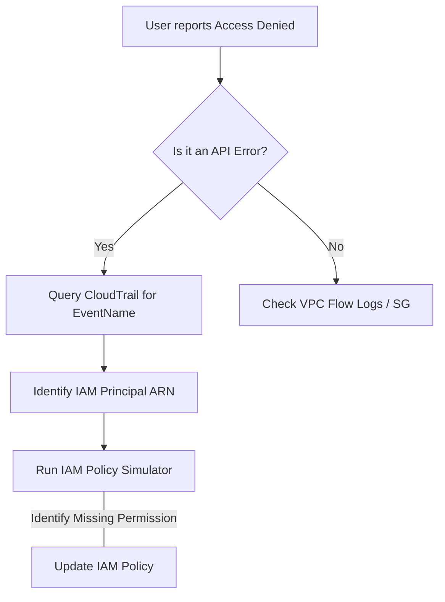

# Curriculum Overview: Configure AWS CloudTrail for Account Auditing

> [!NOTE]
> This curriculum is designed to align with the AWS Certified CloudOps Engineer - Associate (SOA-C03) exam domains, specifically focusing on Monitoring, Logging, Observability, and Security & Compliance.

## Prerequisites

Before beginning this curriculum, learners must have a foundational understanding of AWS core services and security principles. Specifically, you should be familiar with:

*   **AWS Management Console & CLI:** Ability to navigate the console and execute basic `aws cli` commands.
*   **Identity and Access Management (IAM):** Understanding of Users, Roles, Policies, and the principle of least privilege.
*   **Amazon S3 Basics:** Knowledge of creating buckets, understanding bucket policies, and basic object storage concepts.
*   **JSON Syntax:** Ability to read and construct basic JSON documents, as CloudTrail logs and IAM policies heavily rely on this format.
*   **Basic Cloud Architecture:** Familiarity with the AWS Well-Architected Framework, specifically the Security and Operational Excellence pillars.

## Module Breakdown

This curriculum is divided into four sequential modules designed to take you from foundational concepts to advanced multi-account auditing and automated analysis.

| Module | Title | Difficulty | Core Services |
| :--- | :--- | :--- | :--- |
| **1** | **CloudTrail Fundamentals & Deployment** | Beginner | CloudTrail, S3, Control Tower |
| **2** | **Log Security & Retention** | Intermediate | KMS, S3, IAM |
| **3** | **Centralized Analysis & Querying** | Intermediate | CloudWatch Logs Insights |
| **4** | **Auditing & Threat Detection** | Advanced | GuardDuty, IAM Policy Simulator |

### Module 1: CloudTrail Fundamentals & Deployment
Focuses on the core mechanics of AWS CloudTrail. You will learn how CloudTrail provides visibility into AWS account usage by recording API calls and how to deploy it at an organizational level using AWS Control Tower.

### Module 2: Log Security & Retention
Securing audit logs is a critical compliance requirement. This module covers ensuring S3 bucket write permissions are correctly configured, enforcing log retention periods (e.g., $T_{\text{retention}} \geq 365$ days for compliance), and applying optional AWS KMS encryption.

### Module 3: Centralized Analysis & Querying
Moving from raw data to actionable insights. You will learn how to integrate CloudTrail with Amazon CloudWatch Logs for real-time analysis and use CloudWatch Logs Insights to query application and system logs using purpose-built syntax.

### Module 4: Auditing & Threat Detection
Focuses on utilizing CloudTrail data to secure the environment. You will integrate CloudTrail with Amazon GuardDuty to detect malicious activity and use the IAM Policy Simulator and Access Analyzer to troubleshoot access issues.

## Learning Objectives per Module

Upon completing this curriculum, learners will achieve the following specific outcomes:

**Module 1 Objectives:**
*   Enable CloudTrail trails and distinguish between Management Events and Data Events.
*   Configure CloudTrail at the organization level using AWS Control Tower (Foundational OU).

**Module 2 Objectives:**
*   Secure CloudTrail log files in Amazon S3 using KMS encryption and strict bucket policies.
*   Validate CloudTrail log integrity to ensure logs have not been tampered with after delivery.

**Module 3 Objectives:**
*   Integrate CloudTrail with CloudWatch Logs to enable real-time alerting on specific API actions.
*   Write custom JMESPath queries and CloudWatch Logs Insights syntax to extract specific user actions over a defined time period ($t_1 \leq t \leq t_2$).

**Module 4 Objectives:**
*   Troubleshoot denied API calls by tracing `AccessDenied` errors in CloudTrail and simulating the events in the IAM Policy Simulator.
*   Explain how Amazon GuardDuty consumes CloudTrail management and S3 data events to build a unique 32-alphanumeric ID detector for security findings.

### Core CloudTrail Architecture

The following diagram illustrates how CloudTrail captures API events and distributes them to various AWS services for storage, monitoring, and threat detection.

## Success Metrics

To ensure mastery of the material, learner success will be measured against the following qualitative and quantitative metrics:

1.  **Deployment Verification:** Successfully provision an Organization-wide CloudTrail using AWS Control Tower without misconfiguring foundational Security OUs.
2.  **Query Proficiency:** Given a simulated security incident, successfully write a CloudWatch Logs Insights query to identify the exact IAM User, IP Address, and Time of the unauthorized API call within 5 minutes.
3.  **Threat Remediation:** Successfully configure a GuardDuty suppression rule to filter out a known false positive originating from a CloudTrail log, reducing alert noise.
4.  **Practice Exam Score:** Achieve an $80\%$ or higher on a set of SOA-C03 practice questions specifically targeting Domain 4 (Security and Compliance) and Domain 2 (Monitoring, Logging, and Observability).

### Troubleshooting Flow

Learners will be expected to memorize and execute the following troubleshooting flowchart when addressing access issues:

## Real-World Application

> [!IMPORTANT]
> CloudTrail is not just an exam topic; it is the absolute backbone of cloud security forensics and compliance.

In a real-world CloudOps or SysOps role, mastering AWS CloudTrail is essential for:

*   **Forensic Investigations:** When an EC2 instance is unexpectedly terminated or a security group is opened to `0.0.0.0/0`, CloudTrail is the *only* definitive way to answer "Who did this, when did they do it, and from what IP address?"
*   **Compliance & Auditing:** Frameworks like SOC 2, HIPAA, and PCI-DSS require strict audit trails of all infrastructure changes. An organization-wide CloudTrail setup ensures that no developer or rogue account can bypass logging.
*   **Operational Troubleshooting:** Often, deployment pipelines (like AWS Elastic Beanstalk or CloudFormation) fail due to obscure permission boundaries. CloudOps engineers rely on CloudTrail error logs to identify exactly which background service role is missing an `iam:PassRole` or `s3:GetObject` permission.
*   **Cost Management:** By tracking resource provisioning events in CloudTrail, teams can identify automated scripts that might be infinitely spinning up resources, saving thousands of dollars in accidental cloud spend.