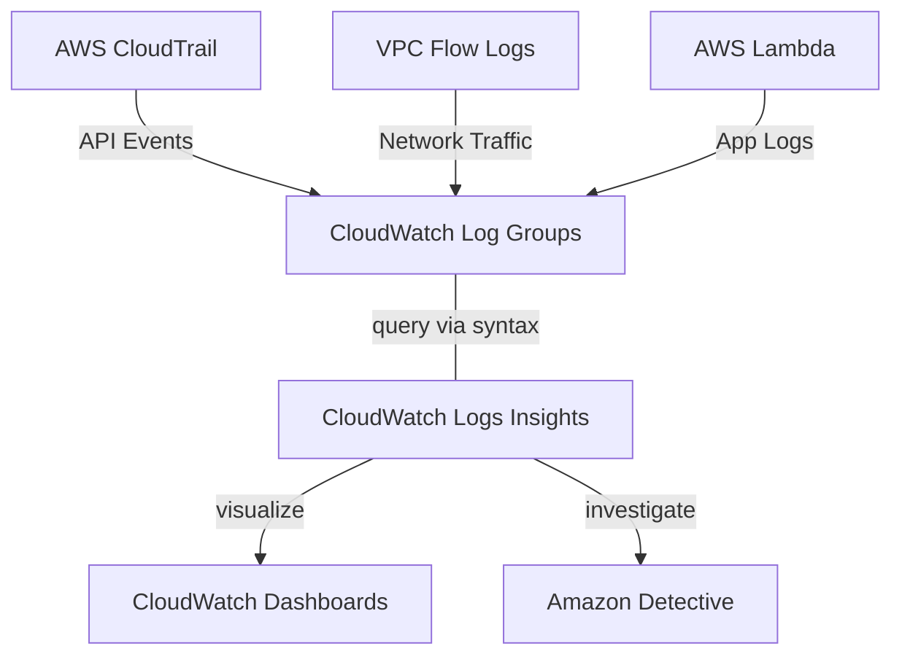
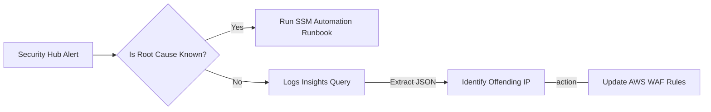

# Curriculum Overview: Querying Log Data with CloudWatch Logs Insights

> This curriculum outline defines the topics and learning outcomes required to master AWS CloudWatch Logs Insights for troubleshooting, security auditing, and operational excellence.

## Prerequisites

Before beginning this curriculum, learners must possess foundational knowledge of AWS operational tools and core compute/networking services.

*   **Cloud Concepts:** Understanding of cloud-native architectures, High Availability (HA), and Fault Tolerance.
*   **AWS Management Tools:** Proficiency with the AWS Management Console and AWS CLI.
*   **Foundational Services:** Basic familiarity with Amazon EC2, AWS Lambda, and Amazon VPCs.
*   **Monitoring Basics:** Experience configuring standard Amazon CloudWatch Metrics and Alarms.
*   **JSON/Querying Skills:** Basic understanding of reading JSON documents and extracting keys/values.

## Module Breakdown

The curriculum is structured progressively, starting from centralized logging fundamentals up to advanced security investigations and automated remediation.

| Module | Topic | Difficulty | Key Focus Area |
| :--- | :--- | :--- | :--- |
| **1** | **Centralized Logging Foundations** | Beginner | Configuring AWS CloudTrail, VPC Flow Logs, and CloudWatch agent on EC2/Containers. |
| **2** | **Introduction to Logs Insights** | Intermediate | Navigating the console, understanding the purpose-built syntax, and basic filtering. |
| **3** | **Advanced Querying & Aggregation** | Advanced | Parsing JSON, cross-log-group searches, and time-series visualizations. |
| **4** | **Security & Observability Integration** | Expert | Analyzing GuardDuty findings, integrating with Amazon Detective, and Lambda Insights. |

### Log Ingestion & Analysis Architecture

## Learning Objectives per Module

### Module 1: Centralized Logging Foundations
*   **Enable multi-source logging:** Configure the CloudWatch agent on EC2 and containers (ECS/EKS) to collect system-level metrics and application logs.
*   **Audit account activity:** Enable AWS CloudTrail data events and integrate them with CloudWatch Logs.
*   **Capture network traffic:** Set up VPC Flow Logs to monitor IP traffic data for troubleshooting security groups and ACLs.

### Module 2: Introduction to Logs Insights
*   **Navigate the query interface:** Execute basic queries using the CloudWatch Logs Insights console.
*   **Apply foundational commands:** Utilize commands like `fields`, `filter`, `sort`, and `limit` to isolate specific log events.
*   **Query across groups:** Use AWS Resource Groups to organize related services (e.g., Lambda functions) and search across multiple log groups simultaneously.

### Module 3: Advanced Querying & Aggregation
*   **Parse complex logs:** Extract data from nested JSON log formats using the `parse` command and JMESPath-like data extraction.
*   **Perform statistical analysis:** Aggregate data using the `stats` command to calculate averages, sums, and percentiles.
*   **Build visualizations:** Convert query results into time-series line or bar charts and export them to CloudWatch Dashboards for multi-account visibility.

### Module 4: Security & Observability Integration
*   **Troubleshoot serverless workloads:** Leverage Lambda Insights to capture metrics like CPU usage, memory, concurrent executions, and iterator age.
*   **Investigate security findings:** Correlate CloudWatch Log data with AWS Security Hub insights and GuardDuty alerts.
*   **Transition to specialized tools:** Identify when to export findings to Amazon Detective for machine-learning-powered graph visualizations and deep historical evaluation.

## Success Metrics

To ensure mastery of the curriculum, learners will be evaluated against the following performance metrics:

*   **Query Speed & Accuracy:** Ability to write a syntactically correct Logs Insights query to isolate a specific HTTP 5xx error within 60 seconds.
*   **Dashboard Construction:** Successfully build a centralized CloudWatch Dashboard displaying at least three distinct visual metrics derived from complex Logs Insights queries.
*   **Cross-Service Troubleshooting:** Given a simulated Security Hub insight (e.g., unauthorized access attempt), use Logs Insights to successfully track the offending IP address across both VPC Flow Logs and CloudTrail logs.
*   **Cost Optimization:** Demonstrate the ability to filter log ingestion and set retention policies effectively to avoid unnecessary AWS logging charges.

> [!IMPORTANT]
> **Success Milestone:** You will know you have mastered the curriculum when you no longer need to download logs to your local machine for analysis, but can perform all extraction, filtering, and aggregation natively within AWS.

## Real-World Application

In a production environment, an AWS SysOps Administrator or CloudOps Engineer relies heavily on CloudWatch Logs Insights to minimize Mean Time to Resolution (MTTR) during operational incidents.

### Scenario: Investigating a Serverless Outage
Imagine an e-commerce platform where users are suddenly experiencing checkout failures. The backend relies on multiple loosely coupled AWS Lambda functions. 

Instead of checking each Lambda function's logs individually, a SysOps Admin will:
1. Open CloudWatch Logs Insights and select the specific AWS Resource Group containing all checkout-related microservices.
2. Write a purpose-built query to filter for the word `ERROR` or `Exception`.
3. Aggregate the results by `bin(5m)` to see exactly when the error spike started.
4. Identify that a specific downstream database integration is timing out, allowing them to route the ticket to the correct database engineering team immediately.

### Incident Response Workflow

### Tool Comparison: When to use what?

| Tool | Primary Use Case | Best For... | Cost Model |
| :--- | :--- | :--- | :--- |
| **CloudWatch Logs Insights** | Ad-hoc query and log parsing | Quick text/JSON searches, custom metric extraction, application debugging | Per GB of data scanned during the query |
| **Amazon Detective** | Security incident visualization | Long-term (up to 1 year) evaluation, GuardDuty correlation, graph-theory links | Per GB of data ingested per account/region |
| **Security Hub Insights** | Finding consolidation | Grouping cross-provider security alerts to trigger automated EventBridge remediations | Per finding processed/ingested |

> [!TIP]
> **Best Practice:** Use Logs Insights for immediate, tactical queries (like finding the stack trace of a broken application). Use Amazon Detective when an initial query uncovers a potential persistent threat and you need to visualize the "blast radius" over the past 30 days.