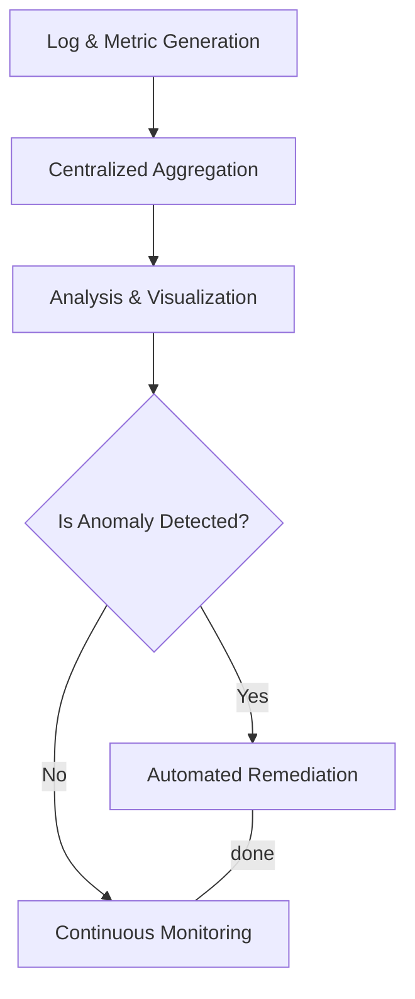
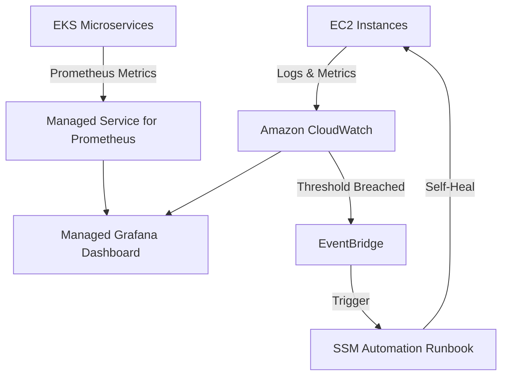

# Curriculum Overview: Advanced Observability Services

> [!NOTE]
> **Course Alignment:** This curriculum overview aligns closely with Domain 1 of the AWS Certified CloudOps Engineer - Associate (SOA-C03) exam: *Monitoring, Logging, Analysis, Remediation, and Performance Optimization*.

Welcome to the Advanced Observability Services curriculum. As cloud environments transition toward modern, containerized, and microservice-driven architectures, traditional monitoring is no longer sufficient. This curriculum bridges the gap between basic resource checks and full-stack, automated observability.

---

## Prerequisites

Before diving into Advanced Observability Services, learners must establish a solid baseline in cloud operations and AWS fundamentals. You should be comfortable with the following:

*   **AWS Management & Core Services:** Proficiency in navigating the AWS Management Console and executing commands via the AWS CLI. Familiarity with EC2, VPC, and IAM basics.
*   **Basic CloudWatch:** Prior experience setting up simple CloudWatch alarms (e.g., CPU Utilization) and viewing basic metrics.
*   **Container Fundamentals:** A conceptual understanding of Docker containers, Amazon Elastic Container Service (ECS), and Amazon Elastic Kubernetes Service (EKS).
*   **JSON & Query Syntax:** Basic ability to read JSON responses and familiarity with querying structures (like JMESPath).

---

## Module Breakdown

This curriculum is structured to take you from foundational centralized logging up to highly automated, multi-account observability platforms.

| Module | Title | Focus Area | Difficulty |
| :--- | :--- | :--- | :--- |
| **1** | Centralized Logging & Analysis | CloudTrail, CloudWatch Logs Insights, log aggregation | Beginner |
| **2** | Advanced CloudWatch Metrics | Custom metrics, anomaly detection, cross-account dashboards | Intermediate |
| **3** | Container & OS-Level Observability | CloudWatch Agent, EC2, ECS, EKS metrics | Intermediate |
| **4** | Open-Source Monitoring Integrations | Amazon Managed Service for Prometheus & Grafana | Advanced |
| **5** | Event-Driven Remediation | EventBridge, Lambda, SSM Automation Runbooks | Expert |

### Observability Flow

---

## Learning Objectives per Module

By progressing through the curriculum, learners will achieve specific, testable outcomes critical to the role of a CloudOps Engineer.

### Module 1: Centralized Logging & Analysis
*   **Audit effectively:** Configure AWS CloudTrail for comprehensive account auditing and data event tracking.
*   **Query at scale:** Write purpose-built syntax queries using CloudWatch Logs Insights to perform complex searches across application and system logs.

### Module 2: Advanced CloudWatch Metrics
*   **Implement intelligent alerting:** Set up CloudWatch alarms featuring static and dynamic thresholds (anomaly detection).
*   **Centralize visibility:** Design and deploy customizable, shareable CloudWatch Dashboards that aggregate data across multiple AWS Regions and accounts.

### Module 3: Container & OS-Level Observability
*   **Deepen system monitoring:** Configure and manage the CloudWatch agent to collect deep system-level metrics and internal logs from EC2 instances.
*   **Observe modern workloads:** Integrate monitoring agents within Amazon ECS and Amazon EKS clusters to track task and pod health.

### Module 4: Open-Source Monitoring Integrations
*   **Adopt open standards:** Explain the architecture and benefits of Amazon Managed Service for Prometheus.
*   **Visualize beautifully:** Identify use cases and configure Amazon Managed Grafana to create rich, interactive visual dashboards compatible with open-source tools.

### Module 5: Event-Driven Remediation
*   **Automate responses:** Configure Amazon EventBridge rules to trigger remediation actions automatically upon state changes.
*   **Deploy runbooks:** Execute predefined and custom Systems Manager (SSM) Automation runbooks to self-heal infrastructure without human intervention.

---

## Success Metrics

How will you know you have mastered the Advanced Observability Services curriculum? Your success will be measured by your ability to:

1.  **Deploy the CloudWatch Agent Programmatically:** Successfully use SSM or User Data to install and configure the CloudWatch agent across a fleet of simulated EC2 and EKS nodes.
2.  **Resolve an Incident Using Insights:** Given a simulated application failure, identify the root cause within 5 minutes using CloudWatch Logs Insights and VPC Flow Logs.
3.  **Create a Multi-Account Grafana Dashboard:** Successfully link metrics from at least two different AWS accounts into a single Managed Grafana visualization.
4.  **Achieve Zero-Touch Remediation:** Build an EventBridge rule that detects a stopped EC2 instance or a full EBS volume, automatically triggering an SSM runbook to remediate the issue.

---

## Real-World Application

In modern enterprise environments, downtime translates directly into lost revenue and damaged reputation. Traditional monitoring focuses on "what is broken?" (e.g., a server is down). Advanced observability answers "why is it broken, and how can we prevent it?" 

**Scenario:** 
Imagine working for a global e-commerce platform during a flash sale. An unexpected spike in traffic causes memory exhaustion on several backend containers. 

*   *Without advanced observability:* Customers experience timeout errors. The operations team spends 45 minutes manually SSHing into servers to read logs and restart services. 
*   *With advanced observability:* The CloudWatch agent detects memory anomalies instantly. Metrics are pushed to a unified Grafana dashboard. EventBridge detects the CloudWatch alarm and triggers an AWS Lambda function that automatically scales up the Amazon ECS cluster and cycles the unhealthy containers—resolving the issue before end-users even notice.

### Real-World Observability Architecture

> [!TIP]
> **Career Impact:** Mastering these tools shifts your role from *reactive administrator* (fixing broken things) to *proactive engineer* (designing self-healing systems), a highly sought-after skill in DevOps and Site Reliability Engineering (SRE) roles.