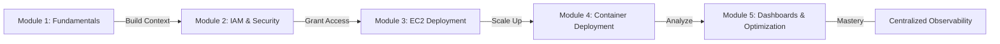
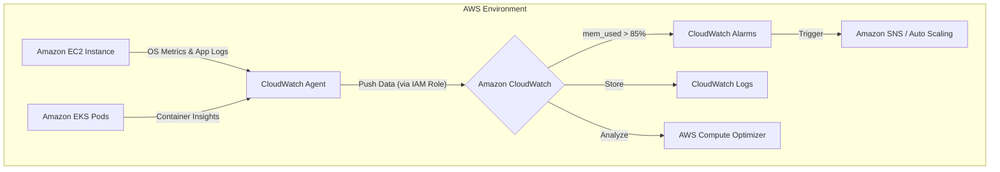

# Curriculum Overview: Configure the CloudWatch Agent on EC2 and Containers

> This curriculum outline defines the learning path, objectives, and real-world applications for deploying and managing the Amazon CloudWatch agent across Amazon EC2 instances and containerized workloads (ECS/EKS). This material aligns tightly with the AWS Certified CloudOps Engineer / SysOps Administrator (SOA-C03) exam domains.

## Prerequisites

Before diving into this curriculum, learners must possess a foundational understanding of AWS infrastructure and access management. 

* **Compute Fundamentals:** Basic knowledge of provisioning Amazon EC2 instances and managing AMIs.
* **Container Basics:** Familiarity with Docker and the high-level architecture of Amazon Elastic Container Service (ECS) and Amazon Elastic Kubernetes Service (EKS).
* **Identity and Access Management (IAM):** Ability to create IAM roles, attach policies, and understand the principle of least privilege.
* **Standard Monitoring:** Understanding of default CloudWatch metrics (e.g., CPU utilization, Disk I/O, Network In/Out) and why OS-level metrics are missing by default.
* **AWS Systems Manager (SSM):** Basic awareness of SSM for fleet management is highly recommended, as the SSM agent is frequently used to deploy the CloudWatch agent.

## Module Breakdown

This curriculum is structured to take you from foundational monitoring concepts to advanced, automated, and centralized observability for modern cloud-native applications.

| Module | Title | Difficulty | Core Focus |
| :--- | :--- | :--- | :--- |
| **Module 1** | **Agent Fundamentals & Architecture** | Beginner | Understanding standard vs. custom metrics and the role of the CloudWatch Agent. |
| **Module 2** | **IAM Permissions & Security** | Intermediate | Configuring `CloudWatchAgentServerPolicy` and instance profiles. |
| **Module 3** | **Deployment on Amazon EC2** | Intermediate | Using Systems Manager (SSM) Run Command and parameter store for agent configuration. |
| **Module 4** | **Deployment on Containers (ECS/EKS)** | Advanced | Configuring DaemonSets (EKS) and sidecars/daemon services (ECS) for container insights. |
| **Module 5** | **Dashboards, Alarms & Optimization** | Advanced | Leveraging collected metrics for AWS Compute Optimizer and CloudWatch Dashboards. |

### Learning Path Progression

## Learning Objectives per Module

### Module 1: Agent Fundamentals & Architecture
* **Identify** the limitations of default EC2 monitoring (e.g., lack of memory and disk space utilization metrics).
* **Describe** how the CloudWatch agent bridges the gap by collecting system-level metrics from the guest operating system.
* **Differentiate** between standard metrics and custom namespaces.

### Module 2: IAM Permissions & Security
* **Implement** IAM roles with the necessary managed policies to allow instances and clusters to push logs and metrics to CloudWatch.
* **Apply** the principle of least privilege when configuring credentials for on-premises servers running the agent.
* **Troubleshoot** access issues using the IAM Policy Simulator if the agent fails to report data.

### Module 3: Deployment on Amazon EC2
* **Configure** the CloudWatch agent configuration JSON file to define which metrics (e.g., memory, disk) and log files to capture.
* **Execute** AWS Systems Manager (SSM) Automation runbooks to install and configure the agent fleet-wide.
* **Verify** that the SSM agent is installed and enabled, as it is a prerequisite for seamless CloudWatch agent deployment and Amazon Inspector vulnerability scanning.

> [!IMPORTANT]
> On EC2, the memory utilization metric must be enabled via the CloudWatch agent. EC2 relies on passing that data from the operating system to CloudWatch. This is a critical point for the SOA-C03 exam!

### Module 4: Deployment on Containers (ECS/EKS)
* **Deploy** the CloudWatch agent as a DaemonSet on Amazon EKS clusters to collect node and pod-level metrics.
* **Configure** the agent as a sidecar container or daemon service in Amazon ECS for task-level insights.
* **Integrate** container logs with CloudWatch Logs for centralized troubleshooting.

### Module 5: Dashboards, Alarms & Optimization
* **Design** cross-region and cross-account CloudWatch Dashboards for centralized fleet monitoring.
* **Configure** CloudWatch alarms and anomaly detection based on the newly collected custom metrics.
* **Analyze** enhanced infrastructure metrics to feed AWS Compute Optimizer for rightsizing recommendations.

## Success Metrics

How will you know you have mastered this curriculum? You should be able to consistently achieve the following observable outcomes in an AWS environment:

1. **Metric Visibility:** You can successfully view `mem_used_percent` and `disk_used_percent` in the CloudWatch Console under a custom namespace (e.g., `CWAgent`).
2. **Log Querying:** You can perform complex searches using CloudWatch Logs Insights on application logs pulled directly from an EC2 instance or an EKS pod.
3. **Automated Deployment:** You can provision 10 new EC2 instances and have the CloudWatch agent automatically installed, configured, and reporting data within 5 minutes without manual SSH access.
4. **Cost Optimization Readiness:** Your collected metrics successfully populate AWS Compute Optimizer, allowing for actionable rightsizing recommendations.

To understand the basic math behind metric collection thresholds, consider the memory utilization formula the agent tracks:

$$ \text{Memory Utilization (\%)} = \left( \frac{\text{Total Memory} - \text{Available Memory}}{\text{Total Memory}} \right) \times 100 $$

Setting a CloudWatch Alarm at $ \ge 85\% $ over 3 consecutive periods is a standard success metric for proactive monitoring.

## Real-World Application

In a production cloud environment, application health is rarely black and white. 

Consider a scenario where a monolithic application on an EC2 instance suffers from a slow memory leak. Because default EC2 metrics only track hypervisor-level data (CPU, Network, Disk I/O), the AWS Management Console will show a healthy instance right up until the operating system runs out of memory and crashes. 

By deploying the CloudWatch agent, CloudOps engineers gain deep visibility into the OS.

### Production Architecture Flow

**Key Career Benefits:**
* **Proactive Remediation:** Integrating custom memory metrics with Amazon EventBridge and EC2 Auto Scaling allows systems to self-heal before users experience downtime.
* **Financial Management:** AWS Compute Optimizer requires historical metric data to make accurate recommendations. By configuring the agent, you enable data-driven decisions that can save your organization thousands of dollars on oversized compute resources.
* **Security & Compliance:** Centralizing logs via the agent ensures that application and OS-level security events are securely stored, immutable, and easily queried during an audit.