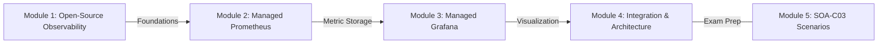
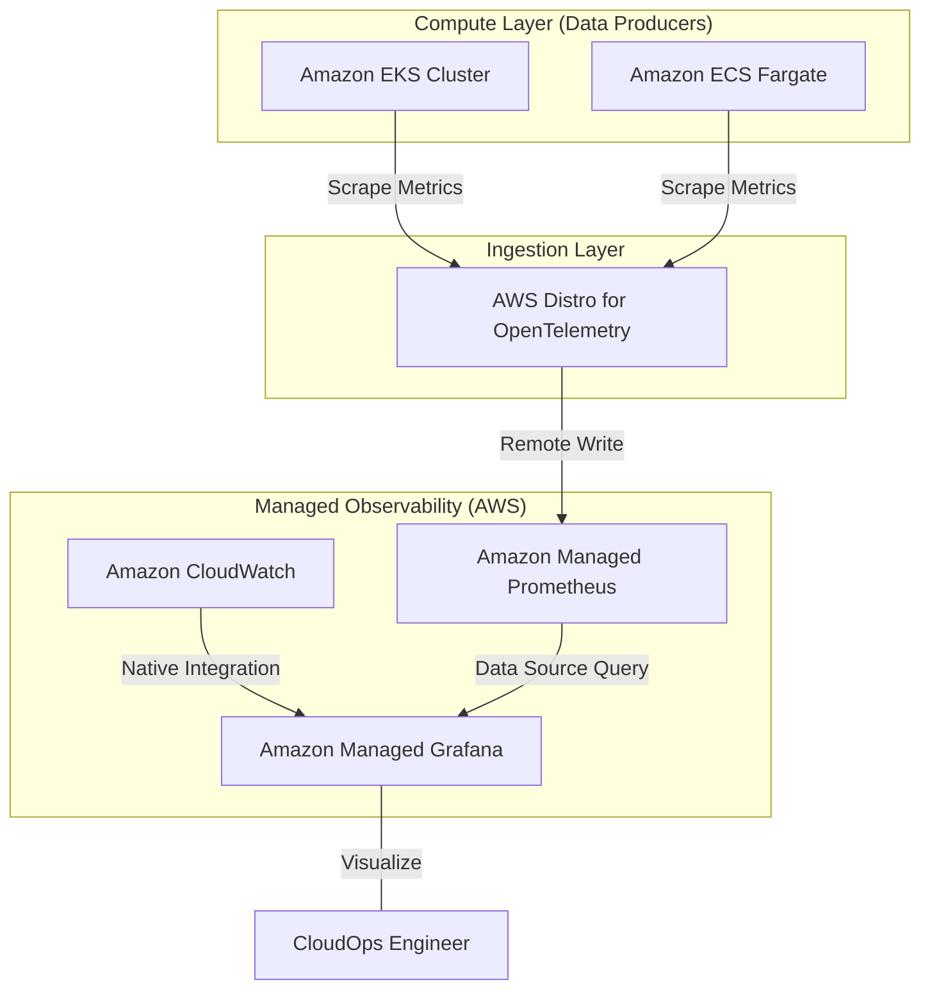

# Curriculum Overview: Managed Service for Prometheus and Grafana

> [!NOTE]
> **Curriculum Alignment:** This module is part of the AWS Certified CloudOps Engineer - Associate (SOA-C03) path, specifically falling under the **Monitoring, Logging, and Observability** domain. It focuses on Advanced Observability Services for modern cloud-native architectures.

## Prerequisites

Before diving into Amazon Managed Service for Prometheus (AMP) and Amazon Managed Grafana (AMG), learners should have a solid foundation in standard AWS observability tools and containerized environments. You must understand:

*   **Amazon CloudWatch Fundamentals:** Basic knowledge of standard metrics, custom metrics, alarms, and dashboards.
*   **Container Basics:** Familiarity with deploying and managing containerized workloads on Amazon Elastic Container Service (ECS) and Amazon Elastic Kubernetes Service (EKS).
*   **Basic Observability Concepts:** Understanding the difference between logs, metrics, and traces.
*   **Identity and Access Management (IAM):** How to apply the principle of least privilege using identity-based policies, as IAM integrates heavily with these managed services.

## Module Breakdown

The curriculum is structured progressively, taking you from the core open-source concepts to full AWS-managed deployments. 

| Module | Topic focus | Difficulty | Estimated Time |
| :--- | :--- | :--- | :--- |
| **Module 1** | Introduction to Open-Source Observability | Beginner | 45 mins |
| **Module 2** | Amazon Managed Service for Prometheus (AMP) | Intermediate | 60 mins |
| **Module 3** | Amazon Managed Grafana (AMG) | Intermediate | 60 mins |
| **Module 4** | EKS/ECS Integrations & Cross-Account Setup | Advanced | 90 mins |
| **Module 5** | SOA-C03 Exam Scenario Workshop | Intermediate | 45 mins |

## Learning Objectives per Module

Each module is designed to build the specific competencies required for the SOA-C03 exam and real-world CloudOps engineering.

### Module 1: Introduction to Open-Source Observability
*   Define the role of Prometheus as a time-series database and metric scraper.
*   Define the role of Grafana as a multi-source data visualization platform.
*   Identify the limitations of self-hosting these tools (e.g., scaling $N$-tier architectures, managing infrastructure).

### Module 2: Amazon Managed Service for Prometheus (AMP)
*   Explain the use cases for open-source compatible monitoring within AWS.
*   Provision an AMP workspace using the AWS Management Console and CLI.
*   Configure the AWS Distro for OpenTelemetry (ADOT) to scrape metrics from Amazon EKS and send them to AMP.

### Module 3: Amazon Managed Grafana (AMG)
*   Deploy an AMG workspace with AWS IAM Identity Center (SSO) integration.
*   Configure AMP, Amazon CloudWatch, and AWS X-Ray as data sources within Grafana.
*   Build custom dashboards utilizing PromQL (Prometheus Query Language).

### Module 4: Integration & Architecture
*   Design a secure, multi-account observability architecture.
*   Troubleshoot VPC and IAM permission issues preventing metric ingestion.

### Module 5: SOA-C03 Exam Scenario Workshop
*   Differentiate when to use CloudWatch vs. AMP/AMG based on scenario requirements.
*   Answer active recall questions regarding cost optimization and performance tuning of observability pipelines.

## Success Metrics

How will you know you have mastered this section of the curriculum? You should be able to check off the following competencies:

1.  **Architectural Fluency:** You can accurately diagram the flow of metrics from an EKS cluster to Grafana without referencing documentation.
2.  **Tool Selection:** Given a business requirement, you can correctly choose between Native CloudWatch and Managed Prometheus/Grafana.
3.  **Hands-On Execution:** You can successfully deploy an AMP workspace and an AMG dashboard using Infrastructure as Code (e.g., AWS CloudFormation or CDK).
4.  **Exam Readiness:** You consistently score 85%+ on practice questions specifically targeting *Advanced Observability Services*.

> [!IMPORTANT]
> **Exam Tip for SOA-C03:** The exam heavily tests your ability to *identify use cases*. If a question mentions a company "migrating existing open-source monitoring," "wanting to avoid vendor lock-in," or "needing PromQL support," the correct answer is almost always Managed Prometheus and Managed Grafana.

## Real-World Application

In modern enterprise environments, engineering teams frequently rely on Kubernetes (EKS) for container orchestration. Because Kubernetes was born in the open-source community, its native monitoring ecosystem is built entirely around Prometheus and Grafana.

### Why does this matter in your career?

If a company runs self-managed Prometheus, the CloudOps team must constantly scale the underlying EC2 instances, manage EBS volumes to prevent data loss, and patch the software. By leveraging **Amazon Managed Service for Prometheus** and **Amazon Managed Grafana**, you provide the exact same user experience to developers (they still use PromQL and Grafana dashboards) while eliminating the undifferentiated heavy lifting of infrastructure management.

### Architectural Flow Example

Below is a standard real-world architecture you will build during this curriculum, demonstrating how AWS services interlock to provide a seamless observability pipeline:

### Service Comparison: CloudWatch vs. Open Source Managed

Understanding this comparison is crucial for architectural decision-making:

| Feature / Requirement | Amazon CloudWatch | Managed Prometheus & Grafana |
| :--- | :--- | :--- |
| **Primary Use Case** | AWS-native workloads (EC2, Lambda, RDS) | Cloud-native, containerized, open-source (EKS, Kubernetes) |
| **Query Language** | CloudWatch Metrics Insights / Logs Insights | PromQL (Prometheus Query Language) |
| **Visualization** | Native CloudWatch Dashboards | Highly customizable Grafana panels & community templates |
| **Vendor Lock-in** | High (Proprietary to AWS) | Low (Standard open-source tooling, easy to migrate) |

By completing this curriculum module, you will transition from a traditional systems administrator into a modern CloudOps Engineer capable of supporting complex, multi-environment, open-source-aligned architectures.