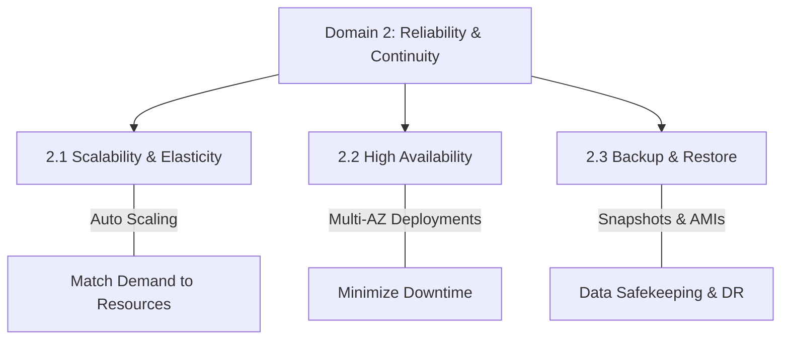
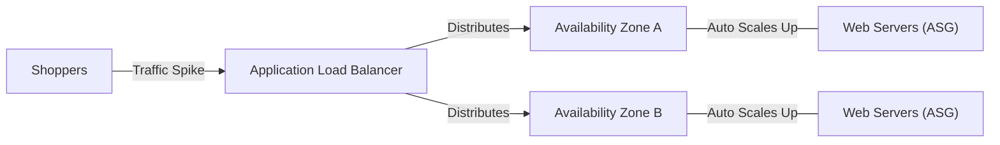

# Unit 2 Curriculum Overview: Reliability and Business Continuity

Welcome to Unit 2 of the AWS Certified SysOps Administrator track. This unit focuses heavily on Domain 2 of the certification exam: ensuring that systems can scale dynamically, remain available during failures, and be securely backed up for rapid disaster recovery.

---

## Prerequisites

Before diving into this unit, you should have a solid foundation in core AWS infrastructure. Ensure you are comfortable with the following concepts:
* **Compute Basics:** Familiarity with spinning up Amazon EC2 instances.
* **Storage Fundamentals:** Understanding of Amazon S3, EBS (Elastic Block Store), and basic data transfer methods.
* **Networking:** Basic knowledge of Virtual Private Clouds (VPCs), subnets, and routing (aligning with Domain 5).

> [!NOTE] 
> If you are weak on storage fundamentals, review **Chapter 6: Storage, Migration, and Transfer** prior to starting this unit, as every business continuity plan relies heavily on the safekeeping of data.

---

## Module Breakdown

This unit is divided into three primary modules, directly mirroring the AWS SysOps exam objectives for Domain 2.

| Module | Exam Objective | Core Focus | Difficulty Progression |
| :--- | :--- | :--- | :--- |
| **Module 2.1** | Implement scalability and elasticity | Auto Scaling, Load Balancing | Intermediate |
| **Module 2.2** | Implement high availability and resilient environments | Multi-AZ architectures, Fault Tolerance | Advanced |
| **Module 2.3** | Implement backup and restore strategies | Snapshots, S3 lifecycle policies, Disaster Recovery (DR) | Intermediate |

### Unit 2 Concept Map

---

## Learning Objectives per Module

### Module 2.1: Scalability and Elasticity
* **Design Auto Scaling Groups (ASG):** Configure ASGs to dynamically add or remove EC2 instances based on CPU utilization or custom CloudWatch metrics.
* **Implement Elastic Load Balancing (ELB):** Distribute incoming application traffic seamlessly across multiple targets to ensure no single instance is overwhelmed.

### Module 2.2: High Availability and Resilient Environments
* **Architect Multi-AZ Deployments:** Provision resources across multiple Availability Zones to withstand data center failures.
* **Calculate and Maximize Availability:** Understand the mathematical definition of system availability. 
  * *Formula:* $Availability = \frac{MTBF}{MTBF + MTTR}$ (Where MTBF is Mean Time Between Failures, and MTTR is Mean Time To Recovery).
* **Implement Route 53 Health Checks:** Use DNS failover routing policies to redirect traffic away from unhealthy endpoints.

### Module 2.3: Backup and Restore Strategies
* **Automate EBS Snapshots:** Use Amazon Data Lifecycle Manager (DLM) to schedule regular point-in-time backups of block storage.
* **Configure S3 Versioning & Cross-Region Replication:** Protect object storage from accidental deletion and geographic disasters.
* **Design Disaster Recovery (DR) Plans:** Differentiate between Pilot Light, Warm Standby, and Multi-Site Active/Active DR strategies.

---

## Success Metrics

How will you know you have mastered this curriculum? You should be able to:
1. **Pass Scenario-Based Exam Questions:** Correctly identify whether a scenario requires scaling (elasticity) versus spanning zones (high availability).
2. **Design a Resilient Architecture:** Draw and implement a standard 3-tier web application that survives the termination of any single EC2 instance.
3. **Achieve an RTO/RPO target:** Successfully configure a backup system that meets a strict Recovery Time Objective (RTO) of $< 1$ hour and a Recovery Point Objective (RPO) of $< 15$ minutes.

---

## Real-World Application

Why does this matter in your career as a SysOps Administrator or Cloud Architect?

> [!IMPORTANT]
> **Downtime Costs Money.** In the real world, reliability is not just an exam domain; it is the lifeblood of digital business.

Consider a retail website on "Black Friday." 

* **Without Elasticity (2.1):** The sudden influx of shoppers would crash the static servers. With elasticity, the infrastructure dynamically expands.
* **Without High Availability (2.2):** A power failure in one AWS data center would take the store offline. With Multi-AZ, traffic seamlessly reroutes to the surviving zone.
* **Without Backups (2.3):** A ransomware attack or accidental database drop could permanently destroy customer orders. With point-in-time restore strategies, the database is recovered in minutes.

Mastering Unit 2 ensures you can confidently protect your organization's revenue, reputation, and data.