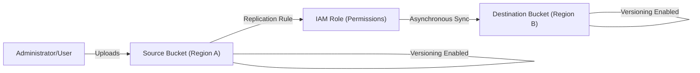

# Lab: Building Resilient Storage with S3 Cross-Region Replication

This lab focuses on **Domain 2: Reliability and Business Continuity** of the AWS SysOps Administrator Associate syllabus. You will implement a high-availability storage strategy using S3 Versioning and Cross-Region Replication (CRR) to ensure data durability and disaster recovery readiness.

> [!WARNING]
> Remember to run the teardown commands at the end of this lab to avoid ongoing charges for S3 storage and replication data transfer.

## Prerequisites

- An active AWS Account.
- AWS CLI installed and configured with Administrator access.
- Basic knowledge of S3 bucket naming conventions.
- Access to two distinct AWS Regions (e.g., `us-east-1` and `us-west-2`).

## Learning Objectives

*   Configure **S3 Versioning** to protect against accidental deletes.
*   Create and attach an **IAM Service Role** for S3 replication.
*   Implement **Cross-Region Replication (CRR)** for automated data redundancy.
*   Verify reliability by testing object synchronization across regions.

## Architecture Overview

In this architecture, any object uploaded to the Source Bucket is automatically and asynchronously replicated to the Destination Bucket in a different geographic region.



## Step-by-Step Instructions

### Step 1: Define Variables and Create Buckets

First, define unique names for your buckets. S3 bucket names must be globally unique.

```bash
# Replace <YOUR_ID> with a unique string
export SOURCE_BUCKET="brainybee-lab-source-<YOUR_ID>"
export DEST_BUCKET="brainybee-lab-dest-<YOUR_ID>"
export SOURCE_REGION="us-east-1"
export DEST_REGION="us-west-2"
```

Create the buckets using the CLI:

```bash
# Create Source Bucket
aws s3api create-bucket --bucket $SOURCE_BUCKET --region $SOURCE_REGION

# Create Destination Bucket (Note: us-west-2 requires LocationConstraint)
aws s3api create-bucket --bucket $DEST_BUCKET --region $DEST_REGION --create-bucket-configuration LocationConstraint=$DEST_REGION
```

<details><summary>Console Alternative</summary>
1. Navigate to <strong>S3 > Create bucket</strong>.
2. Create <code>brainybee-lab-source-xyz</code> in us-east-1.
3. Create <code>brainybee-lab-dest-xyz</code> in us-west-2.
</details>

### Step 2: Enable Versioning

Versioning is a mandatory prerequisite for Cross-Region Replication. It allows you to preserve, retrieve, and restore every version of every object stored in your buckets.

```bash
# Enable versioning on Source
aws s3api put-bucket-versioning --bucket $SOURCE_BUCKET --versioning-configuration Status=Enabled

# Enable versioning on Destination
aws s3api put-bucket-versioning --bucket $DEST_BUCKET --versioning-configuration Status=Enabled
```

### Step 3: Create IAM Replication Role

S3 requires permission to assume a role to replicate objects on your behalf. 

1. Create a trust policy file named `trust-policy.json`:
```json
{
  "Version": "2012-10-17",
  "Statement": [
    {
      "Effect": "Allow",
      "Principal": { "Service": "s3.amazonaws.com" },
      "Action": "sts:AssumeRole"
    }
  ]
}
```

2. Create the role and attach the policy:
```bash
aws iam create-role --role-name S3ReplicationRole --assume-role-policy-document file://trust-policy.json
```

3. Attach the permissions policy (Note: In a production environment, use a scoped-down policy limiting access only to these two specific buckets).

### Step 4: Configure Replication Rule

Create a file named `replication.json`. Replace `<DEST_BUCKET_ARN>` with your actual destination bucket ARN (e.g., `arn:aws:s3:::brainybee-lab-dest-123`) and `<ROLE_ARN>` with your IAM role ARN.

```json
{
  "Role": "<ROLE_ARN>",
  "Rules": [
    {
      "Status": "Enabled",
      "Priority": 1,
      "DeleteMarkerReplication": { "Status": "Disabled" },
      "Filter": { "Prefix": "" },
      "Destination": {
        "Bucket": "arn:aws:s3:::<DEST_BUCKET_NAME>"
      }
    }
  ]
}
```

Apply the configuration:

```bash
aws s3api put-bucket-replication --bucket $SOURCE_BUCKET --replication-configuration file://replication.json
```

## Checkpoints

| Checkpoint | Action | Expected Result |
| :--- | :--- | :--- |
| **Verification 1** | Upload a file: `aws s3 cp test.txt s3://$SOURCE_BUCKET/` | Command returns successful upload. |
| **Verification 2** | Wait 1-2 minutes and check destination: `aws s3 ls s3://$DEST_BUCKET/` | The file `test.txt` should appear in the destination bucket. |
| **Verification 3** | Check Versioning: `aws s3api list-object-versions --bucket $SOURCE_BUCKET` | You should see a `VersionId` associated with your file. |

## Visualizing Resiliency

Below is a TikZ representation of the data availability flow. If Region A fails, the data remains durable in Region B.

```tikz
\begin{tikzpicture}[node distance=2cm, every node/.style={rectangle, draw, minimum width=2.5cm, minimum height=1cm, align=center}]
  \node (S) {Primary Data\\(Region A)};
  \node (R) [right=of S] {Replication\\Engine};
  \node (D) [right=of R] {Secondary Data\\(Region B)};
  
  \draw[->, thick] (S) -- (R);
  \draw[->, thick] (R) -- (D);
  
  \node[draw=none, below=0.5cm of S] (L1) {\textbf{99.999999999\% Durability}};
  \node[draw=none, below=0.5cm of D] (L2) {\textbf{Geographic Separation}};
\end{tikzpicture}
```

## Troubleshooting

| Error | Likely Cause | Solution |
| :--- | :--- | :--- |
| `ReplicationConfigurationNotFoundError` | Versioning not enabled on both buckets. | Ensure `put-bucket-versioning` was successful on both source and destination. |
| Files not appearing in Destination | IAM Role lacks `s3:GetReplicationConfiguration` or `s3:GetObjectVersion`. | Check the IAM Role policy and ensure S3 can assume the role. |
| `AccessDenied` on upload | Bucket policy or IAM permissions. | Verify your local CLI user has `s3:PutObject` permissions. |

## Clean-Up / Teardown

> [!IMPORTANT]
> S3 buckets must be empty before they can be deleted. Because versioning is enabled, you must delete all object versions.

1. Empty the buckets:
```bash
aws s3 rm s3://$SOURCE_BUCKET --recursive
aws s3 rm s3://$DEST_BUCKET --recursive
```

2. Delete the buckets:
```bash
aws s3 rb s3://$SOURCE_BUCKET --force
aws s3 rb s3://$DEST_BUCKET --force
```

3. Delete the IAM Role:
```bash
aws iam delete-role --role-name S3ReplicationRole
```