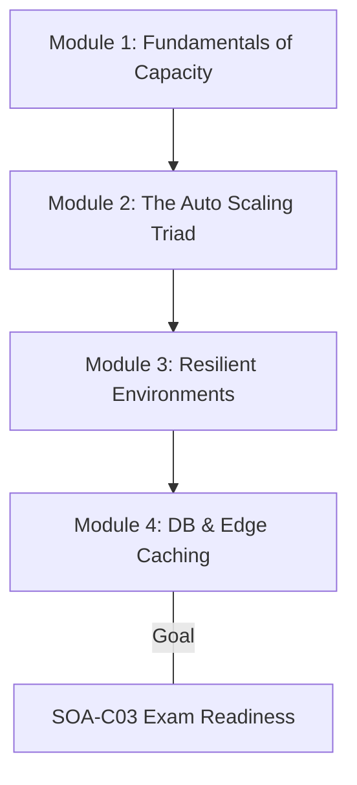

# AWS Curriculum Overview: Scalability and Elasticity

> This curriculum overview defines the learning path for mastering AWS scalability and elasticity, directly aligning with the AWS Certified SysOps Administrator - Associate (SOA-C03) exam objectives (Task 2.1).

## Prerequisites

Before diving into this curriculum, you must possess foundational knowledge in several core AWS domains. Attempting these modules without the prerequisites may result in confusion when configuring interconnected services.

*   **Cloud Computing Concepts:** Firm understanding of high availability, fault tolerance, and the AWS shared responsibility model.
*   **AWS Management Tools:** Proficiency in navigating the AWS Management Console and executing basic operations via the AWS CLI.
*   **Amazon EC2 Fundamentals:** Ability to provision virtual servers, configure Security Groups, and manage Amazon Machine Images (AMIs).
*   **Basic Networking:** Understanding of Virtual Private Clouds (VPCs), public/private subnets, and internet gateways.

> [!IMPORTANT]
> A strong grasp of **Amazon CloudWatch** is highly recommended before starting. Auto Scaling relies heavily on CloudWatch metrics to monitor resource health and trigger dynamic scaling events.

## Module Breakdown

This curriculum is divided into four progressively complex modules, taking you from core concepts to advanced, multi-service scaling architectures.

| Module | Focus Area | Difficulty | Est. Time | Key Service Focus |
| :--- | :--- | :--- | :--- | :--- |
| **Module 1** | Fundamentals of Capacity Management | Beginner | 2 Hours | EC2, Auto Scaling |
| **Module 2** | The Auto Scaling Triad | Intermediate | 4 Hours | CloudWatch, ELB, ASG |
| **Module 3** | Resilient Environments & Health Checks | Intermediate | 3 Hours | Route 53, Multi-AZ |
| **Module 4** | Scaling Databases & Edge Caching | Advanced | 4 Hours | RDS, DynamoDB, CloudFront |

### Curriculum Progression Flow

## Learning Objectives per Module

By completing this curriculum, you will master the configuration, management, and troubleshooting of scalable architectures in AWS.

### Module 1: Fundamentals of Capacity Management
*   Define and configure the three key capacity metrics: **Minimum**, **Desired**, and **Maximum** capacity.
*   Explain how to maintain a fixed number of instances (e.g., maintaining exactly one bastion host by setting Min=1, Desired=1, Max=1).
*   Evaluate workload requirements to determine the appropriate EC2 instances, Amazon ECS containers, or Spot fleets for auto scaling.

### Module 2: The Auto Scaling Triad
*   Implement the "Auto Scaling Triad" by integrating CloudWatch, Elastic Load Balancing (ELB), and Auto Scaling Groups (ASG).
*   Configure Amazon EventBridge rules to automate responses to state changes and system failures.
*   Design dynamic, scheduled, and predictive scaling strategies to match compute resources to demand patterns.

### Module 3: Resilient Environments & Health Checks
*   Configure and troubleshoot Elastic Load Balancing (ELB) listeners and routing rules across multiple Availability Zones.
*   Implement Amazon Route 53 health checks to ensure traffic is only routed to healthy endpoints.
*   Deploy fault-tolerant systems using Multi-AZ deployments for seamless failover operations.

### Module 4: Scaling Databases & Edge Caching
*   Configure managed scaling for AWS databases, including Amazon RDS read replicas and Amazon DynamoDB auto scaling.
*   Implement edge caching using Amazon CloudFront to reduce backend server load and enhance dynamic scalability.
*   Deploy Amazon ElastiCache to accelerate database read performance for read-heavy application workflows.

## Success Metrics

How will you know you have successfully mastered the curriculum? Look for these key indicators of proficiency:

*   **Architectural Fluency:** You can accurately diagram and explain the relationship between CloudWatch alarms, ELB target groups, and Auto Scaling policies without referencing documentation.
*   **Hands-On Lab Validation:** You can successfully deploy a web application that automatically provisions new EC2 instances when simulated CPU utilization exceeds 70%, and correctly terminates them when load drops.
*   **Exam Performance:** You consistently score 85% or higher on SOA-C03 practice questions specifically mapped to Domain 2 (Reliability and Business Continuity) and Task 2.1.

## Real-World Application

Scalability and elasticity are not just exam concepts; they are the backbone of modern cloud operations and cost management.

*   **Handling "Black Friday" Traffic:** E-commerce platforms experience massive, unpredictable spikes in traffic during holiday sales. Elasticity ensures your Auto Scaling Group automatically provisions dozens of new web servers to handle the load, preventing site crashes.
*   **Aggressive Cost Optimization:** A corporate internal application is only used Monday through Friday. Predictive scaling can automatically shrink the server fleet down to zero over the weekend, drastically reducing your monthly AWS bill.
*   **Self-Healing Infrastructure:** If an underlying hardware failure causes an EC2 instance to crash, the Auto Scaling group will detect the failed health check and instantly provision a replacement, ensuring high availability with zero manual intervention.

### Visualizing the Real-World Architecture

The following diagram illustrates the standard **Auto Scaling Triad** utilized in production environments to maintain application uptime.

> [!TIP]
> **Common Pitfall:** A frequent mistake in the real world is setting the *Minimum Capacity* to 0 for a critical application. Always ensure your minimum capacity represents the absolute lowest number of instances needed to maintain the availability of your workload.