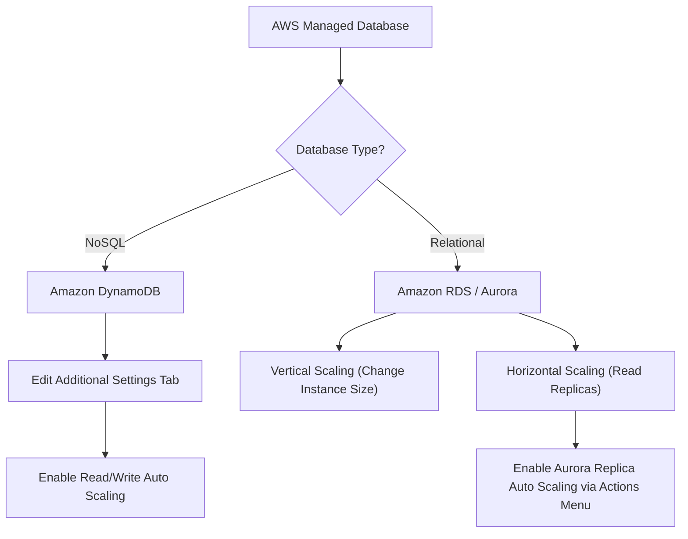

# Curriculum Overview: Configure and Manage Scaling in AWS Managed Databases

Welcome to the curriculum overview for configuring and managing scalability in AWS managed database services, specifically focusing on Amazon RDS and Amazon DynamoDB. This curriculum aligns with the AWS Certified SysOps Administrator - Associate (SOA-C03) exam objectives (Task 2.1: Implement scalability and elasticity).

## Prerequisites

Before diving into this curriculum, learners must possess a foundational understanding of AWS infrastructure and basic database concepts. 

*   **AWS Management Console & CLI:** Ability to navigate the AWS console and execute basic AWS CLI commands.
*   **CloudWatch Fundamentals:** Understanding of Amazon CloudWatch metrics, alarms, and dashboards.
*   **Database Concepts:** Basic differentiation between Relational Databases (SQL) and NoSQL Databases.
*   **Shared Responsibility Model:** Awareness that in managed services like RDS, AWS manages the OS, engine, and backups, while the customer manages the data and scaling configurations.

## Module Breakdown

This curriculum is divided into four progressive modules, taking you from the core concepts of managed databases to advanced auto-scaling configurations.

| Module | Title | Difficulty | Core Focus |
| :--- | :--- | :--- | :--- |
| **Module 1** | Introduction to Managed Database Elasticity | Beginner | Managed vs. Unmanaged DBs, Administrative Overhead |
| **Module 2** | Scaling Amazon DynamoDB | Intermediate | Read/Write Capacity Units (RCU/WCU), Application Auto Scaling |
| **Module 3** | Scaling Amazon RDS & Aurora | Intermediate | Vertical Scaling, Read Replicas, Aurora Auto Scaling |
| **Module 4** | Monitoring, Performance & Troubleshooting | Advanced | CloudWatch metrics, Performance Insights, Alarm remediation |



## Learning Objectives per Module

### Module 1: Introduction to Managed Database Elasticity
*   **Differentiate** between self-managed EC2 databases and AWS-managed databases (RDS/DynamoDB) regarding administrative overhead.
*   **Identify** how managed services restrict direct OS/shell access to provide a secure, automated scaling environment.
*   **Evaluate** the cost benefits of reduced administrative overhead.

### Module 2: Scaling Amazon DynamoDB
*   **Configure** On-Demand vs. Provisioned capacity modes.
*   **Implement** DynamoDB Application Auto Scaling by modifying the *Additional Settings* tab in the AWS Console.
*   **Define** target utilization percentages to trigger scaling events for Read Capacity Units (RCUs) and Write Capacity Units (WCUs).

### Module 3: Scaling Amazon RDS & Aurora
*   **Execute** vertical scaling on Amazon RDS by modifying DB instance classes (understanding the associated downtime).
*   **Deploy** Amazon RDS Read Replicas to offload read-heavy database traffic.
*   **Configure** Aurora Auto Scaling for read replicas using the *Actions menu* of the regional cluster to handle dynamic traffic.

### Module 4: Monitoring, Performance & Troubleshooting
*   **Analyze** RDS Performance Insights and CloudWatch metrics to determine *when* to scale.
*   **Troubleshoot** common scaling failures (e.g., hitting account quotas or maximum configured capacity limits).
*   **Automate** notifications using Amazon EventBridge when scaling events occur.

## Success Metrics

How will you know you have mastered this curriculum? You should be able to consistently demonstrate the following:

1.  **Practical Deployment:** Successfully configure an Aurora Auto Scaling policy that adds a new read replica when CPU utilization exceeds 75%.
2.  **DynamoDB Configuration:** Demonstrate setting up a DynamoDB table with Provisioned Capacity and applying an Application Auto Scaling policy with a 70% target utilization.
3.  **Exam Readiness:** Score 85% or higher on practice questions mapped to SOA-C03 Skill 2.1.3 (Configure and manage scaling in AWS managed databases).
4.  **Cost Optimization:** Prove through AWS Cost Explorer that your scaling policies successfully reduced provisioned capacity during off-peak hours.

## Real-World Application

In modern cloud environments, traffic is rarely static. Understanding how to dynamically scale AWS managed databases is critical for balancing **performance** with **cost**.

> [!IMPORTANT] 
> **The E-Commerce Flash Sale Scenario**
> Imagine you are a SysOps Administrator for an e-commerce platform. During a sudden marketing promotion, traffic spikes by 400%.

*   **Without Auto Scaling:** The database hits 100% CPU. Queries queue up, latency skyrockets, and the website crashes, resulting in lost revenue.
*   **With Auto Scaling:** Amazon CloudWatch detects the rising metric. For your Aurora cluster, it automatically provisions additional read replicas. For your DynamoDB session store, Application Auto Scaling increases the Write Capacity Units (WCUs). The platform remains stable, and once the sale ends, the databases scale back down to save money.

### Visualizing Capacity vs. Traffic Spikes

The following diagram illustrates how Application Auto Scaling responds to consumed capacity dynamically over time.

```tikz
\begin{tikzpicture}[x=1cm, y=1cm]
  % Axes
  \draw[->, thick] (0,0) -- (8,0) node[right] {Time};
  \draw[->, thick] (0,0) -- (0,5) node[above] {Capacity};

  % Consumed Capacity (solid line)
  \draw[thick, blue] (0,1) to[out=0, in=180] (2,1.5) to[out=0, in=180] (4,4) to[out=0, in=180] (6,2) to[out=0, in=180] (7.5,2.5);
  \node[blue, right] at (7.5,2.5) {Consumed};

  % Provisioned Capacity (dashed line, step-like)
  \draw[thick, red, dashed] (0,1.5) -- (3,1.5) -- (3,4.5) -- (5,4.5) -- (5,2.5) -- (7.5,2.5);
  \node[red, right] at (7.5, 4.5) {Provisioned};

  % Labels
  \node[align=center, below] at (4,-0.2) {Traffic Spike};
  \draw[dotted, gray] (4,0) -- (4,4);
\end{tikzpicture}
```

By leveraging AWS managed databases, you offload the heavy lifting of server provisioning, OS patching, and engine configuration to AWS, allowing you to focus purely on strategic scaling, performance tuning, and database optimization.