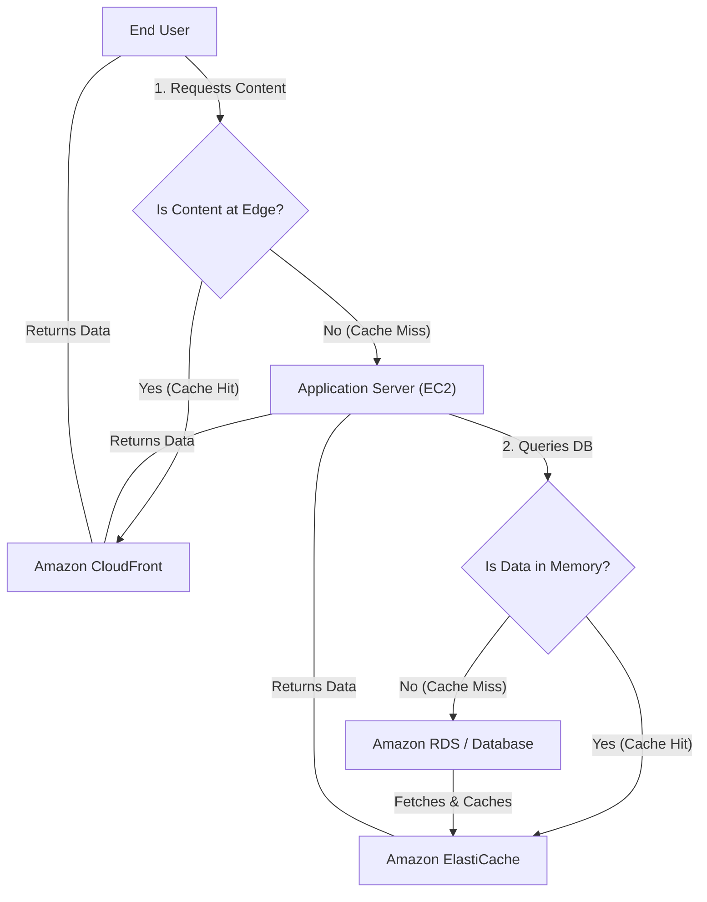

# Curriculum Overview: Implementing AWS Caching for Dynamic Scalability

This curriculum is designed to help you master **Task 2.1.2** of the AWS Certified SysOps Administrator / CloudOps Engineer Associate (SOA-C03) Exam: *Implement caching by using AWS services to enhance dynamic scalability (for example, Amazon CloudFront, Amazon ElastiCache).* 

By leveraging AWS caching mechanisms, you can drastically reduce latency, offload backend processing, minimize API request costs, and enhance the global elasticity of your applications.

---

## Prerequisites

Before diving into this curriculum, learners should have a solid foundation in the following areas:

*   **Core AWS Services**: Familiarity with Amazon EC2, Amazon S3, and Amazon RDS.
*   **Networking Fundamentals**: Understanding of DNS, HTTP/HTTPS requests, and network latency.
*   **Database Concepts**: Basic knowledge of relational databases vs. in-memory data stores.
*   **Application Architecture**: Understanding of frontend (client), backend (server), and database tiers.

> [!IMPORTANT]
> If you are unfamiliar with hosting a static website on Amazon S3, review the AWS tutorial on S3 Static Web Hosting before proceeding, as S3 is frequently used as an origin for CloudFront caching.

---

## Module Breakdown

The curriculum is structured progressively, starting with high-level caching strategies and moving into specific AWS service implementations.

| Module | Title | Difficulty | Key Focus Area |
| :--- | :--- | :--- | :--- |
| **1** | **Caching Fundamentals & Architecture** | Beginner | The "Why" of caching, where to cache (Edge vs. Backend vs. Client-side). |
| **2** | **Amazon CloudFront (Edge Caching)** | Intermediate | Content Delivery Networks (CDNs), S3 Origins, caching static and dynamic web content globally. |
| **3** | **Amazon ElastiCache (Backend Caching)** | Intermediate | In-memory data stores (Redis & Memcached), offloading database queries, managing session state. |
| **4** | **Client-Side API Caching** | Advanced | Using AWS SDKs to cache API requests (e.g., AWS Secrets Manager caching) to improve speed and reduce costs. |
| **5** | **Troubleshooting & Optimization** | Advanced | Cache invalidation, TTLs (Time to Live), identifying cache misses, and resolving bottlenecks. |

### Caching Architecture Overview

---

## Learning Objectives per Module

### Module 1: Caching Fundamentals
*   Define dynamic scalability and explain how caching reduces infrastructure burden.
*   Identify the appropriate caching layer (Edge, Backend, Client) based on application requirements.

### Module 2: Amazon CloudFront
*   Configure Amazon CloudFront to cache frequently accessed files (e.g., movie trailers, images) using an Amazon S3 bucket as the origin.
*   Explain how CloudFront provides performance gains by terminating connections closer to the end-user.
*   Differentiate between static asset caching and dynamic route acceleration (e.g., using AWS Global Accelerator).

### Module 3: Amazon ElastiCache
*   Deploy an ElastiCache cluster (Redis or Memcached) to support an Amazon EC2-based web application.
*   Implement strategies to offload heavy read-operations from Amazon RDS to ElastiCache.
*   Design a stateless application architecture by storing user session data in ElastiCache.

### Module 4: Client-Side API Caching
*   Implement client-side caching within AWS SDKs to reduce the number of API requests to services like AWS Secrets Manager.
*   Understand how to retrieve secrets via AWS CloudFormation dynamic references while optimizing API limits.

### Module 5: Troubleshooting & Optimization
*   Troubleshoot application latency issues using CloudWatch metrics for CloudFront and ElastiCache.
*   Manage cache expiration using Time to Live (TTL) settings and manual invalidations.

---

## Success Metrics

How will you know you have mastered this curriculum? You will be able to:

1.  **Architecture Design**: Successfully draw and provision an architecture where a globally distributed application utilizes CloudFront for frontend assets and ElastiCache for backend query caching.
2.  **Cost & Performance Optimization**: Demonstrate a measurable reduction in API calls (e.g., to Secrets Manager) and database reads (to RDS) in a lab environment using CloudWatch metrics.
3.  **Exam Readiness**: Consistently score 85%+ on SOA-C03 practice questions related to Task 2.1 (Implement scalability and elasticity) specifically concerning CloudFront and ElastiCache.

---

## Real-World Application

Why does this matter in your career as a CloudOps Engineer or SysOps Administrator? 

*   **Global Media Streaming**: Imagine working for a streaming service. You will use **Amazon CloudFront** to cache large media files (like movie trailers) close to users worldwide. This prevents your Amazon S3 buckets from being overwhelmed by direct requests, keeping latency low and user experience high.
*   **E-Commerce Flash Sales**: During a Black Friday event, a massive influx of users searches for the same product catalog. Instead of querying your relational database (RDS) thousands of times per second, you implement **Amazon ElastiCache**. The first query caches the product list, and the next 9,999 users are served instantly from memory, preventing database crashes.
*   **Cost Management**: By implementing client-side caching for **AWS Secrets Manager**, you prevent your application from making an expensive, high-latency API call every single time it needs a database credential, resulting in massive cost savings at scale.

> [!TIP]
> **Exam Tip:** Whenever a scenario question asks how to handle "frequently accessed files" with "connections closer to the end user," look for **Amazon CloudFront**. When the question focuses on "offloading database reads" or "sub-millisecond latency for session state," look for **Amazon ElastiCache**.