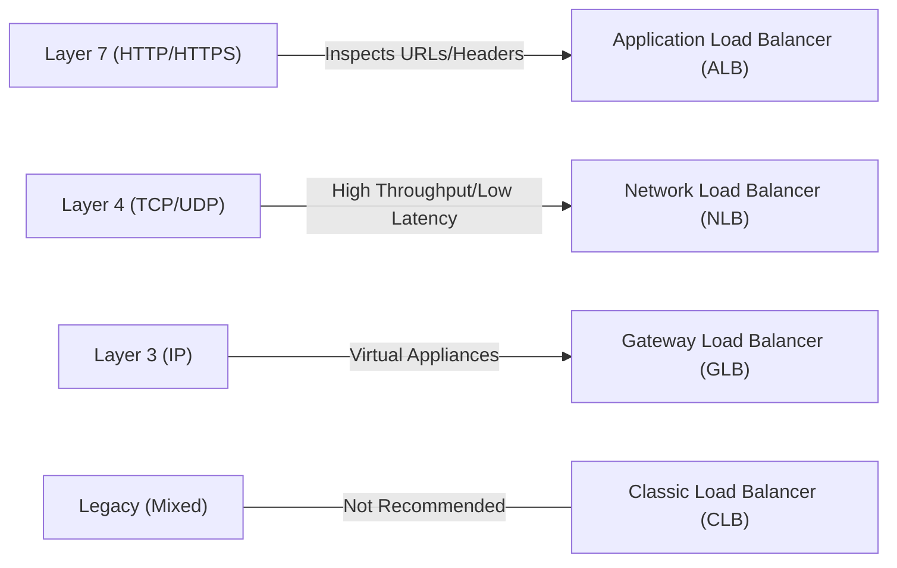
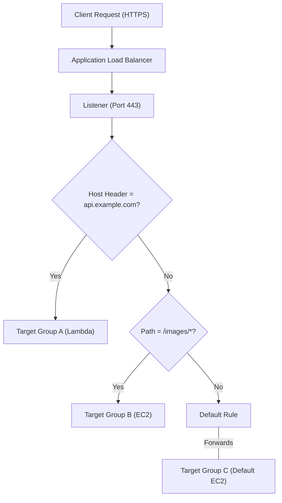

# Curriculum Overview: Manage Elastic Load Balancing (ELB) Listeners and Rules

Welcome to the curriculum overview for **Managing Elastic Load Balancing (ELB) Listeners and Rules**. This curriculum is designed to equip you with the practical skills and theoretical knowledge required to efficiently distribute incoming application traffic across multiple targets, such as Amazon EC2 instances, containers, IP addresses, and Lambda functions.

---

## Prerequisites

Before diving into this curriculum, learners should have a solid foundation in the following areas to ensure success:

*   **OSI Model Fundamentals:** A clear understanding of the Open Systems Interconnection (OSI) model, specifically Layer 3 (Network), Layer 4 (Transport/TCP/UDP), and Layer 7 (Application/HTTP/HTTPS).
*   **AWS Networking Basics:** Familiarity with Amazon Virtual Private Cloud (VPC), Subnets, Route Tables, and Internet Gateways.
*   **Compute Foundations:** Experience launching and managing Amazon EC2 instances and basic knowledge of AWS Lambda.
*   **Security Concepts:** Understanding of basic web security, including SSL/TLS certificates, HTTPS, and AWS Security Groups.

> [!IMPORTANT]
> If you are unfamiliar with the concept of a **Security Group**, please review AWS VPC stateful firewalls before beginning Module 1, as misconfigured security groups are the leading cause of failed load balancer health checks.

---

## Module Breakdown

The curriculum is structured progressively, taking you from foundational concepts to advanced, highly secure routing architectures.

| Module | Title | Difficulty | Est. Time | Core Focus |
| :--- | :--- | :--- | :--- | :--- |
| **Module 1** | ELB Foundations & Types | Beginner | 1.5 Hours | ALB vs. NLB vs. GLB vs. Classic |
| **Module 2** | Target Groups & Auto Scaling | Intermediate | 2.0 Hours | Connecting compute resources to the ELB |
| **Module 3** | Listeners & Advanced Routing Rules | Intermediate | 2.5 Hours | Configuring IF/THEN conditions and headers |
| **Module 4** | ELB Security & Integrations | Advanced | 2.0 Hours | SSL/TLS, AWS WAF, and Trusted Advisor |

### ELB Architecture & Layer Mapping

The following diagram illustrates how different load balancers operate at different layers of the network stack:

---

## Learning Objectives per Module

### Module 1: ELB Foundations & Types
*   Differentiate between the three active types of AWS load balancers (ALBs, NLBs, GLBs) based on use cases and OSI layers.
*   Understand the pricing model, which is calculated based on hours used and capacity units ($C_u$), representing the number of connections and bytes processed.
*   Identify scenarios where migrating from a Classic Load Balancer to an ALB/NLB is required.

### Module 2: Target Groups & Auto Scaling
*   Define and provision **Target Groups** containing EC2 instances, IP addresses, or Lambda functions.
*   Integrate ELBs with Amazon EC2 Auto Scaling to dynamically register/deregister instances based on load.
*   Configure health checks and troubleshoot 502 Bad Gateway errors related to target group health.

### Module 3: Listeners & Advanced Routing Rules
*   Configure ALB Listeners for specific ports and protocols.
*   Design up to $100$ routing rules per ALB utilizing `IF/THEN` conditions.
*   Implement host-based routing, path-based routing, and query-string routing.

### Module 4: ELB Security & Integrations
*   Apply predefined Elastic Load Balancing security policies and ciphers to enforce HTTPS/SSL best practices.
*   Analyze AWS Trusted Advisor reports to identify insecure listener configurations or overly permissive security groups.
*   Integrate ALBs with AWS WAF for web traffic filtering and AWS Global Accelerator for API performance enhancement.

---

## Success Metrics

How will you know you have mastered this curriculum? You should be able to check off the following competencies:

1.  **Architectural Selection:** Given a scenario (e.g., "We need UDP traffic balanced for a gaming server"), you can instantly and accurately select the correct ELB (NLB).
2.  **Rule Deployment:** You can successfully configure an ALB listener with a default rule and at least three conditional rules (e.g., routing `/api/*` to a Lambda target group and `/images/*` to an EC2 target group).
3.  **Security Compliance:** You can configure an ALB to pass all AWS Trusted Advisor security checks, ensuring HTTPS is strictly enforced and security groups only allow necessary ports.
4.  **Troubleshooting:** You can rapidly diagnose an architecture where instances are failing health checks by tracing the Security Group rules between the ELB and the Target Group.

### Visualizing a Multi-Rule Architecture

A key success metric is understanding and designing flows like the one below:

---

## Real-World Application

In a professional CloudOps or DevOps role, mastering ELB listeners and rules is non-negotiable for building highly available, resilient systems.

**Scenario: The Microservices Migration**
Imagine you work for an e-commerce company transitioning from a monolithic application to a microservices architecture. Instead of spinning up a separate load balancer for the billing service, the inventory service, and the web frontend (which is incredibly costly), you can utilize a **single Application Load Balancer**.

By leveraging **Listener Rules**, you can analyze the incoming traffic's host headers and URL paths:
*   Traffic matching `billing.company.com` is routed to the isolated Billing Target Group.
*   Traffic matching the path `/api/inventory` is routed to a fleet of lightweight AWS Lambda functions.
*   All other traffic falls back to the default rule, serving the main storefront via an Auto Scaling Group of EC2 instances.

This not only optimizes compute resources and slashes your monthly AWS bill, but it also provides a centralized chokepoint to attach an **AWS WAF** (Web Application Firewall), instantly protecting all downstream microservices from SQL injection and Cross-Site Scripting (XSS) attacks in one move.