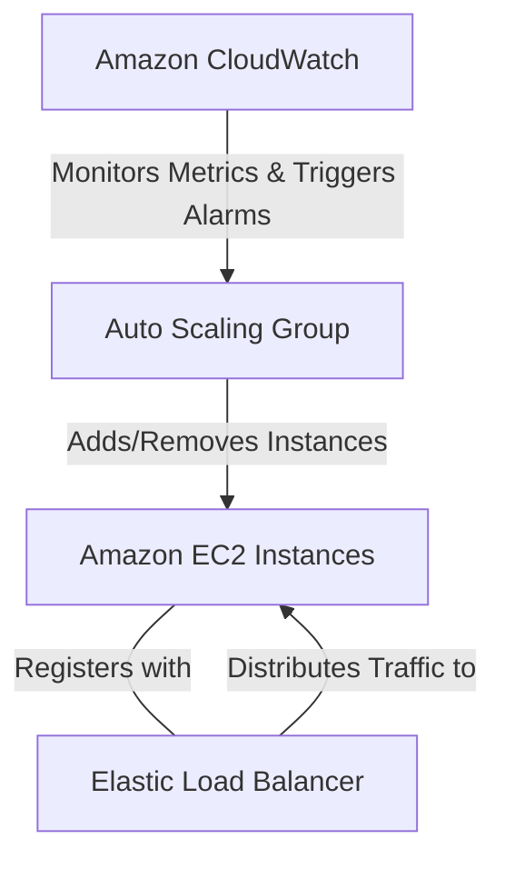

# EC2 Auto Scaling & Scaling Policies: Curriculum Overview

Welcome to the curriculum overview for **Configure and manage EC2 Auto Scaling groups and scaling policies**. This document outlines the structured learning path designed to prepare you for designing, deploying, and managing elastic compute environments in AWS. This topic is heavily featured in the AWS Certified SysOps Administrator - Associate (SOA-C03) exam under **Task 2.1: Implement scalability and elasticity**.

---

## Prerequisites

Before diving into Auto Scaling, learners must have a solid foundational understanding of core AWS services. If you are missing any of these prerequisites, it is highly recommended to review them before starting this curriculum.

*   **Amazon EC2 Fundamentals:** Understanding of instances, Amazon Machine Images (AMIs), and instance types.
*   **Networking (VPC):** Familiarity with Virtual Private Clouds, public/private subnets, and Availability Zones (AZs).
*   **Load Balancing:** Basic knowledge of Elastic Load Balancing (ELB) and Target Groups.
*   **Monitoring Basics:** Experience with Amazon CloudWatch metrics and alarms.

> [!WARNING] 
> **IAM Permissions Check**
> You will need adequate Identity and Access Management (IAM) permissions to create EC2 instances, Launch Templates, and Auto Scaling roles in your AWS environment for the hands-on labs.

---

## Module Breakdown

This curriculum is divided into five progressive modules. It moves from static configurations to highly dynamic, event-driven scaling architectures.

| Module | Focus Area | Key Concepts | Difficulty |
| :--- | :--- | :--- | :--- |
| **Module 1** | Configuration Foundations | Launch Templates vs. Configurations, AMIs | ⭐ Beginner |
| **Module 2** | ASG Mechanics | ASG Creation, Multi-AZ deployments, Capacity Limits | ⭐⭐ Intermediate |
| **Module 3** | The Auto Scaling Triad | CloudWatch, ELB integration, Health Checks | ⭐⭐ Intermediate |
| **Module 4** | Scaling Policies | Dynamic, Scheduled, and Predictive Scaling | ⭐⭐⭐ Advanced |
| **Module 5** | Optimization & Resilience | Spot Fleet rebalancing, Compute Optimizer | ⭐⭐⭐ Advanced |

### The Auto Scaling Triad

The core of Module 3 relies on understanding the relationship between three critical AWS services. This is commonly referred to as the **Auto Scaling Triad**.



---

## Learning Objectives per Module

### Module 1: Configuration Foundations
*   **Objective 1:** Differentiate between legacy Launch Configurations and modern Launch Templates.
*   **Objective 2:** Create a version-controlled Launch Template specifying instance type, AMI, and security groups.
*   **Objective 3:** Explain the lifecycle of an Amazon Machine Image (AMI) in the context of scaling.

> [!TIP]
> Always use **Launch Templates**. AWS is phasing out Launch Configurations. Templates support versioning, allowing you to easily update the AMI or instance type without creating a completely new resource.

### Module 2: ASG Mechanics
*   **Objective 1:** Define the core capacity metrics: Minimum, Maximum, and Desired capacity.
*   **Objective 2:** Deploy an Auto Scaling Group across multiple Availability Zones to ensure high availability.
*   **Objective 3:** Implement static capacity maintenance (e.g., enforcing exactly one Bastion host).

### Module 3: The Auto Scaling Triad
*   **Objective 1:** Configure ELB health checks on an ASG to automatically replace unhealthy instances.
*   **Objective 2:** Interpret CloudWatch metrics to determine scaling triggers.
*   **Objective 3:** Troubleshoot common instance launch failures and capacity quota limits.

### Module 4: Scaling Policies
*   **Objective 1:** Implement **Target Tracking Policies** (e.g., maintain average CPU utilization at $70\%$).
*   **Objective 2:** Configure **Scheduled Scaling** for predictable traffic patterns.
*   **Objective 3:** Enable **Predictive Scaling** using machine learning to proactively scale ahead of daily/weekly spikes.

### Module 5: Optimization & Resilience
*   **Objective 1:** Use AWS Compute Optimizer to right-size instances.
*   **Objective 2:** Configure capacity rebalancing for Spot Instances to manage cost without sacrificing availability.
*   **Objective 3:** Implement instance scale-in protection for critical long-running workloads.

---

## Visualizing Capacity Limits

Understanding the mathematical bounds of your ASG is critical for both cost management and application performance. Let $C$ be the current number of instances.
The Auto Scaling Group enforces the rule: $$\text{Min Capacity} \le C \le \text{Max Capacity}$$

```tikz
\begin{tikzpicture}
  % Axes
  \draw[thick, ->] (0,0) -- (8,0) node[right] {\text{Time}};
  \draw[thick, ->] (0,0) -- (0,5) node[above] {\text{Instances}};

  % Y-axis labels
  \node[left] at (0,1) {1};
  \node[left] at (0,2) {2};
  \node[left] at (0,3) {3};
  \node[left] at (0,4) {4};

  % Limit Lines
  \draw[dashed, red, thick] (0,1) -- (7.5,1) node[right, text=red] {\text{Min Capacity (1)}};
  \draw[dashed, blue, thick] (0,2) -- (7.5,2) node[right, text=blue] {\text{Desired Capacity (2)}};
  \draw[dashed, red, thick] (0,4) -- (7.5,4) node[right, text=red] {\text{Max Capacity (4)}};

  % Instance Count Line (Step function simulation)
  \draw[very thick, green!60!black] 
    (0,2) -- (1.5,2) 
    -- (1.5,3) -- (3,3) 
    -- (3,4) -- (4.5,4) 
    -- (4.5,2) -- (6,2)
    -- (6,1) -- (7,1);

  % Annotations
  \node[above, text=black, font=\footnotesize] at (3,4) {\text{Traffic Spike}};
  \node[below, text=black, font=\footnotesize] at (6.5,1) {\text{Low Traffic}};
\end{tikzpicture}
```

---

## Success Metrics

How will you know you have mastered this curriculum? Upon completion, learners should be able to consistently demonstrate the following:

1.  **Deploy an End-to-End Architecture:** Successfully launch an ASG behind an Application Load Balancer using an infrastructure-as-code tool (like CloudFormation or AWS CLI).
2.  **Demonstrate Self-Healing:** Manually terminate an EC2 instance within an ASG and verify that a new instance is automatically provisioned to meet the *Desired Capacity*.
3.  **Execute Cost-Aware Scaling:** Configure a mixed-instances policy combining On-Demand and Spot instances, proving adherence to an optimized budget.
4.  **Simulate Load:** Use a stress-testing tool on an EC2 instance to trigger a CloudWatch CPU alarm, verifying that a step scaling or target tracking policy successfully provisions new instances.

---

## Real-World Application

Why does mastering EC2 Auto Scaling matter in a professional cloud environment?

### Scenario 1: The E-Commerce "Black Friday" Spike
*   **The Problem:** An online retail store receives 10x normal traffic on Black Friday. If they run maximum capacity all year, they waste thousands of dollars. If they run minimum capacity, the site crashes on the biggest sales day of the year.
*   **The ASG Solution:** Using **Scheduled Scaling**, operations teams can proactively increase the minimum capacity on Thursday night. Simultaneously, **Dynamic Scaling (Target Tracking)** ensures that if the spike is larger than expected, new instances are continually added up to a safe, budget-conscious maximum.

### Scenario 2: The Self-Healing Bastion Host
*   **The Problem:** An administrative bastion host (jump box) goes offline due to an underlying hardware failure in AWS. Administrators cannot access private resources.
*   **The ASG Solution:** The engineer places the bastion host in an ASG with Min=1, Desired=1, Max=1. If the instance fails its EC2 status check, the ASG terminates it and provisions a new one in a healthy Availability Zone, ensuring continuous administrative access without manual intervention.

> [!NOTE]
> Real-world Auto Scaling isn't just about handling traffic—it is a foundational mechanism for **Reliability and Business Continuity**. Auto scaling across Availability Zones prevents regional hardware faults from taking down your application.