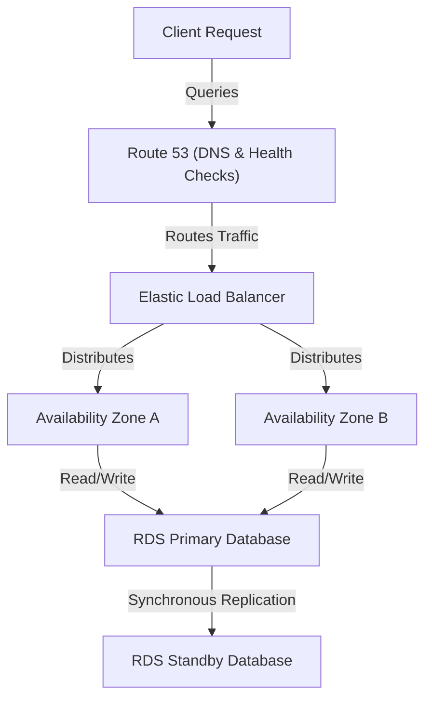
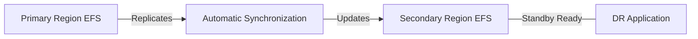

# Curriculum Overview: Configuring Fault-Tolerant Systems in AWS

> This curriculum outline defines the topics and learning outcomes focused on deploying, managing, and operating scalable, highly available, and fault-tolerant systems on AWS, directly aligned with the AWS Certified CloudOps Engineer Associate (SOA-C03) exam domains.

## Prerequisites

Before embarking on this curriculum, learners must possess a foundational understanding of cloud concepts and basic AWS operations to ensure success. 

*   **Cloud Navigation:** Proficiency in using the AWS Management Console and executing commands using the AWS Command Line Interface (CLI).
*   **Core Compute & Networking:** Familiarity with deploying Amazon EC2 instances, understanding VPCs, subnets, and security groups.
*   **Foundational Storage:** Basic understanding of block (EBS) and object (S3) storage mechanisms.
*   **Conceptual Awareness:** Understanding of the AWS Well-Architected Framework, specifically the Reliability and Performance Efficiency pillars.

> [!IMPORTANT] 
> If you are unfamiliar with executing basic AWS CLI queries using `JMESPath` syntax or deploying a standard EC2 web server, consider reviewing the **AWS Operational Foundations** module before starting this curriculum.

---

## Module Breakdown

This curriculum is divided into a structured progression, moving from network-level resilience to compute scaling, database redundancy, and finally storage replication.

| Module | Title | Difficulty | Core Services |
| :--- | :--- | :--- | :--- |
| **Module 1** | Traffic Routing & Health Checks | Intermediate | ELB, Amazon Route 53 |
| **Module 2** | Compute Elasticity | Intermediate | EC2 Auto Scaling Groups |
| **Module 3** | Database High Availability | Advanced | Amazon RDS, Aurora |
| **Module 4** | Storage Fault Tolerance | Advanced | Amazon EFS, Amazon S3 |

Click to view the Architectural End-State

By the end of this curriculum, you will be able to design and configure systems that look like this:

---

## Learning Objectives per Module

### Module 1: Traffic Routing & Health Checks
*   **Analyze application resilience** by configuring Amazon Route 53 health checks and DNS-level failover for multi-region or hybrid environments.
*   **Distribute traffic reliably** by configuring and troubleshooting Elastic Load Balancing (ELB) listeners and rules across instances and containers.
*   **Identify degraded targets** to automatically route traffic away from failing nodes before end-users are impacted.

### Module 2: Compute Elasticity
*   **Manage compute resources dynamically** to meet shifting demand patterns using EC2 Auto Scaling groups.
*   **Implement scaling policies** (dynamic, scheduled, and predictive) tied to CloudWatch metrics.
*   **Configure automated instance recovery** and define EC2 status checks for self-healing compute tiers.

### Module 3: Database High Availability
*   **Architect fault-tolerant data tiers** using Multi-AZ deployments for Amazon RDS and Amazon Aurora.
*   **Configure database failover** mechanisms and read replicas to ensure high availability and read scalability.
*   **Automate backups** using AWS Backup to establish point-in-time recovery capabilities that meet organizational RPO/RTO requirements.

### Module 4: Storage Fault Tolerance
*   **Implement cross-AZ shared storage** using Amazon EFS to allow simultaneous access from multiple EC2 instances or containers.
*   **Configure EFS Replication** to transparently synchronize data and metadata to a destination AWS region to achieve minute-level Recovery Time Objectives (RTO).
*   **Protect object storage** by implementing Amazon S3 versioning and Cross-Region Replication (CRR).

---

## Success Metrics

Mastery of this curriculum is evaluated through both theoretical understanding and practical implementation metrics. You will know you have succeeded when you can:

1.  **Achieve Defined RTO/RPO SLAs:** Successfully restore an RDS database point-in-time snapshot to meet a strict Recovery Point Objective (RPO) and Recovery Time Objective (RTO).
2.  **Survive a Zone Failure Simulation:** Terminate an active Availability Zone's instances in a lab environment and verify that the Application Load Balancer successfully reroutes traffic with zero 5xx errors returned to the client.
3.  **Deploy Cross-Region EFS:** Successfully configure an Amazon EFS primary filesystem and replicate it to a secondary region, validating synchronization.
4.  **Mathematical Validation of Uptime:** Use the standard availability formula to project system uptime based on your AWS architecture choices.

$$ \text{Availability} = \frac{\text{MTBF}}{\text{MTBF} + \text{MTTR}} $$

*(Where **MTBF** is Mean Time Between Failures and **MTTR** is Mean Time To Recovery. Fault-tolerant architectures dramatically reduce MTTR during an incident.)*

---

## Real-World Application

Why does this matter in your career as a CloudOps Engineer or SysOps Administrator?

### Business Continuity in E-Commerce
Imagine managing the infrastructure for a global retail platform during Black Friday. A single EC2 instance failure or an entire Availability Zone outage could result in millions of dollars in lost revenue. By implementing the architectures taught in this curriculum—such as an Application Load Balancer routing to an Auto Scaling Group backed by a Multi-AZ RDS instance—your application automatically detects failures and replaces degraded components without human intervention.

### Disaster Recovery for Financial Institutions
Strict compliance frameworks require financial services to maintain off-site backups and disaster recovery capabilities. You will learn to use **Amazon EFS Replication** and **S3 Cross-Region Replication** to create "Warm Standby" or "Pilot Light" disaster recovery environments. 

> [!TIP] 
> **Cost vs. Fault Tolerance:** Designing for fault tolerance always involves a cost tradeoff. For instance, an RDS Multi-AZ deployment costs twice as much as a Single-AZ deployment (due to the hidden standby instance). A key real-world skill you will develop is evaluating *when* a workload justifies the cost of maximum resilience.

By mastering these concepts, you transition from simply "running servers" to "engineering resilient systems," a critical leap for passing the SOA-C03 exam and excelling in enterprise cloud operations.