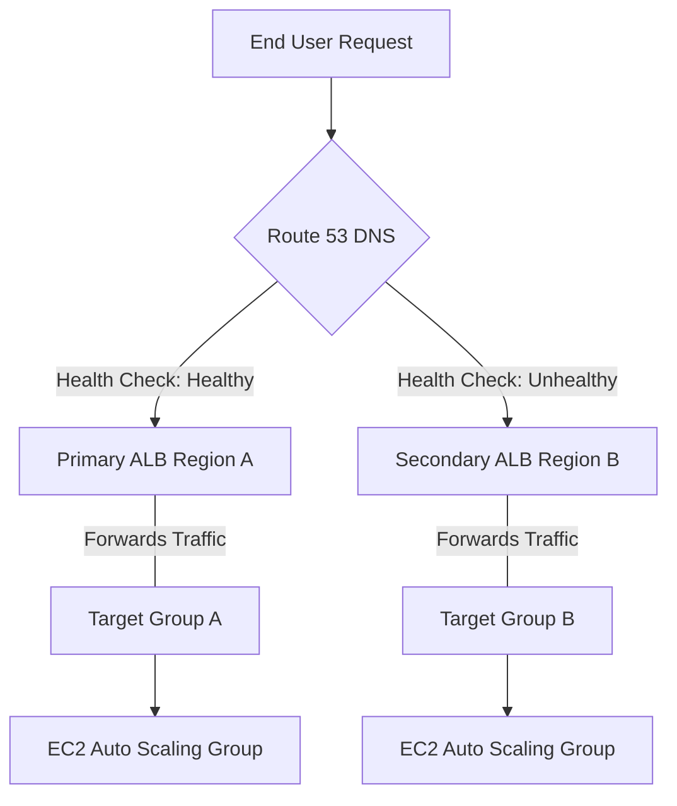

# Curriculum Overview: Configure and Troubleshoot Elastic Load Balancing (ELB) and Amazon Route 53 Health Checks

> [!NOTE] 
> This curriculum aligns with the AWS Certified SysOps Administrator/CloudOps Engineer Associate (SOA-C03) Exam Guide, specifically Domain 2 (Reliability and Business Continuity) and Task 2.2: Implement highly available and resilient environments.

## Prerequisites

Before beginning this curriculum, learners must have a foundational understanding of AWS networking, security, and compute services. Mastery of these concepts is required to successfully design and troubleshoot highly available architectures.

*   **VPC Fundamentals:** Solid understanding of subnets (public vs. private), Internet Gateways, NAT Gateways, and route tables.
*   **AWS Security Posture:** Knowledge of Security Groups (stateful) and Network ACLs (stateless), as well as Identity and Access Management (IAM) basics.
*   **DNS Principles:** Familiarity with Domain Name System concepts, including A records, CNAMEs, and TTL (Time to Live).
*   **Amazon EC2 & Auto Scaling:** Understanding of Amazon Machine Images (AMIs) and how Auto Scaling groups dynamically provision compute instances.

## Module Breakdown

The curriculum is structured into four progressive modules, moving from configuration fundamentals to advanced troubleshooting and edge protection.

| Module | Title | Core Focus | Difficulty |
| :--- | :--- | :--- | :--- |
| **Module 1** | **ELB Fundamentals & Listener Security** | Application, Network, and Gateway Load Balancers; Target Groups; SSL/TLS Configuration. | Beginner |
| **Module 2** | **Route 53 Routing & Health Checks** | DNS-level failover, health check creation, and latency/weighted routing policies. | Intermediate |
| **Module 3** | **Advanced Resilience & Edge Protection** | AWS Shield Advanced integration, SRT proactive engagement, CloudFront edge caching. | Advanced |
| **Module 4** | **Troubleshooting & Remediation** | Analyzing VPC Flow Logs, ELB access logs, Trusted Advisor alerts, and security group misconfigurations. | Expert |

## Learning Objectives per Module

### Module 1: ELB Fundamentals & Listener Security
*   **Configure ELB Listeners:** Deploy load balancers with secure listeners using HTTPS/SSL, updated security policies, and recommended ciphers.
*   **Manage Target Groups:** Register EC2 instances, containers, or IP addresses as targets and define localized health checks.
*   **Audit Security Groups:** Utilize AWS Trusted Advisor to identify misconfigured or overly permissive security groups attached to load balancers.

### Module 2: Route 53 Routing & Health Checks
*   **Implement DNS Failover:** Configure Route 53 active-passive and active-active failover routing policies across multiple Availability Zones or Regions.
*   **Design Global Health Checks:** Create Route 53 health checks that monitor endpoint health, calculated health of other checks, or CloudWatch alarms.
*   **Analyze Application Resilience:** Use health check metrics to ensure multi-region and hybrid environment availability.

### Module 3: Advanced Resilience & Edge Protection
*   **Integrate AWS Shield Advanced:** Configure Shield Advanced policies to protect ELB and CloudFront distributions against DDoS attacks.
*   **Enable Proactive Engagement:** Associate Route 53 health checks with protected resources so the AWS Shield Response Team (SRT) can proactively contact you during a health check failure.
*   **Optimize Content Delivery:** Implement CloudFront to cache dynamic content at the edge, reducing origin load and mitigating 502 errors linked to origin SSL certificate expiration.

### Module 4: Troubleshooting & Remediation
*   **Diagnose Connectivity Issues:** Use VPC Reachability Analyzer and VPC Flow logs to troubleshoot unreachable ELBs.
*   **Interpret Application Logs:** Collect and analyze ELB access logs to identify HTTP 5xx errors and backend timeout issues.
*   **Automate Responses:** Configure Amazon EventBridge to trigger AWS Systems Manager (SSM) Automation runbooks when a load balancer or health check state changes.

## Visual Anchors

### High Availability Traffic Flow



### Conceptual Health Check Timeline

```tikz
\begin{tikzpicture}[>=stealth, thick, node distance=2.5cm]
  % Nodes
  \node[draw, rounded corners, fill=blue!10, text width=2.5cm, align=center] (r53) at (0,0) {Route 53\\Health Check};
  \node[draw, fill=green!10, text width=2cm, align=center] (elb) at (5,2) {Primary\\ELB};
  \node[draw, fill=red!10, text width=2cm, align=center] (fail) at (5,-2) {Failover\\Resource};

  % Edges
  \draw[->] (r53) -- node[above, sloped] {Status: 200 OK} (elb);
  \draw[->, dashed, color=red] (r53) -- node[below, sloped] {Status: 5xx Error} (fail);
  
  % Labels
  \node[text width=3cm, align=center] at (2.5, 3) {Standard Operations};
  \node[text width=3cm, align=center] at (2.5, -3) {Automated Failover};
\end{tikzpicture}
```

## Success Metrics

To demonstrate mastery of this curriculum, learners must successfully meet the following criteria:

1.  **Architecture Validation:** Successfully deploy a Multi-AZ web application behind an Application Load Balancer that survives a simulated Availability Zone failure with zero downtime.
2.  **Disaster Recovery SLA:** Configure a cross-region Route 53 failover setup that successfully redirects traffic to a backup region in under 60 seconds during a simulated primary region outage.
3.  **Security Compliance:** Achieve a 100% pass rate on AWS Trusted Advisor ELB Security checks, ensuring no permissive security groups or insecure listener ciphers exist.
4.  **Diagnostic Accuracy:** Correctly identify the root cause of 5 network connectivity scenarios using ELB Access Logs and VPC Flow Logs in a timed troubleshooting lab.

## Real-World Application

> [!IMPORTANT]
> Why does this matter in the field?

In modern cloud engineering, downtime translates directly to lost revenue and damaged brand reputation. 

Consider an international e-commerce platform during a peak holiday sale. A sudden spike in localized traffic combined with an application bug causes instances in the primary `us-east-1` region to lock up. Without properly configured Route 53 health checks and Elastic Load Balancing, customers would receive generic `504 Gateway Timeout` errors.

By implementing the skills in this curriculum, an AWS CloudOps Engineer ensures that:
1. **Route 53** instantly detects the unhealthy ELB endpoints in the primary region.
2. Traffic is seamlessly routed to the `us-west-2` standby environment.
3. **AWS Shield Advanced**, integrated with these health checks, actively mitigates any concurrent DDoS attempts masking as legitimate traffic.

Mastering these components transforms reactive troubleshooting into proactive, resilient architecture design.