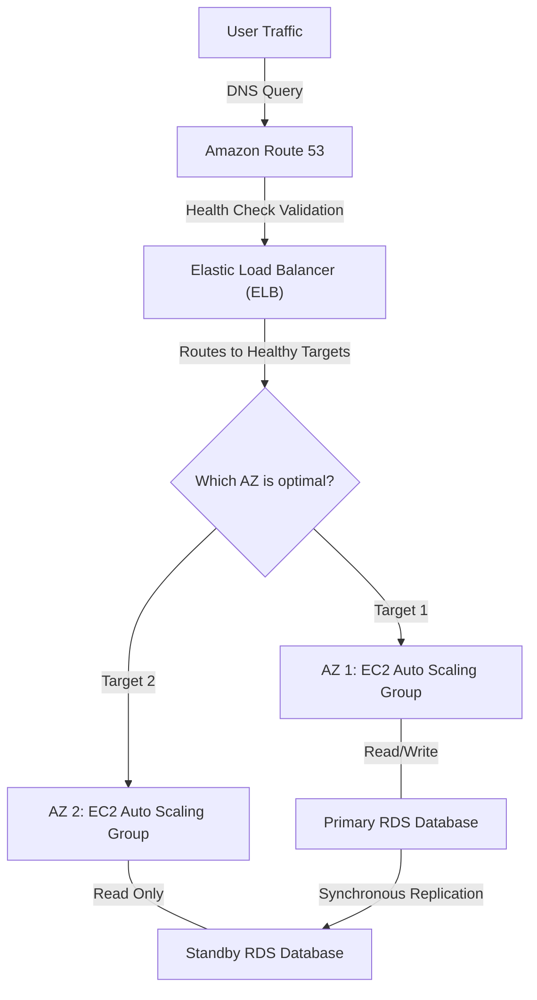

## Prerequisites

Before diving into the High Availability and Resilience curriculum, learners must possess a foundational understanding of cloud concepts and the AWS ecosystem. This ensures that the advanced architectural concepts discussed will have practical context.

*   **AWS Global Infrastructure:** A strong grasp of AWS Regions, Availability Zones (AZs), and edge locations. You must understand the difference between a single-AZ and multi-AZ deployment.
*   **Core AWS Services:** Familiarity with foundational compute and storage services, particularly Amazon EC2, Amazon S3, and Amazon EBS.
*   **Networking Fundamentals:** Basic knowledge of Amazon Virtual Private Cloud (VPC), subnets, route tables, and Internet Gateways.
*   **Operational Proficiency:** Experience navigating the AWS Management Console and executing basic operations using the AWS Command Line Interface (CLI).

> [!IMPORTANT]
> This curriculum aligns heavily with Domain 2 (Reliability and Business Continuity) of the AWS Certified SysOps Administrator/CloudOps Engineer - Associate (SOA-C03) exam. Reviewing the official exam guide prior to starting is highly recommended.

---

## Module Breakdown

This curriculum is divided into four sequential modules, escalating from foundational scaling concepts to comprehensive disaster recovery strategies.

| Module | Title | Difficulty | Core Topics |
| :--- | :--- | :--- | :--- |
| **1** | **Scalability & Elasticity** | ⭐⭐ | EC2 Auto Scaling, Elastic Load Balancing (ELB), Caching mechanisms (CloudFront, ElastiCache). |
| **2** | **High Availability Architectures** | ⭐⭐⭐ | Multi-AZ deployments, Amazon RDS/Aurora failover, Route 53 health checks & routing. |
| **3** | **Resilient Storage Systems** | ⭐⭐⭐ | Amazon FSx (Lustre, Windows), Hybrid deployments, S3 Versioning, EBS replication. |
| **4** | **Backup & Disaster Recovery** | ⭐⭐⭐⭐ | AWS Backup centralized management, RTO/RPO evaluation, DR strategies (Pilot Light, Warm Standby). |

### Architectural Overview: The High Availability Flow

The following diagram illustrates a standard highly available web architecture spanning multiple Availability Zones.



---

## Learning Objectives per Module

By completing this curriculum, learners will master the skills necessary to implement and maintain fault-tolerant environments.

### Module 1: Scalability & Elasticity
*   **Configure** dynamic, scheduled, and predictive scaling policies for Amazon EC2 Auto Scaling groups.
*   **Implement** traffic distribution using Application and Network Load Balancers to prevent single points of failure.
*   **Enhance** dynamic scalability by leveraging caching services like Amazon CloudFront and ElastiCache.

### Module 2: High Availability Architectures
*   **Deploy** and manage Multi-AZ configurations for Amazon RDS and Amazon Aurora to ensure automatic failover.
*   **Analyze** application resilience by configuring complex Route 53 health checks and DNS-level failover routing.
*   **Differentiate** between the appropriate use cases for single-AZ, multi-AZ, and multi-region deployments.

### Module 3: Resilient Storage Systems
*   **Implement** highly available and cost-effective file storage using Amazon FSx, understanding cross-AZ data transfer implications.
*   **Protect** critical object data against accidental deletion or corruption by enforcing S3 Versioning and Cross-Region Replication (CRR).
*   **Synchronize** on-premises datacenter storage with AWS using hybrid-enabled deployments to expand data availability.

### Module 4: Backup & Disaster Recovery
*   **Automate** enterprise-wide backup and restore operations across EBS, RDS, EFS, and S3 using AWS Backup plans and vaults.
*   **Evaluate** and apply the four primary Disaster Recovery (DR) strategies based on business requirements.
*   **Execute** database point-in-time restores to satisfy specific RTO and RPO constraints.

---

## Success Metrics

How will you know you have mastered the concepts of High Availability and Resilience? Mastery in this curriculum is measured through the following verifiable metrics:

1.  **Automated Failover Validation:** You can manually terminate a primary RDS instance and successfully observe the automated promotion of the standby replica without manual intervention.
2.  **Zero-Downtime Scaling:** Under a simulated load test, your Auto Scaling Group dynamically provisions new EC2 instances and registers them with the ELB without dropping active client requests.
3.  **Exam Readiness:** You consistently score 85% or higher on practice questions related to Domain 2 (Reliability and Business Continuity) for the SOA-C03 certification.
4.  **Successful DR Drill:** You can successfully restore a deleted DynamoDB table or RDS database to a point-in-time state within a 15-minute Recovery Time Objective (RTO).

### The Mathematics of Availability

Availability is often calculated using "nines" (e.g., 99.99%). You must be able to calculate baseline availability metrics to ensure SLA compliance:

$$ \mbox{Availability \%} = \left( \frac{\mbox{Total Uptime}}{\mbox{Total Uptime} + \mbox{Total Downtime}} \right) \times 100 $$

---

## Real-World Application

In the real world, systems fail. Availability Zones experience power outages, bad code causes application crashes, and human error leads to deleted databases. A SysOps Administrator's primary responsibility is ensuring that these localized failures do not result in a total business outage.

### RPO vs. RTO

Understanding the distinction between Recovery Point Objective (RPO) and Recovery Time Objective (RTO) is crucial for aligning technical architecture with business goals. 

```tikz
\begin{tikzpicture}[xscale=1.1, yscale=1.2]
  % Time axis
  \draw[thick, ->] (0,0) -- (10,0) node[right] {\mbox{Timeline}};
  
  % Event ticks
  \draw[thick] (2, -0.3) -- (2, 0.3) node[above, font=\bfseries] {\mbox{Last Backup}};
  \draw[thick, red] (5, -0.3) -- (5, 0.3) node[above, font=\bfseries, text=red] {\mbox{Disaster Event}};
  \draw[thick] (8.5, -0.3) -- (8.5, 0.3) node[above, font=\bfseries] {\mbox{System Restored}};
  
  % RPO / RTO brackets
  \draw[<->, blue, thick] (2, -0.6) -- (5, -0.6) node[midway, below] {\mbox{RPO (Data Loss)}};
  \draw[<->, green!50!black, thick] (5, -0.6) -- (8.5, -0.6) node[midway, below] {\mbox{RTO (Downtime)}};
  
  % Background shading for emphasis
  \fill[blue, opacity=0.1] (2,0) rectangle (5,-0.5);
  \fill[green!50!black, opacity=0.1] (5,0) rectangle (8.5,-0.5);
\end{tikzpicture}
```

> [!TIP]
> **RPO (Recovery Point Objective):** Determines how much data your business can afford to lose (dictates your backup frequency).
> **RTO (Recovery Time Objective):** Determines how long your business can afford to be offline (dictates your failover strategy).

### Comparing Disaster Recovery Strategies

When bridging theory and real-world application, you must balance cost against RTO/RPO requirements. 

| Strategy | Description | RTO/RPO | Cost/Complexity |
| :--- | :--- | :--- | :--- |
| **Backup & Restore** | Data is backed up to S3. Infrastructure is provisioned only after disaster strikes. | Hours to Days | Very Low |
| **Pilot Light** | Core database runs continuously, but compute instances are off/scaled to zero until needed. | Tens of Minutes | Low |
| **Warm Standby** | A scaled-down but fully functional version of the environment runs at all times. | Minutes | Medium |
| **Multi-Site Active/Active** | Traffic is routed to multiple regions simultaneously. Zero downtime failover. | Real-time (Zero) | Very High |

By implementing the concepts in this curriculum, you move an organization from reactive fire-fighting to proactive resilience, leveraging tools like AWS Backup and Amazon FSx to ensure data is both highly available and secure from catastrophic loss.