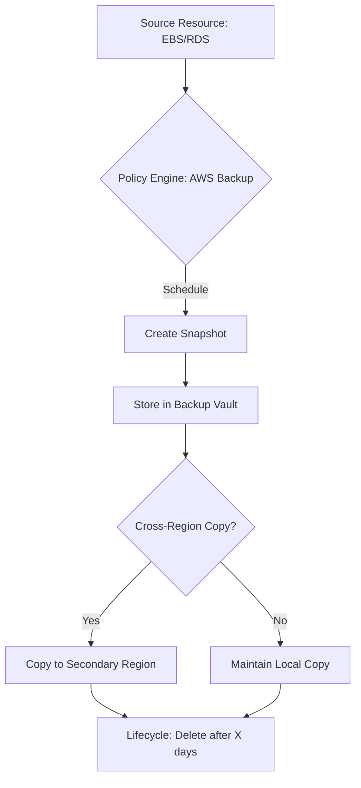

# AWS Disaster Recovery Procedures: Implementation & Strategy

This guide covers the critical procedures for ensuring business continuity on AWS, focusing on the tools and strategies required for the SysOps Administrator Associate (SOA-C03) exam.

## Learning Objectives
By the end of this guide, you should be able to:
*   **Differentiate** between Recovery Time Objective (RTO) and Recovery Point Objective (RPO).
*   **Implement** automated backup strategies using AWS Backup and Data Lifecycle Manager (DLM).
*   **Execute** database restoration procedures, including Point-in-Time Restore (PITR).
*   **Configure** cross-region disaster recovery for secrets and storage.
*   **Identify** the appropriate DR strategy (e.g., Pilot Light vs. Warm Standby) based on business requirements.

## Key Terms & Glossary
*   **RPO (Recovery Point Objective):** The maximum acceptable amount of data loss measured in time (e.g., "We can afford to lose 15 minutes of data").
*   **RTO (Recovery Time Objective):** The maximum acceptable downtime to restore service (e.g., "The system must be back online within 2 hours").
*   **PITR (Point-in-Time Restore):** A restoration method that allows a database to be returned to any specific second within a retention period.
*   **DLM (Data Lifecycle Manager):** An AWS tool to automate the creation, retention, and deletion of EBS snapshots and AMIs.
*   **Cross-Region Replication (CRR):** Automatically copying data (S3 buckets, Secrets, or Snapshots) to a different geographic AWS region for redundancy.

## The "Big Idea"
Disaster Recovery (DR) is not just about having a backup; it is about the **orchestration of restoration**. In a cloud-native environment, DR focuses on minimizing the "Blast Radius" of a failure by distributing resources across Availability Zones and Regions, and using automation to ensure that when a disaster strikes, the response is predictable, repeatable, and fast.

## Formula / Concept Box

| Strategy | RTO / RPO | Cost | Description |
| :--- | :--- | :--- | :--- |
| **Backup & Restore** | Hours/Days | $ | Data is backed up and restored only when a disaster occurs. |
| **Pilot Light** | Minutes/Hours | $$ | Core data is mirrored; minimal "pilot" version of infrastructure is kept off. |
| **Warm Standby** | Minutes | $$$ | A scaled-down but functional version of the environment is always running. |
| **Multi-Site (Active-Active)** | Real-time | $$$$ | Fully redundant traffic-serving environment in two or more regions. |

## Hierarchical Outline
1.  **Backup Automation**
    *   **AWS Backup:** Centralized policy-based backup for RDS, EBS, EFS, and DynamoDB.
    *   **Amazon Data Lifecycle Manager (DLM):** Specific to **EBS snapshots** and EBS-backed AMIs.
2.  **Storage & Database Resiliency**
    *   **Amazon S3:** Enable **Versioning** and **Cross-Region Replication** to prevent accidental deletion and regional failure.
    *   **Amazon RDS:** Use **Multi-AZ** for high availability and **Read Replicas** (cross-region) for DR.
3.  **Secrets & Configuration**
    *   **AWS Secrets Manager:** Replicate secrets to secondary regions so applications can authenticate immediately after a failover.
4.  **Recovery Procedures**
    *   **EBS Fast Snapshot Restore (FSR):** Eliminates latency of the first read from snapshots.
    *   **Route 53 Health Checks:** Automate DNS failover to healthy endpoints.

## Visual Anchors

### The DR Timeline: RPO vs RTO

```tikz
\begin{tikzpicture}[node distance=2cm, font=\small]
    % Timeline
    \draw[thick, ->] (0,0) -- (10,0) node[right] {Time};
    
    % Event Marker
    \draw[red, ultra thick] (5,-0.5) -- (5,1.5) node[above] {Disaster Event};
    
    % RPO
    \draw[blue, thick, <->] (2,-0.8) -- (5,-0.8);
    \node at (3.5, -1.2) {\textbf{RPO} (Data Loss)};
    \draw[dashed] (2,0) -- (2,-0.8);
    \node[below] at (2,0) {Last Backup};

    % RTO
    \draw[orange, thick, <->] (5,-0.8) -- (8,-0.8);
    \node at (6.5, -1.2) {\textbf{RTO} (Downtime)};
    \draw[dashed] (8,0) -- (8,-0.8);
    \node[below] at (8,0) {Service Restored};
\end{tikzpicture}
```

### Automated Backup Logic



## Definition-Example Pairs
*   **Point-in-Time Restore (PITR)**
    *   *Definition:* Using transaction logs to restore a database to a specific millisecond within the retention period.
    *   *Example:* A developer accidentally runs a `DELETE` command without a `WHERE` clause at 10:05 AM. The SysOps admin uses PITR to restore the database to its state at 10:04:59 AM.
*   **Cross-Account Snapshot Copy**
    *   *Definition:* Moving a backup to a completely separate AWS account to protect against account-level compromise.
    *   *Example:* Using DLM to copy EBS snapshots from the Production Account to a dedicated Security/Archive Account.

## Worked Examples
### Scenario: Restoring an RDS Instance with Minimal Data Loss
**The Problem:** A database corruption occurred at 14:00. The RPO is 5 minutes.

**Step-by-Step Breakdown:**
1.  **Identify the Target Time:** Since the corruption happened at 14:00, we aim for a restore point at 13:59.
2.  **Locate the Instance:** Navigate to the RDS Console > Databases.
3.  **Initiate Restore:** Select the corrupted instance -> Actions -> **Restore to point in time**.
4.  **Specify Time:** Choose "Custom" and enter the date and time (13:59:00).
5.  **Configuration:** Specify a new DB Instance Identifier (e.g., `db-recovery-instance`).
6.  **Update Application:** Once the new instance is `Available`, update the application's connection string (or swap CNAME records in Route 53).

> [!IMPORTANT]
> Restoring from a snapshot or PITR always creates a **new** DB instance with a new endpoint.

## Checkpoint Questions
1.  What is the main difference between AWS Backup and Amazon Data Lifecycle Manager (DLM)?
2.  You need to ensure that an application in `us-east-1` can still access its database passwords if the region fails. Which service feature should you use?
3.  True or False: S3 Cross-Region Replication (CRR) requires Versioning to be enabled on both source and destination buckets.
4.  Which DR strategy offers the lowest RTO but at the highest cost?

<details>
<summary>Click to see Answers</summary>

1. AWS Backup is a centralized service for many resources (RDS, EBS, EFS, etc.); DLM is focused specifically on automating EBS snapshots and AMIs.
2. Replicate the secret in **AWS Secrets Manager** to a secondary region.
3. **True**. Versioning is a prerequisite for S3 Replication.
4. **Multi-Site (Active-Active)**.
</details>