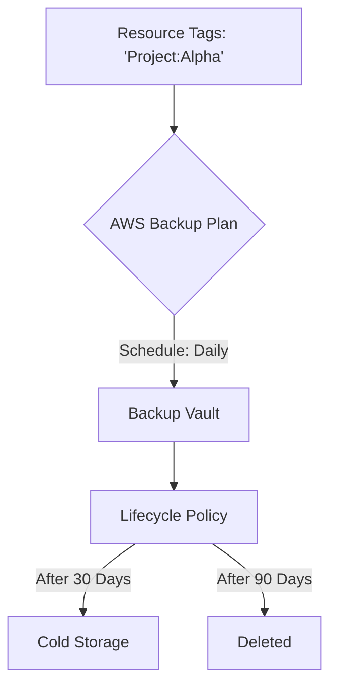

# Automating AWS Backups and Snapshots

This guide covers the implementation and automation of backup and restore strategies across various AWS services, focusing on centralized management with **AWS Backup** and resource-specific automation using **Amazon Data Lifecycle Manager (DLM)**.

## Learning Objectives

After studying this guide, you should be able to:
*   Differentiate between **AWS Backup** and **Amazon Data Lifecycle Manager (DLM)**.
*   Explain the mechanics of **incremental EBS snapshots** vs. **full archive snapshots**.
*   Configure automated backup plans for EC2, RDS, EBS, S3, and DynamoDB.
*   Identify recovery requirements based on **RPO** (Recovery Point Objective) and **RTO** (Recovery Time Objective).
*   Implement versioning and cross-region replication for storage durability.

## Key Terms & Glossary

*   **RPO (Recovery Point Objective):** The maximum acceptable amount of data loss measured in time (e.g., "We can lose up to 4 hours of data").
*   **RTO (Recovery Time Objective):** The maximum acceptable time to restore the system after a failure.
*   **Snapshot:** A point-in-time, incremental backup of an EBS volume stored in S3.
*   **AMI (Amazon Machine Image):** A template containing a software configuration (OS, application server, and applications) used to launch EC2 instances.
*   **Backup Vault:** A container used by AWS Backup to organize and encrypt your backups.
*   **Point-in-Time Restore (PITR):** The ability to restore a database (like RDS or DynamoDB) to any second within a retention period.

## The "Big Idea"

In cloud operations, **manual backups are a liability**. Automation shifts the responsibility of data protection from human intervention to defined **policies**. By using centralized tools like AWS Backup, organizations ensure compliance, reduce the risk of human error during disasters, and optimize costs by automatically transitioning old backups to cheaper storage tiers.

## Formula / Concept Box

| Concept | Metric / Rule | Application |
| :--- | :--- | :--- |
| **EBS Standard Cost** | Incremental Storage | Pay only for changed blocks after the first full snapshot. |
| **EBS Archive Cost** | Full Image Storage | Pay for the entire volume size; lower storage price but higher retrieval cost. |
| **RPO Calculation** | $Time_{Now} - Time_{Last Backup}$ | Determines how much data is lost if a crash occurs now. |
| **RTO Calculation** | $Time_{Restored} - Time_{Failure}$ | Measures the downtime experienced by the business. |

## Hierarchical Outline

*   **I. Centralized Backup Management**
    *   **AWS Backup:** A fully managed service that centralizes and automates data protection.
        *   **Backup Plans:** Define the schedule (cron), retention, and lifecycle (move to cold storage).
        *   **Resource Assignments:** Assign resources by ARN or **Tags** (Best Practice).
        *   **Supported Services:** EBS, EC2, RDS, Aurora, DynamoDB, EFS, FSx, and S3.
*   **II. Resource-Specific Automation**
    *   **Amazon Data Lifecycle Manager (DLM):** Focused specifically on EBS volumes and EBS-backed AMIs.
        *   Automates creation, retention, and deletion based on tags.
        *   Supports **Cross-Account Copying** for disaster recovery.
*   **III. Database-Specific Strategies**
    *   **RDS Snapshots:** Automated daily backups and transaction logs for PITR.
    *   **DynamoDB Backups:** On-demand backups and continuous backups (PITR).
*   **IV. Storage Versioning**
    *   **S3 Versioning:** Protects against accidental deletion or overwrites.
    *   **Object Lock:** Implements WORM (Write Once, Read Many) for compliance.

## Visual Anchors

### AWS Backup Workflow

### Incremental Snapshot Logic

This diagram illustrates how EBS snapshots only save the blocks that changed between $T_1$ and $T_2$.

\begin{tikzpicture}[scale=0.8]
    % Time 1
    \draw[thick] (0,0) rectangle (2,3) node[midway] {Initial Blocks};
    \draw[->] (2.2,1.5) -- (3.8,1.5) node[midway, above] {Change};
    % Time 2
    \draw[thick] (4,0) rectangle (6,3);
    \draw[fill=gray!30] (4,2) rectangle (6,3) node[midway] {Changed};
    \draw[fill=white] (4,0) rectangle (6,2) node[midway] {Original};
    % Snapshot
    \draw[dashed] (7,1.5) circle (1cm) node {Snap 2};
    \draw[->] (6,2.5) -- (7,2.5);
    \node at (7,0) {Only Saves "Changed"};
\end{tikzpicture}

## Definition-Example Pairs

*   **Immutable Backup:** A backup that cannot be altered or deleted until its retention period expires.
    *   *Example:* Using **AWS Backup Vault Lock** to prevent a malicious user or ransomware from deleting recovery points.
*   **Cross-Region Replication (CRR):** Automatically copying data from one AWS Region to another.
    *   *Example:* Replicating S3 buckets from `us-east-1` to `us-west-2` so that if an entire region goes offline, data remains accessible.
*   **Fast Snapshot Restore (FSR):** An EBS feature that eliminates the latency of I/O operations when a volume is first created from a snapshot.
    *   *Example:* Restoring a critical 10TB database volume where the business cannot wait for the data to be "lazy-loaded" from S3.

## Worked Examples

### Example 1: Creating a DLM Policy for EBS
**Scenario:** You need to ensure all EBS volumes tagged with `Department: Finance` are backed up every 12 hours and kept for 7 days.

1.  **Identify Target:** Navigate to EC2 > Lifecycle Manager.
2.  **Define Policy:** Select "EBS snapshot policy".
3.  **Target Tags:** Add `Department: Finance` as the target resource tag.
4.  **Schedule:** Set the schedule to 12 hours.
5.  **Retention:** Set the count to 14 (12 hours x 2 = 1 day; 1 day x 7 = 14 snapshots).
6.  **Enable:** Review and create. DLM will now handle all future volumes with that tag automatically.

### Example 2: Configuring AWS Backup for Multi-Service App
**Scenario:** An app uses an EC2 instance, an RDS database, and an S3 bucket. You need a single pane of glass for backups.

1.  **Create Vault:** Create a vault named `Production-Vault`.
2.  **Define Plan:** Create a plan with a rule: "Daily at 5 AM UTC, Retain 30 days".
3.  **Assign Resources:** Instead of picking individual IDs, choose "Assign by Tag" where `Env = Production`.
4.  **Result:** Any new S3 bucket or RDS instance tagged `Env: Production` is automatically added to the backup schedule without further manual configuration.

## Checkpoint Questions

1.  What is the primary difference between the EBS Snapshot **Standard** tier and **Archive** tier regarding how data is stored?
2.  A company requires an RTO of 15 minutes. Does a standard S3 Glacier Restore (3-5 hours) meet this requirement?
3.  Which service would you use to automate backups specifically for **EFS** and **DynamoDB** simultaneously?
4.  True or False: Amazon Data Lifecycle Manager (DLM) can be used to back up Instance Store volumes.
5.  How does AWS Backup use **Tags** to simplify resource management?

Click to see answers

1. Standard is incremental (changed blocks only); Archive is a full copy (all blocks).
2. No, Glacier's 3-5 hour retrieval exceeds the 15-minute RTO.
3. AWS Backup (DLM only supports EBS/AMI).
4. False (Instance store is ephemeral and cannot be snapshotted).
5. It allows for "set and forget" assignments; any resource tagged with a specific key/value is automatically included in the backup plan.

