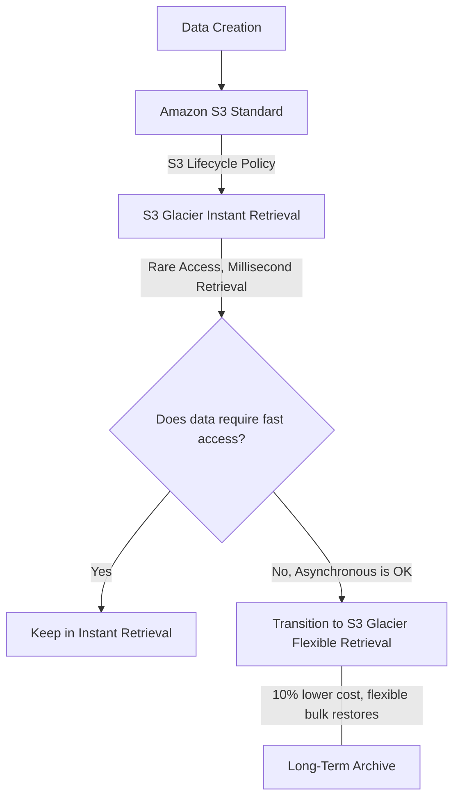
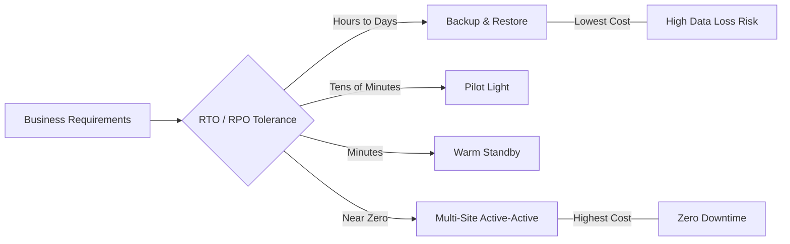

# Curriculum Overview: Backup, Restore, and Disaster Recovery

> [!NOTE]
> This curriculum aligns with the AWS Certified CloudOps Engineer / SysOps Administrator - Associate (SOA-C03) Exam Guide, specifically focusing on **Task 2.3: Implement backup and restore strategies**.

## Prerequisites

Before beginning this curriculum, learners must have a foundational understanding of the following concepts and tools:

*   **AWS Management Console & CLI:** Familiarity with navigating the AWS interface and executing basic CLI commands.
*   **Core AWS Services:** Foundational knowledge of compute (Amazon EC2), storage (Amazon S3, Amazon EBS), and databases (Amazon RDS, DynamoDB).
*   **Identity and Access Management (IAM):** Understanding of basic permissions, roles, and policies required to manage backup resources.
*   **Basic Networking:** Understanding of VPCs, Subnets, and Availability Zones (AZs) for multi-AZ deployments.

## Module Breakdown

This curriculum is divided into four progressive modules, designed to take you from basic storage concepts to complex, multi-region disaster recovery architectures.

| Module | Topic | Difficulty | Estimated Time |
| :--- | :--- | :--- | :--- |
| **Module 1** | Storage Tiering & Archival with Amazon S3 | Beginner | 2 Hours |
| **Module 2** | Automating Snapshots & Backups | Intermediate | 3 Hours |
| **Module 3** | Database & Instance Restoration | Intermediate | 2.5 Hours |
| **Module 4** | Disaster Recovery (DR) Strategies | Advanced | 3.5 Hours |

### Storage Tiering Workflow

## Learning Objectives per Module

### Module 1: Storage Tiering & Archival with Amazon S3
*   **Differentiate S3 Storage Classes:** Compare S3 Standard, S3 Standard-IA, S3 Glacier Instant Retrieval, and S3 Glacier Flexible Retrieval.
*   **Implement S3 Versioning:** Protect against accidental overwrites and deletions using bucket versioning.
*   **Design S3 Lifecycle Policies:** Automate the transition of objects to colder storage tiers to optimize costs (e.g., meeting the 90-day minimum storage duration for S3 Glacier Instant Retrieval).

### Module 2: Automating Snapshots & Backups
*   **Configure Amazon Data Lifecycle Manager (DLM):** Automate the creation, retention, and deletion of EBS Snapshots and EBS-backed Amazon Machine Images (AMIs).
*   **Implement AWS Backup:** Create centralized backup plans and vaults to protect EC2, RDS, EBS, EFS, and DynamoDB resources.
*   **Utilize Resource Tagging:** Apply Target resource tags and DLM tags to enforce regular backup schedules across isolated AWS accounts.

### Module 3: Database & Instance Restoration
*   **Execute Point-in-Time Recovery (PITR):** Restore managed databases like Amazon RDS and DynamoDB to specific timestamps to meet strict Recovery Point Objectives (RPO).
*   **Recover EC2 Instances:** Restore full instances from EBS-backed AMIs and attach snapshots to running instances.
*   **Manage Fast Snapshot Restore:** Understand the billing implications and performance benefits of enabling Fast Snapshot Restore for critical EBS volumes.

### Module 4: Disaster Recovery (DR) Strategies
*   **Define RTO and RPO:** Align technical backup metrics with business recovery requirements.
*   **Evaluate DR Architectures:** Compare Backup and Restore, Pilot Light, Warm Standby, and Multi-Site Active-Active strategies.
*   **Implement Cross-Region Replication:** Automate disaster recovery by replicating S3 data and EBS snapshots to secondary AWS regions.

<strong>Deep Dive: RTO vs. RPO</strong>

*   **Recovery Time Objective (RTO):** The maximum acceptable delay between the interruption of service and the restoration of service. (How long can we afford to be offline?)
*   **Recovery Point Objective (RPO):** The maximum acceptable amount of data loss measured in time. (How much data can we afford to lose?)

## Success Metrics

To demonstrate mastery of this curriculum, learners must successfully complete the following criteria:

1.  **Cost-Optimized Archival Validation:** Successfully configure an S3 Lifecycle policy that transitions 1TB of mock data into S3 Glacier Flexible Retrieval, demonstrating at least a 10% cost reduction over S3 Glacier Instant Retrieval.
2.  **Automated Backup Implementation:** Provision an Amazon Data Lifecycle Manager (DLM) policy that schedules daily EBS snapshots, retains them for 7 days, and automatically copies them to a secondary AWS Region.
3.  **Database Restoration Drill:** Successfully restore a dropped Amazon RDS database table using Point-in-Time Recovery within a 15-minute simulated Recovery Time Objective (RTO).
4.  **Disaster Recovery Architecture Design:** Diagram and defend a "Pilot Light" DR strategy for a standard 3-tier web application, clearly defining how AWS services scale up during a failover event.

### Disaster Recovery Strategy Spectrum

## Real-World Application

Why does mastering Backup, Restore, and Disaster Recovery matter in your career as a CloudOps Engineer?

*   **Ransomware Mitigation:** In the era of widespread ransomware attacks, immutable backups and cross-account snapshot automation (via AWS Backup and DLM) are the ultimate fail-safe. If production environments are compromised, your backup strategy ensures the business survives.
*   **Regulatory Compliance & Audits:** Organizations in healthcare, finance, and public sectors face strict annual audits. Knowing how to efficiently store years of historical data using S3 Glacier Flexible Retrieval—where data is accessed only once or twice a year but retrieved asynchronously—saves the company significant capital while maintaining 100% compliance.
*   **Cost vs. Performance Optimization:** An architect who defaults to storing everything in S3 Standard wastes thousands of dollars. An engineer who understands that S3 Glacier Instant Retrieval offers milliseconds access for rarely accessed data becomes an invaluable asset for cloud financial management.
*   **Business Continuity:** Hardware fails, natural disasters occur, and human error happens. By implementing strategies like Pilot Light or Warm Standby, you transform catastrophic regional outages into minor inconveniences, preserving revenue and customer trust.

> [!IMPORTANT]
> **Common Pitfall to Avoid in the Real World:** Relying solely on Amazon DLM for Instance Store volumes. Remember: *Amazon Data Lifecycle Manager only works with EBS-backed AMIs and volume types. You cannot create, retain, or delete instance store-backed AMIs with Amazon DLM.*
